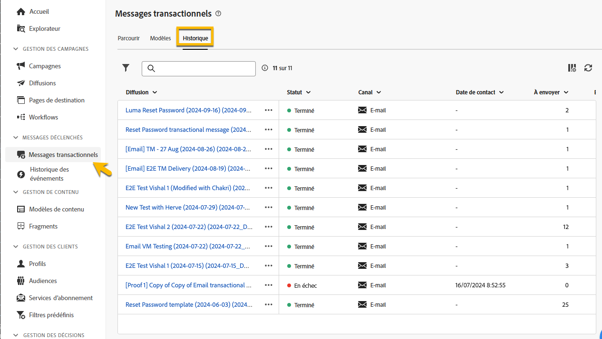

# Surveiller des messages transactionnels

Après la publication et l’envoi de votre message transactionnel, vous pouvez obtenir des rapports et des journaux sur celui-ci.

## Journaux de message transactionnel {#transactional-logs}

Une fois votre message publié, vous pouvez vérifier son exécution en cliquant sur le bouton **[!UICONTROL Journaux]**.

{zoomable="yes"}

Vous avez ainsi accès aux journaux détaillés sur la publication du message dans l’onglet **[!UICONTROL Journaux]**.

{zoomable="yes"}

Vous pouvez également afficher la liste des **[!UICONTROL BAT]** envoyés avec leurs journaux dans l’onglet correspondant.

## Historique des messages transactionnels {#transactional-history}

Dans la section **[!UICONTROL Messages déclenchés]**, vous pouvez afficher des détails sur tous les messages transactionnels qui ont été exécutés. Pour y accéder, accédez à **[!UICONTROL Messages transactionnels]**. Dans l’onglet **[!UICONTROL Historique]**, vous pouvez voir la liste des messages transactionnels exécutés, ainsi que leur statut et des informations supplémentaires.

{zoomable="yes"}

Effectuez une recherche pour retrouver votre message, puis cliquez dessus.
Vous pouvez consulter les détails à cet emplacement.

{zoomable="yes"}

## Historique des événements {#event-history}

>[!CONTEXTUALHELP]
>id="acw_transacmessages_eventhistory"
>title="Historique des événements des messages transactionnels"
>abstract="Vous pouvez disposer d’une vue sur les événements qui déclenchent votre message transactionnel."

>[!CONTEXTUALHELP]
>id="acw_transacmessages_eventhistory_preview"
>title="Prévisualisation de l’historique des événements des messages transactionnels"
>abstract="Vous pouvez disposer d’une vue sur les événements qui déclenchent votre message transactionnel."

Vous pouvez également disposer d’une vue sur les événements qui déclenchent votre message transactionnel.
Pour les voir, accédez à la section **[!UICONTROL Historique des événements]**.

Vous pouvez les voir avec le nom du type d’événement.

{zoomable="yes"}

Vous obtenez plus de détails comme ci-dessous en cliquant sur l’ID d’**[!UICONTROL Événement]** :

* Coordonnées
* À propos des dates de processus

Vous pouvez même disposer d’une prévisualisation du message envoyé avec le bouton **[!UICONTROL Prévisualiser]** et voir les données reçues qui déclenchent le message avec le bouton **[!UICONTROL Afficher les données]**.

{zoomable="yes"}

Le bouton **[!UICONTROL Plus]** vous permet de supprimer l’historique des événements.
