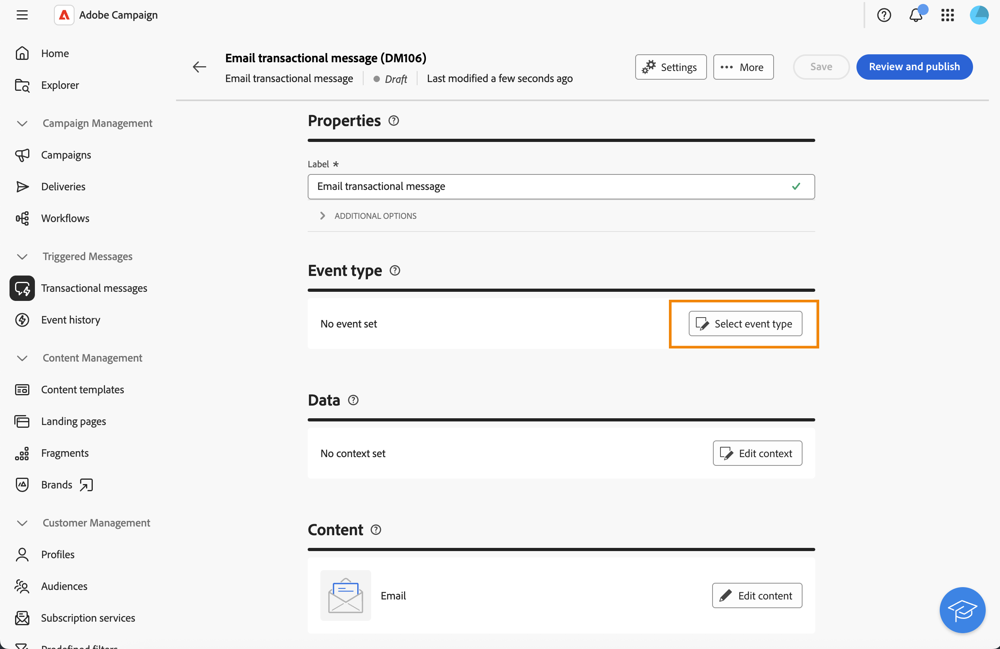

# Enrichir des messages transactionnels avec des données de profils{#profile-enrichment}

Cette fonctionnalité vous permet de personnaliser les messages transactionnels en liant des champs de la base de données Adobe Campaign au contenu des messages. Vous pouvez sélectionner des mappings de ciblage, des colonnes d’enrichissement et une clé de réconciliation pour garantir une personnalisation précise en temps réel tout en maintenant vos seuils de performances.

* Les messages transactionnels basés sur des événements utilisent les données que contiennent les événements.
* Les messages transactionnels basés sur des profils utilisent les données contenues dans la base de données Adobe Campaign.

Pour configurer l’enrichissement des profils, procédez comme suit :

1. Créez le message transactionnel. [En savoir plus](#create-enrichment)
1. Définissez le type d’événement. [En savoir plus](#event-enrichment)
1. Configurez les paramètres d&#39;enrichissement. [En savoir plus](#settings-enrichment)
1. Définissez le contenu. [En savoir plus](#content-enrichment)
1. Validez et envoyez. [En savoir plus](#send-enrichment)

>[!NOTE]
>
>Votre serveur doit être mis à niveau vers la version 8.8.2 ou une version ultérieure.
>
>Actuellement, cette fonctionnalité n’est disponible que pour les e-mails, les SMS et les notifications push.

## Créer le message transactionnel{#create-enrichment}

Tout d’abord, vous devez créer un message transactionnel.

1. Dans la section **[!UICONTROL Messages déclenchés]**, accédez à **[!UICONTROL Messages transactionnels]** et créez un nouveau message transactionnel.

   {zoomable="yes"}

1. Choisissez un modèle et définissez les propriétés. Pour plus d’informations à ce sujet, consultez cette [page](create-transactional.md#transactional-message).

## Définir le type d’événement{#event-enrichment}

Vous devez ensuite définir l’événement en tant qu’événement basé sur des profils pour cibler les données contenues dans la base de données Adobe Campaign.

1. Dans la section **Type d’événement**, sélectionnez **Sélectionner le type d’événement**, puis choisissez si vous souhaitez utiliser un type d’événement existant ou créer le vôtre.

   >[!NOTE]
   >
   >Vous ne pouvez pas choisir un type d&#39;événement déjà utilisé dans un autre modèle de message transactionnel.

   {zoomable="yes"}

1. Saisissez les informations relatives au type d’événement :

   * Pour un type d’événement existant, sélectionnez-le dans la liste.
   * Pour un nouveau type d’événement, ajoutez un libellé et un nom.

1. Ensuite, sélectionnez **Profil RT** dans la liste déroulante **Type d’événement**.

   {zoomable="yes"}

## Configurer les paramètres d’enrichissement{#settings-enrichment}

À présent, ajoutons des champs à l’événement. Ceux-ci vous permettront ensuite de personnaliser le message transactionnel.

1. Dans la section **Données**, cliquez sur **Paramètres d’enrichissement**.

   {zoomable="yes"}

   >[!NOTE]
   >
   >Ce bouton est disponible uniquement lorsque vous définissez un événement basé sur des profils.

1. Dans la section **Attributs supplémentaires**, cliquez sur **Ajouter un attribut** et sélectionnez les champs nécessaires.

   {zoomable="yes"}

1. Définissez l’attribut qui sera utilisé comme clé de réconciliation.

1. Choisissez ce qui doit se produire si la clé n’est pas disponible dans la payload.

   * Le message a été envoyé sans personnalisation.
   * Le message n’a pas été envoyé.

## Définir le contenu{#content-enrichment}

Vous devez ensuite définir le contenu du message transactionnel.

1. Dans la section **Contenu**, cliquez sur le bouton **Modifier le contenu** et définissez le contenu de votre message. Voir cette [page](create-transactional.md#transactional-content).

   {zoomable="yes"}

1. Lorsque vous utilisez la personnalisation, sur la ligne d’objet par exemple, utilisez le menu **Enrichissement de profil** pour ajouter les champs basés sur des profils, que vous avez précédemment définis.

   {zoomable="yes"}

## Valider et envoyer{#send-enrichment}

Pour finir, vous devez valider et envoyer la diffusion.

1. Validez la diffusion en simulant le contenu et en envoyant des BAT. Voir cette [page](validate-transactional.md).

1. Cliquez sur le bouton **[!UICONTROL Vérifier et publier]** pour créer et publier le message. Les déclencheurs peuvent désormais exécuter l’envoi de votre message transactionnel.

<!--
When creating the event configuration, select the Profile event targeting dimension (see Creating an event).

Add fields to the event, in order to be able to personalize the transactional message (see Defining the event attributes). You must add at least one field to create an enrichment. You do not need to create other fields such as First name and Last name as you will be able to use personalization fields from the Adobe Campaign database.

Create an enrichment in order to link the event to the Profile resource (see Enriching the event) and select this enrichment as the Targeting enrichment.

IMPORTANT
This step is mandatory for profile-based events.
Preview and publish the event (see Previewing and publishing the event).

When previewing the event, the REST API does not contain an attribute specifying the email address, mobile phone, or push notification specific attributes, as it will be retrieved from the Profile resource.

Once the event has been published, a transactional message linked to the new event is automatically created. In order for the event to trigger sending a transactional message, you must modify and publish the message that was just created…

Integrate the event into your website (see Integrate the event triggering).
-->

