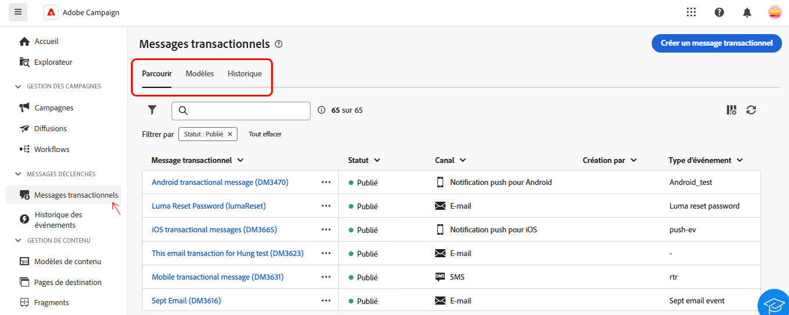

# À propos des messages transactionnels {#transactional-messaging}

>[!CONTEXTUALHELP]
>id="acw_transacmessages"
>title="Messages transactionnels"
>abstract="Les messages transactionnels constituent un module spécialisé d’Adobe Campaign conçu pour gérer les messages déclenchés."

>[!CONTEXTUALHELP]
>id="acw_homepage_welcome_rn1"
>title="Messages transactionnels"
>abstract="Les messages transactionnels constituent un module spécialisé d’Adobe Campaign conçu pour gérer les messages déclenchés. Ces messages sont générés automatiquement en réponse aux événements provenant des systèmes d&#39;information."
>additional-url="https://experienceleague.adobe.com/docs/campaign-web/v8/release-notes/release-notes.html?lang=fr" text="Voir les notes de mise à jour"

<!-- >>[!CONTEXTUALHELP]
>id="acw_transacmessages_exclusionlogs"
>title="Transactional messaging exclusion logs"
>abstract="Transactional messaging exclusion logs" -->

Les messages transactionnels constituent un module spécialisé d’Adobe Campaign conçu pour gérer les messages déclenchés. Ces messages sont générés automatiquement en réponse aux événements provenant des systèmes d’information. Parmi les exemples courants de ces événements, citons les clics sur des boutons ou des liens, l’abandon de panier, la demande d’alertes de disponibilité de produits, la création ou la modification de compte, etc.

Les messages transactionnels sont utilisés pour envoyer :

* des notifications importantes, telles que les confirmations de commande ou les réinitialisations de mot de passe ;
* des réponses en temps réel aux actions des clientes et clients (par exemple, création d’un compte, finalisation d’un achat) ;
* du contenu non promotionnel essentiel aux interactions des clientes et clients.

Le module des messages transactionnels s’intègre parfaitement à vos systèmes d’information. Les événements, tels que les actions des clientes et clients, sont transmis à Adobe Campaign qui envoie le message personnalisé correspondant. Ces messages peuvent être envoyés individuellement ou par lots via divers canaux, comme e-mail, SMS ou notifications push.

Vous pouvez retrouver le module **[!UICONTROL Message transactionnel]** dans la section **[!UICONTROL Messages déclenchés]**.

{zoomable="yes"}

La page **[!UICONTROL Message transactionnel]** contient 3 onglets :

* **[!UICONTROL Parcourir]**, où vous disposez de la liste des messages transactionnels avec leur statut.
* **[!UICONTROL Modèles]**, où vous retrouvez et créez les modèles de messages transactionnels.
* **[!UICONTROL Historique]**, où vous disposez des détails sur tous les messages transactionnels qui ont été exécutés.

Dans cette documentation, découvrez comment effectuer les opérations suivantes :

* [Créer des messages transactionnels](create-transactional.md) à l’aide d’un modèle et connaître les paramètres nécessaires.
* [Valider le contenu de vos messages transactionnels](validate-transactional.md) et simuler une personnalisation.
* [Surveiller vos messages transactionnels](monitor-transactional.md).
