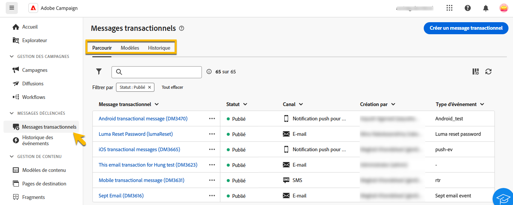

# À propos des messages transactionnels {#transactional-messaging}

>[!CONTEXTUALHELP]
>id="acw_transacmessages"
>title="Messages transactionnels"
>abstract="Les messages transactionnels constituent un module spécialisé d’Adobe Campaign conçu pour gérer les messages déclenchés."

>[!CONTEXTUALHELP]
>id="acw_homepage_welcome_rn1"
>title="Messages transactionnels"
>abstract="Les messages transactionnels sont un module spécialisé d’Adobe Campaign conçu pour gérer les messages déclenchés. Ces messages sont générés automatiquement en réponse aux événements provenant des systèmes d&#39;information."
>additional-url="https://experienceleague.adobe.com/docs/campaign-web/v8/release-notes/release-notes.html?lang=fr" text="Voir les notes de mise à jour"

<!-- >>[!CONTEXTUALHELP]
>id="acw_transacmessages_exclusionlogs"
>title="Transactional messaging exclusion logs"
>abstract="Transactional messaging exclusion logs" -->

Les messages transactionnels sont un module spécialisé d’Adobe Campaign conçu pour gérer les messages déclenchés. Ces messages sont générés automatiquement en réponse aux événements provenant des systèmes d&#39;information. Parmi les exemples courants de ces événements, citons les clics sur des boutons ou des liens, l’abandon de panier, la demande d’alertes de disponibilité de produits, la création ou la modification de compte, etc.

Les messages transactionnels sont utilisés pour envoyer :

* Notifications importantes, telles que les confirmations de commandes ou les réinitialisations de mot de passe,
* Réponses en temps réel aux actions des clients (par exemple, création de compte, fin d’achat),
* Contenu non promotionnel essentiel aux interactions client.

Le module des messages transactionnels s’intègre de manière transparente à vos systèmes d’information. Les événements, tels que les actions du client, sont transmis à Adobe Campaign qui envoie le message personnalisé correspondant. Ces messages peuvent être envoyés unitairement ou par lots sur différents canaux tels que les emails, les SMS ou les notifications push.

Vous pouvez trouver le module **[!UICONTROL Message transactionnel]** dans la section **[!UICONTROL Messages déclenchés]** .

{zoomable="yes"}

Vous avez 3 onglets dans la page **[!UICONTROL Message transactionnel]** :

* **[!UICONTROL Parcourir]** où vous avez la liste des messages transactionnels avec leur état,
* **[!UICONTROL Modèles]** où vous trouvez et créez des modèles de messages transactionnels,
* **[!UICONTROL Historique]** où vous trouverez les détails de tous les messages transactionnels qui ont été exécutés.

Découvrez dans cette documentation comment :

* [Créer des messages transactionnels](create-transactional.md) à l’aide d’un modèle et connaître les paramètres nécessaires,
* [Validez le contenu de vos messages transactionnels](validate-transactional.md) et simulez une personnalisation,
* [Surveillez vos messages transactionnels](monitor-transactional.md).
