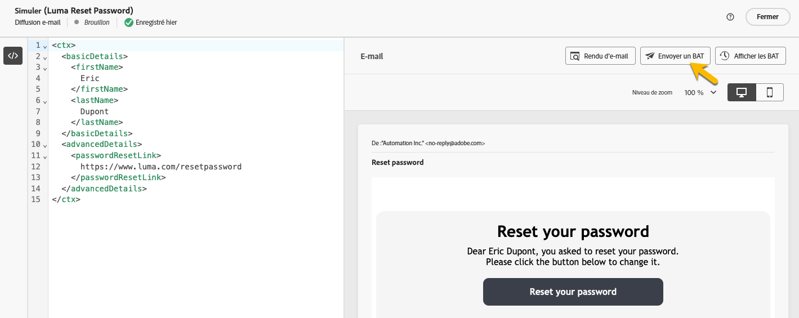

# Valider des messages transactionnels

Pendant ou après la création de votre message transactionnel, vous pouvez valider le contenu à l’aide d’un exemple de données.

## Simuler le contenu {#simulate-content}

Pour simuler le contenu de votre message, procédez comme suit :

* Assurez-vous que le chemin de personnalisation dans le contenu de votre message correspond à votre exemple de contexte. Dans l’exemple ci-dessous, pour afficher le prénom du profil de test, utilisez le chemin *rtEvent.ctx.basicDetails.firstName*.

  Vous pouvez modifier le contenu du message ou l’exemple de contexte pour les faire correspondre.

  {zoomable="yes"}

* Cliquez sur le bouton **[!UICONTROL Simuler le contenu]** pour prévisualiser votre message transactionnel avec les données saisies dans l’exemple de contexte.

  {zoomable="yes"}

  Après avoir vérifié votre contenu, cliquez sur le bouton **[!UICONTROL Fermer]**.

* N’oubliez pas de cliquer sur le bouton **[!UICONTROL Republier]** si vous avez apporté des modifications à votre contenu.

## Envoyer un BAT

Pour tester et expérimenter le message transactionnel tel qu’il serait diffusé via le canal de votre choix (e-mail, SMS ou notification push, par exemple), utilisez la fonctionnalité de BAT.

Dans la [fenêtre de contenu de la simulation](#simulate-content), cliquez sur le bouton **[!UICONTROL Envoyer un BAT]**.

{zoomable="yes"}

Dans la nouvelle fenêtre qui s’affiche, saisissez l’adresse e-mail ou le numéro de téléphone, selon le canal, où vous souhaitez recevoir le BAT. Après avoir saisi l’adresse souhaitée, cliquez sur les boutons **[!UICONTROL Envoyer le BAT]** et **[!UICONTROL Confirmer]**. Cette action envoie un exemple de votre message transactionnel, en s’assurant que l’ensemble des personnalisations, du contenu dynamique et de la mise en forme s’affichent comme ils le devraient pour vos utilisateurs et utilisatrices finaux.

{zoomable="yes"}

Cette étape est essentielle pour identifier les problèmes potentiels avant de publier votre message transactionnel.