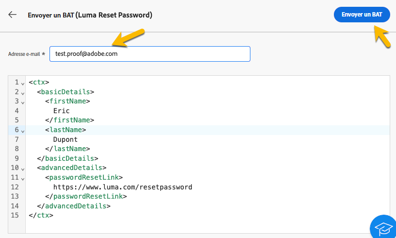

# Validation des messages transactionnels

Pendant ou après la création de votre message transactionnel, vous pouvez valider le contenu à l’aide d’un exemple de données.

## Simuler le contenu {#simulate-content}

Pour simuler le contenu de votre message, procédez comme suit :

* Assurez-vous que le chemin de personnalisation dans le contenu de votre message correspond à votre exemple de contexte. Dans l’exemple ci-dessous, pour afficher le prénom du profil de test, nous utilisons le chemin *rtEvent.ctx.basicDetails.firstName*

  Vous pouvez modifier le contenu du message ou l’exemple de contexte pour les aligner.

  {zoomable="yes"}

* Cliquez sur le bouton **[!UICONTROL Simuler le contenu]** pour prévisualiser votre message transactionnel avec les données que vous avez saisies dans l’exemple de contexte.

  {zoomable="yes"}

  Après avoir vérifié votre contenu, cliquez sur le bouton **[!UICONTROL Fermer]** .

* N’oubliez pas de cliquer sur le bouton **[!UICONTROL Republier]** si vous avez apporté des modifications à votre contenu.

## Envoyer un BAT

Si vous souhaitez tester et tester le message transactionnel tel qu’il serait diffusé par le canal de votre choix (email, SMS ou notification push, par exemple), vous pouvez utiliser la fonction BAT.

Dans la [fenêtre de contenu de la simulation](#simulate-content), cliquez sur le bouton **[!UICONTROL Envoyer le BAT]** .

{zoomable="yes"}

Dans la nouvelle fenêtre qui s&#39;affiche, saisissez l&#39;adresse email (ou le numéro de téléphone, selon le canal) où vous souhaitez recevoir le BAT. Une fois que vous avez saisi l’adresse souhaitée, cliquez sur **[!UICONTROL Envoyer le BAT]** et sur les boutons **[!UICONTROL Confirmer]** . Cette action vous permet d’envoyer un exemple de message transactionnel, en vous assurant que toutes les personnalisations, le contenu dynamique et la mise en forme s’affichent correctement comme pour vos utilisateurs finaux.

{zoomable="yes"}

Il s’agit d’une étape essentielle pour identifier les problèmes potentiels avant de publier votre message transactionnel.
