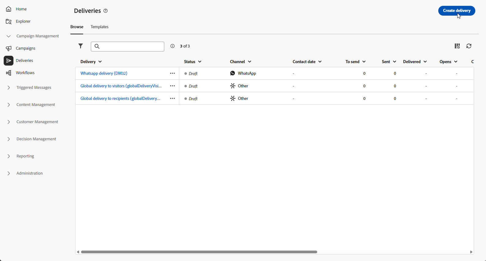
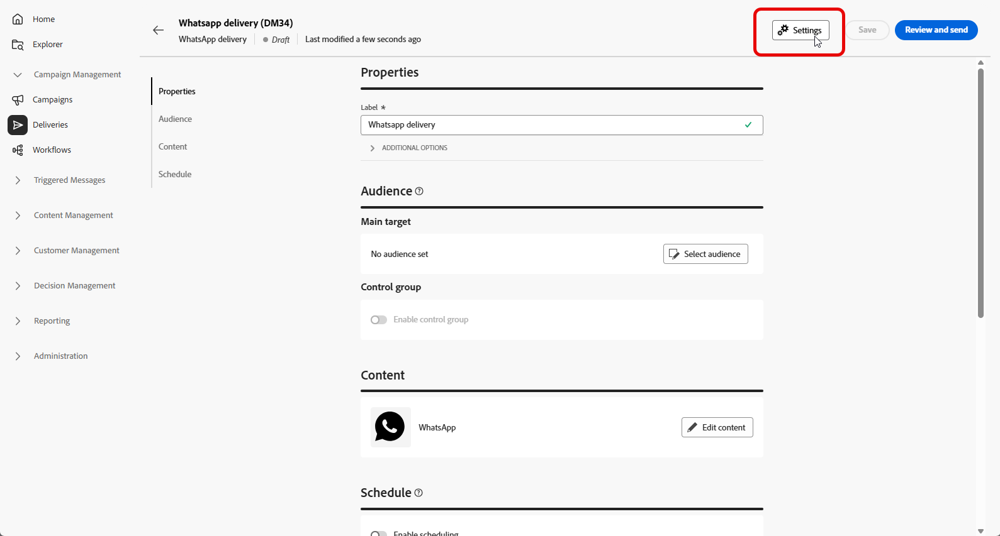

# Créer un message WhatsApp {#create-whatsapp}

L’**interface d’utilisation d’Adobe Campaign Web** vous permet de concevoir des messages WhatsApp qui utilisent des modèles approuvés par Meta, de les personnaliser pour chaque profil et de les tester avant de les envoyer.

+++ En savoir plus sur les éléments de message pris en charge et les appels à l’action

Les types de messages pris en charge dans WhatsApp sont les suivants :

| Fonctionnalité de message | Description |
|-|-|
| En-têtes | Texte facultatif qui apparaît au-dessus du corps de votre message. |
| Texte | Prend en charge le contenu dynamique par le biais de paramètres. |
| Image d’en-tête | Image facultative qui apparaît au-dessus du corps de votre message. |
| Corps de texte | Prend en charge le contenu dynamique par le biais de paramètres. |
| Texte du pied de page | Prend en charge le contenu dynamique par le biais de paramètres. |

+++

## Créer une diffusion WhatsApp {#create-whatsapp-journey-campaign}

>[!IMPORTANT]
>
>Les commentaires des messages WhatsApp ne sont actuellement pas pris en charge.

Dans l’interface d’utilisation d’Adobe Campaign Web, procédez comme suit pour créer une diffusion WhatsApp autonome.

1. Parcourez le menu **[!UICONTROL Diffusions]** et cliquez sur **[!UICONTROL Créer une diffusion]**.

   

1. Choisissez **[!UICONTROL WhatsApp]** et sélectionnez un modèle de diffusion.[En savoir plus sur les modèles](../msg/delivery-template.md).

   

1. Cliquez sur **[!UICONTROL Créer une diffusion]** pour confirmer.

1. Cliquez sur **[!UICONTROL Paramètres]** pour accéder aux options avancées liées à votre modèle.[En savoir plus](../advanced-settings/delivery-settings.md)

   

1. Saisissez le **[!UICONTROL libellé]** de la diffusion. Utilisez **[!UICONTROL Options supplémentaires]** si vous avez besoin d’un nom interne, d’un dossier, d’un code de diffusion, d’une description ou d’une nature, selon le même modèle que les autres canaux.

1. Cliquez sur **[!UICONTROL Sélectionner une audience]** pour cibler une audience existante ou en créer une.[En savoir plus sur les audiences](../audience/about-recipients.md).

1. Cliquez sur **[!UICONTROL Modifier le contenu]** pour ouvrir l’éditeur de contenu WhatsApp, reportez-vous à [Définir votre contenu WhatsApp](#whatsapp-content)).

   

1. Vous pouvez activer **[!UICONTROL Activer la planification]** pour effectuer l’envoi à une date et une heure spécifiques.[En savoir plus](../msg/gs-deliveries.md#gs-schedule).

## Définir votre contenu WhatsApp{#whatsapp-content}

>[!BEGINSHADEBOX]

Avant de concevoir votre message WhatsApp dans l’interface d’utilisation d’Adobe Campaign Web, créez et envoyez votre modèle dans Meta.[En savoir plus](https://www.facebook.com/business/help/2055875911147364?id=2129163877102343)

Votre modèle WhatsApp doit être approuvé par Meta avant utilisation.L’approbation prend souvent quelques heures, mais peut prendre jusqu’à 24 heures.[En savoir plus](https://developers.facebook.com/docs/whatsapp/message-templates/guidelines/#approval-process)

>[!ENDSHADEBOX]

1. Sur la page de configuration de la diffusion dans l’interface d’utilisation d’Adobe Campaign Web, cliquez sur **[!UICONTROL Modifier le contenu]** pour configurer le message WhatsApp.

1. Choisissez Marketing comme **catégorie de modèles** :

   [En savoir plus sur les catégories de modèles](https://developers.facebook.com/docs/whatsapp/updates-to-pricing/new-template-guidelines/#template-category-guidelines)

   

1. Dans le menu déroulant **Modèle WhatsApp**, sélectionnez votre modèle approuvé par Meta.

   [Découvrez comment créer des modèles WhatsApp.](https://www.facebook.com/business/help/2055875911147364?id=2129163877102343)

   

1. Si votre modèle approuvé par Meta comprend une image, fournissez l’**[!UICONTROL URL de l’image]**.

   

1. Dans le champ **Espace réservé de personnalisation**, utilisez l’éditeur de personnalisation pour mapper les champs et expressions de profil aux paramètres du modèle.[En savoir plus](../personalization/personalize.md).

   

Lorsque le message est prêt :

* **Diffusion autonome ou de campagne** : utilisez **[!UICONTROL Vérifier et envoyer]** et **[!UICONTROL Envoyer]** dans le tableau de bord de la diffusion.

* **Workflow** : ouvrez la diffusion à partir de l’activité de workflow lorsque l’exécution la rend disponible, puis utilisez le tableau de bord de diffusion de la même manière.[En savoir plus](../workflows/start-monitor-workflows.md)

Vous pouvez ensuite suivre les résultats à partir des points d’entrée **[!UICONTROL Rapports]** de la diffusion et [rapports de diffusion](../reporting/delivery-reports.md).
