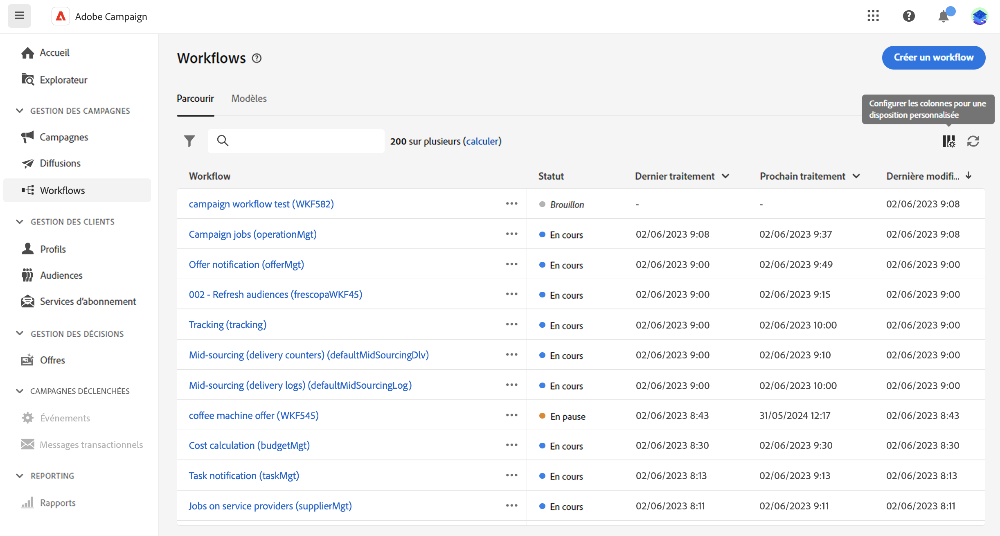

# Accéder et gérer des workflows {#access-monitor}

>[!CONTEXTUALHELP]
>id="acw_targeting_workflow_list"
>title="Workflows"
>abstract="Sur cet écran, vous pouvez accéder à la liste complète des workflows autonomes et de campagne, vérifier leur statut actuel, les dates de dernière/prochaine exécution et créer un nouveau workflow. Rendez-vous sur l’onglet « Modèles » pour accéder aux modèles de workflow disponibles."

Le menu **[!UICONTROL Workflows]** vous permet d’accéder à la liste complète des workflows. Les **workflows autonomes**, créés à partir de cet écran et les **workflows de campagne**, créés dans une campagne, sont répertoriés.

{zoomable="yes"}

Chaque workflow de la liste affiche des informations sur son [statut](#status) en cours, la dernière fois qu’il a été exécuté ou modifié, ainsi que la date et l’heure de la prochaine exécution planifiée.

Vous pouvez personnaliser les colonnes affichées en cliquant sur l’icône **[!UICONTROL Configurer la colonne pour une disposition personnalisée]**, située dans le coin supérieur droit de la liste. Vous pouvez ainsi ajouter des informations supplémentaires à la liste, telles que la dernière activité à avoir rencontré une erreur pour chaque workflow ou la dimension de ciblage appliquée.

Une barre de recherche et des filtres sont également disponibles pour faciliter la recherche dans la liste. Vous pouvez par exemple filtrer les workflows afin de n’afficher que ceux appartenant à une campagne ou ceux traités au cours d’une période spécifique.

Pour dupliquer ou supprimer un workflow, cliquez sur le bouton représentant des points de suspension et sélectionnez **[!UICONTROL Dupliquer]** ou **[!UICONTROL Supprimer]**.

>[!NOTE]
>
>Vous pouvez dupliquer un workflow en cours, mais vous ne pouvez pas le supprimer.

## Statuts des workflows {#status}

Les workflows peuvent adopter plusieurs statuts :

* **[!UICONTROL Brouillon]** : le workflow a été créé et enregistré.
* **[!UICONTROL En cours]** : le workflow est en cours d’exécution.
* **[!UICONTROL Terminé]** : l’exécution du workflow est terminée.
* **[!UICONTROL En pause]** : le workflow a été suspendu.
* **[!UICONTROL Avec erreur]** : le workflow a rencontré une erreur. Ouvrez le workflow et consultez les logs et tâches pour identifier l’erreur et la résoudre. [Découvrez comment surveiller les logs et les tâches.](start-monitor-workflows.md#logs-tasks)

Pour obtenir des informations détaillées sur le démarrage et la surveillance de l’exécution des workflows, consultez [cette page](start-monitor-workflows.md).

## Modèles de workflows {#templates}

L’onglet **[!UICONTROL Modèles]** répertorie tous les modèles de workflows disponibles.

Les modèles de workflow contiennent des activités préconfigurées et des configurations globales des propriétés qui peuvent être réutilisées pour créer de nouveaux workflows.

Vous pouvez créer des modèles de workflow à partir d’un workflow existant ou à partir de zéro. [Découvrez comment créer des modèles de workflow](create-workflow.md#workflow-templates).
