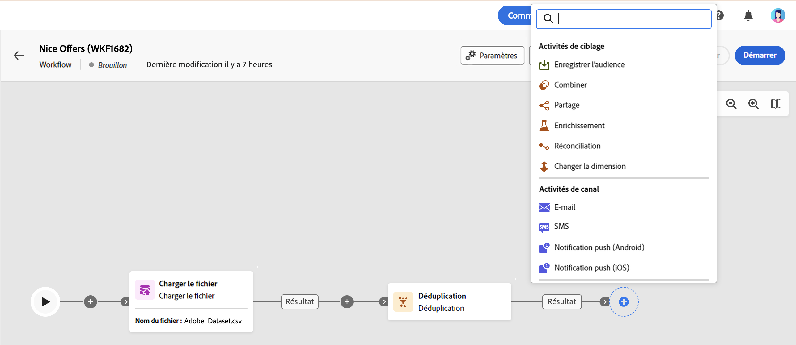

# À propos des activités de workflows {#workflow-activities}

Les activités de workflows sont regroupées en trois catégories. Selon le contexte, les activités disponibles peuvent différer.

Toutes les activités sont présentées dans les sections ci-dessous :

* [Activités de ciblage](#targeting)
* [Activités de canal](#channel)
* [Activités de contrôle de flux](#flow-control)

## Activités de ciblage {#targeting}

Ces activités sont spécifiques au ciblage, à la manipulation et à l’enrichissement des données relatives à la population. Elles permettent de construire une ou plusieurs cibles en définissant une audience, puis en partageant ou en combinant ces audiences à l’aide des opérations d’intersection, d’union ou d’exclusion.

* L&#39;activité [Sauvegarde d&#39;audience](save-audience.md) permet de mettre à jour une audience existante ou de créer une nouvelle audience à partir de la population calculée en amont dans un workflow.
* L’activité [Créer une audience](build-audience.md) vous permet de définir votre population cible. Vous pouvez sélectionner une audience existante ou utiliser le créateur de règles pour définir votre propre requête.
* L’activité [Combiner](combine.md) permet d’effectuer une segmentation sur votre population entrante. Vous pouvez utiliser une union, une intersection ou une exclusion.
* L’activité [Partage](split.md) permet de segmenter la population entrante en plusieurs sous-ensembles.
* L’activité [Enrichissement](enrichment.md) vous permet de définir des données supplémentaires à traiter dans votre workflow. Avec cette activité, vous pouvez utiliser la transition entrante et configurer l’activité pour ajouter des données supplémentaires à la transition sortante.
* L&#39;activité [Déduplication](deduplication.md) permet de supprimer les doublons dans le ou les résultats des activités entrantes.
* La variable [Changement de dimension](change-dimension.md) l&#39;activité vous permet de modifier la dimension de ciblage au fur et à mesure que vous créez votre workflow.

## Activités de canal {#channel}

Adobe Campaign Web vous permet d’automatiser et d’exécuter des campagnes marketing sur plusieurs canaux, tels que les e-mails, les SMS ou les notifications push. Vous pouvez combiner des activités de canal dans la zone de travail afin de créer des workflows cross-canal pouvant déclencher des actions en fonction du comportement de la clientèle.

Les activités **Canal** suivantes sont disponibles :

* E-mail
* Notification push
* SMS

Reportez-vous à cette [section](channels.md).

## Activités de contrôle de flux {#flow-control}

>[!CONTEXTUALHELP]
>id="acw_orchestration_end"
>title="Activité Fin"
>abstract="L’activité **Fin** vous permet de marquer graphiquement la fin d’un workflow. Cette activité n’a aucun impact fonctionnel et est donc facultative."

Les activités ci-après sont spécifiques à l’organisation et à l’exécution du workflow. Leur principale tâche est de coordonner les autres activités :

* La variable [Planificateur](scheduler.md) l’activité vous permet de planifier le démarrage du workflow.
* L’activité [Rendez-vous](and-join.md) vous permet de synchroniser plusieurs branches d’exécution d’un workflow.
* L’activité **Fin** vous permet de marquer graphiquement la fin d’un workflow. Cette activité n’a aucun impact fonctionnel et est donc facultative.
* L’activité [Branchement](fork.md) permet de créer des transitions sortantes afin de lancer plusieurs activités en parallèle.
* L’activité [Attente](wait.md) permet de suspendre momentanément l’exécution d’une partie d’un workflow.

<!--
## Data management activities {#data-management}

overview: what they're used for
which use case you can perform with them

list available activites + short description + ref to section
-->

