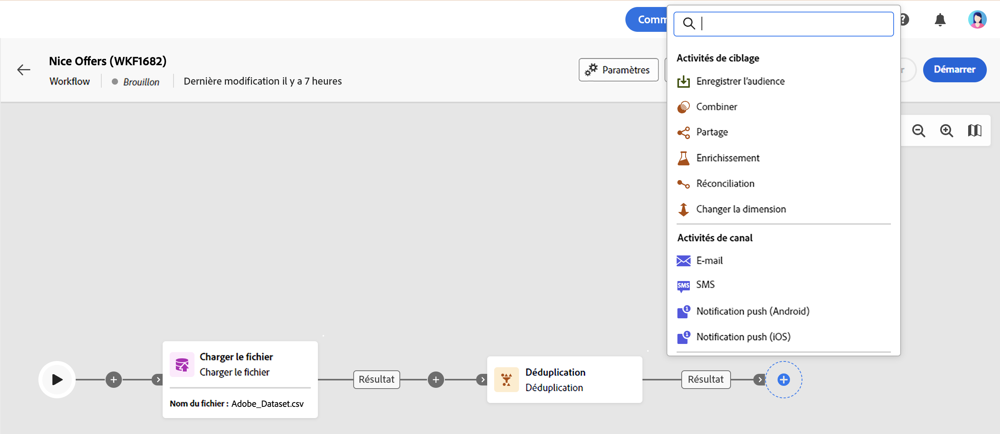

<?xml version="1.0" encoding="UTF-8"?>
<xliff xmlns="urn:oasis:names:tc:xliff:document:1.2" xmlns:okp="okapi-framework:xliff-extensions" xmlns:its="http://www.w3.org/2005/11/its" xmlns:itsxlf="http://www.w3.org/ns/its-xliff/" version="1.2" its:version="2.0">
<file original="help/v8/workflows/activities/about-activities.md.mdsc" source-language="en-US" target-language="en-XX" datatype="x-text/markdown">
<body>
<trans-unit id="tu1" restype="x-YAML_METADATA_HEADER_VALUE" xml:space="preserve">
<source xml:lang="en-US">Work with workflows activities</source>
<target xml:lang="en-XX">Utiliser les activités de workflows</target>
</trans-unit>
<trans-unit id="tu2" restype="x-YAML_METADATA_HEADER_VALUE" xml:space="preserve">
<source xml:lang="en-US">Learn how to workflow activities</source>
<target xml:lang="en-XX">Découvrez les activités de workflows.</target>
</trans-unit>
<trans-unit id="tu3" xml:space="preserve">
<source xml:lang="en-US">About workflow activities</source>
<target xml:lang="en-XX">À propos des activités de workflows</target>
</trans-unit>
<trans-unit id="tu4" xml:space="preserve">
<source xml:lang="en-US">Workflow activities are grouped into three categories. Depending on the context, available activities may differ.</source>
<target xml:lang="en-XX">Les activités de workflows sont regroupées en trois catégories. Selon le contexte, les activités disponibles peuvent différer.</target>
</trans-unit>
<trans-unit id="tu5" xml:space="preserve">
<source xml:lang="en-US">All activities are detailed in the sections below:</source>
<target xml:lang="en-XX">Toutes les activités sont présentées dans les sections ci-dessous :</target>
</trans-unit>
<trans-unit id="tu6" xml:space="preserve">
<source xml:lang="en-US">Targeting and data management activities</source>
<target xml:lang="en-XX">Activités de ciblage et de gestion des données</target>
</trans-unit>
<trans-unit id="tu7" xml:space="preserve">
<source xml:lang="en-US">Channel activities</source>
<target xml:lang="en-XX">Activités de canal</target>
</trans-unit>
<trans-unit id="tu8" xml:space="preserve">
<source xml:lang="en-US">Flow control activities</source>
<target xml:lang="en-XX">Activités de contrôle de flux</target>
</trans-unit>
<trans-unit id="tu9" xml:space="preserve">
<source xml:lang="en-US"><ph id="1" ctype="x-IMAGE"></ph></source>
<target xml:lang="en-XX"><ph id="1" ctype="x-IMAGE"></ph></target>
</trans-unit>
<trans-unit id="tu10" xml:space="preserve">
<source xml:lang="en-US">Targeting activities</source>
<target xml:lang="en-XX">Activités de ciblage</target>
</trans-unit>
<trans-unit id="tu11" xml:space="preserve">
<source xml:lang="en-US">These activities are specific to targeting. They allow you to build one or more target audiences by defining an audience and splitting or combining these audiences using intersection, union, or exclusion operations.</source>
<target xml:lang="en-XX">Ces activités sont spécifiques au ciblage. Elles permettent de créer une ou plusieurs audiences cibles en définissant une audience, puis en divisant ou en combinant ces audiences à l’aide des opérations d’intersection, d’union ou d’exclusion.</target>
</trans-unit>
<trans-unit id="tu12" xml:space="preserve">
<source xml:lang="en-US"><ph id="1" ctype="x-LINK">[</ph>Build audience<ph id="2" ctype="x-LINK">](build-audience.md)</ph>: Define your target population. Select an existing audience or use the query modeler to define your own query. You can also configure <ph id="3" ctype="x-STRONG_EMPHASIS">**</ph>Enrichment data<ph id="4" ctype="x-STRONG_EMPHASIS">**</ph> (available for queries).</source>
<target xml:lang="en-XX"><ph id="1" ctype="x-LINK">[</ph>Créer une audience<ph id="2" ctype="x-LINK">](build-audience.md)</ph> : définissez votre population cible. Sélectionnez une audience existante ou utilisez le concepteur de requête pour définir votre propre requête. Vous pouvez également configurer les <ph id="3" ctype="x-STRONG_EMPHASIS">**</ph>Données d’enrichissement<ph id="4" ctype="x-STRONG_EMPHASIS">**</ph> (disponible pour les requêtes).</target>
</trans-unit>
<trans-unit id="tu13" xml:space="preserve">
<source xml:lang="en-US"><ph id="1" ctype="x-LINK">[</ph>Change data source<ph id="2" ctype="x-LINK">](change-data-source.md)</ph>: Change the data source for the working table of your workflow.</source>
<target xml:lang="en-XX"><ph id="1" ctype="x-LINK">[</ph>Modifier la source de données<ph id="2" ctype="x-LINK">](change-data-source.md)</ph> : modifiez la source de données de la table de travail de votre workflow.</target>
</trans-unit>
<trans-unit id="tu14" xml:space="preserve">
<source xml:lang="en-US"><ph id="1" ctype="x-LINK">[</ph>Change dimension<ph id="2" ctype="x-LINK">](change-dimension.md)</ph>: Change the targeting dimension while building your workflow.</source>
<target xml:lang="en-XX"><ph id="1" ctype="x-LINK">[</ph>Changement de dimension<ph id="2" ctype="x-LINK">](change-dimension.md)</ph> : modifiez la dimension de ciblage lors de la création de votre workflow.</target>
</trans-unit>
<trans-unit id="tu15" xml:space="preserve">
<source xml:lang="en-US"><ph id="1" ctype="x-LINK">[</ph>Combine<ph id="2" ctype="x-LINK">](combine.md)</ph>: Perform segmentation on your inbound population. Use a union, an intersection, or an exclusion.</source>
<target xml:lang="en-XX"><ph id="1" ctype="x-LINK">[</ph>Combiner<ph id="2" ctype="x-LINK">](combine.md)</ph> : effectuez une segmentation sur votre population entrante. Utilisez une union, une intersection ou une exclusion.</target>
</trans-unit>
<trans-unit id="tu16" xml:space="preserve">
<source xml:lang="en-US"><ph id="1" ctype="x-LINK">[</ph>Deduplication<ph id="2" ctype="x-LINK">](deduplication.md)</ph>: Remove duplicates in the results of inbound activities.</source>
<target xml:lang="en-XX"><ph id="1" ctype="x-LINK">[</ph>Déduplication<ph id="2" ctype="x-LINK">](deduplication.md)</ph> : supprimez les doublons dans les résultats des activités entrantes.</target>
</trans-unit>
<trans-unit id="tu17" xml:space="preserve">
<source xml:lang="en-US"><ph id="1" ctype="x-LINK">[</ph>Enrichment<ph id="2" ctype="x-LINK">](enrichment.md)</ph>: Define additional data to process in your workflow. Configure the activity to complete the output transition with additional data.</source>
<target xml:lang="en-XX"><ph id="1" ctype="x-LINK">[</ph>Enrichissement<ph id="2" ctype="x-LINK">](enrichment.md)</ph> : définissez des données supplémentaires à traiter dans votre workflow. Configurez l’activité pour terminer la transition sortante avec des données supplémentaires.</target>
</trans-unit>
<trans-unit id="tu18" xml:space="preserve">
<source xml:lang="en-US"><ph id="1" ctype="x-LINK">[</ph>Incremental query<ph id="2" ctype="x-LINK">](incremental-query.md)</ph>: Query the database on a scheduled basis. Each time this activity runs, it excludes results from previous executions, targeting only new elements.</source>
<target xml:lang="en-XX"><ph id="1" ctype="x-LINK">[</ph>Requête incrémentale<ph id="2" ctype="x-LINK">](incremental-query.md)</ph> : interrogez la base de données à des moments planifiés. Chaque fois que cette activité s’exécute, elle exclut les résultats des exécutions précédentes, et ne cible que les nouveaux éléments.</target>
</trans-unit>
<trans-unit id="tu19" xml:space="preserve">
<source xml:lang="en-US"><ph id="1" ctype="x-LINK">[</ph>Reconciliation<ph id="2" ctype="x-LINK">](reconciliation.md)</ph>: Define the link between the data in the Adobe Campaign database and the data in a work table, such as data loaded from an external file.</source>
<target xml:lang="en-XX"><ph id="1" ctype="x-LINK">[</ph>Réconciliation<ph id="2" ctype="x-LINK">](reconciliation.md)</ph> : définissez le lien entre les données de la base de données d’Adobe Campaign et les données d’une table de travail, par exemple les données chargées à partir d’un fichier externe.</target>
</trans-unit>
<trans-unit id="tu20" xml:space="preserve">
<source xml:lang="en-US"><ph id="1" ctype="x-LINK">[</ph>Save audience<ph id="2" ctype="x-LINK">](save-audience.md)</ph>: Update an existing audience or create a new audience from the population computed upstream in a workflow.</source>
<target xml:lang="en-XX"><ph id="1" ctype="x-LINK">[</ph>Enregistrer l’audience<ph id="2" ctype="x-LINK">](save-audience.md)</ph> : mettez à jour une audience existante ou créez une nouvelle audience à partir de la population calculée en amont dans un workflow.</target>
</trans-unit>
<trans-unit id="tu21" xml:space="preserve">
<source xml:lang="en-US"><ph id="1" ctype="x-LINK">[</ph>Split<ph id="2" ctype="x-LINK">](split.md)</ph>: Segment the incoming population into several subsets.</source>
<target xml:lang="en-XX"><ph id="1" ctype="x-LINK">[</ph>Partage<ph id="2" ctype="x-LINK">](split.md)</ph> : segmentez la population entrante en plusieurs sous-ensembles.</target>
</trans-unit>
<trans-unit id="tu22" xml:space="preserve">
<source xml:lang="en-US">Data management activities</source>
<target xml:lang="en-XX">Activités de Data Management</target>
</trans-unit>
<trans-unit id="tu23" xml:space="preserve">
<source xml:lang="en-US">These activities are specific to manipulating and enriching population data.</source>
<target xml:lang="en-XX">Ces activités sont spécifiques à la manipulation et à l’enrichissement des données de population.</target>
</trans-unit>
<trans-unit id="tu24" xml:space="preserve">
<source xml:lang="en-US"><ph id="1" ctype="x-LINK">[</ph>Data loading (RDBMS)<ph id="2" ctype="x-LINK">](data-loading-rdbms.md)</ph>: Load data directly from an external relational database into your workflow.</source>
<target xml:lang="en-XX"><ph id="1" ctype="x-LINK">[</ph>Chargement des données (SGBD)<ph id="2" ctype="x-LINK">](data-loading-rdbms.md)</ph> : chargez des données directement depuis une base de données relationnelle externe dans votre workflow.</target>
</trans-unit>
<trans-unit id="tu25" xml:space="preserve">
<source xml:lang="en-US"><ph id="1" ctype="x-LINK">[</ph>Extract file<ph id="2" ctype="x-LINK">](extract-file.md)</ph>: Export data from Adobe Campaign to another system as an external file.</source>
<target xml:lang="en-XX"><ph id="1" ctype="x-LINK">[</ph>Extraction de fichier<ph id="2" ctype="x-LINK">](extract-file.md)</ph> : exportez des données à partir d’Adobe Campaign vers un autre système sous la forme d’un fichier externe.</target>
</trans-unit>
<trans-unit id="tu26" xml:space="preserve">
<source xml:lang="en-US"><ph id="1" ctype="x-LINK">[</ph>Load file<ph id="2" ctype="x-LINK">](load-file.md)</ph>: Work with profiles and data stored in an external file.</source>
<target xml:lang="en-XX"><ph id="1" ctype="x-LINK">[</ph>Chargement de fichier<ph id="2" ctype="x-LINK">](load-file.md)</ph> : utilisez des profils et des données stockés dans un fichier externe.</target>
</trans-unit>
<trans-unit id="tu27" xml:space="preserve">
<source xml:lang="en-US"><ph id="1" ctype="x-LINK">[</ph>Transfer file<ph id="2" ctype="x-LINK">](transfer-file.md)</ph>: Receive or send files, test for file presence, or list files on a server. The protocol used can be either server-to-server protocol or HTTP protocol.</source>
<target xml:lang="en-XX"><ph id="1" ctype="x-LINK">[</ph>Transfert de fichier<ph id="2" ctype="x-LINK">](transfer-file.md)</ph> : recevez ou envoyez des fichiers, testez la présence de fichiers ou répertoriez les fichiers sur un serveur. Le protocole utilisé peut être soit un protocole serveur à serveur, soit un protocole HTTP.</target>
</trans-unit>
<trans-unit id="tu28" xml:space="preserve">
<source xml:lang="en-US"><ph id="1" ctype="x-LINK">[</ph>JavaScript code<ph id="2" ctype="x-LINK">](javascript-code.md)</ph>: Execute a JavaScript code snippet within the context of a workflow.</source>
<target xml:lang="en-XX"><ph id="1" ctype="x-LINK">[</ph>Code JavaScript<ph id="2" ctype="x-LINK">](javascript-code.md)</ph> : exécutez un fragment de code JavaScript dans le contexte d’un workflow.</target>
</trans-unit>
<trans-unit id="tu29" xml:space="preserve">
<source xml:lang="en-US"><ph id="1" ctype="x-LINK">[</ph>Subscription services<ph id="2" ctype="x-LINK">](subscription-services.md)</ph>: Subscribe or unsubscribe multiple profiles to or from a service in a single action.</source>
<target xml:lang="en-XX"><ph id="1" ctype="x-LINK">[</ph>Services d’abonnement<ph id="2" ctype="x-LINK">](subscription-services.md)</ph> : abonnez plusieurs profils à un service ou désabonnez-les de ce service en une seule action.</target>
</trans-unit>
<trans-unit id="tu30" xml:space="preserve">
<source xml:lang="en-US"><ph id="1" ctype="x-LINK">[</ph>Update data<ph id="2" ctype="x-LINK">](update-data.md)</ph>: Perform mass updates on fields in the database. Several options allow you to personalize the data update.</source>
<target xml:lang="en-XX"><ph id="1" ctype="x-LINK">[</ph>Mise à jour des données<ph id="2" ctype="x-LINK">](update-data.md)</ph> : effectuez des mises à jour en masse des champs de la base de données. Plusieurs options vous permettent de personnaliser la mise à jour des données.</target>
</trans-unit>
<trans-unit id="tu31" xml:space="preserve">
<source xml:lang="en-US">Channel activities</source>
<target xml:lang="en-XX">Activités de canal</target>
</trans-unit>
<trans-unit id="tu32" xml:space="preserve">
<source xml:lang="en-US">Adobe Campaign Web allows you to automate and execute marketing campaigns across multiple channels. Combine channel activities into the canvas to create cross-channel workflows that trigger actions based on customer behavior. The following <ph id="1" ctype="x-STRONG_EMPHASIS">**</ph>Channel<ph id="2" ctype="x-STRONG_EMPHASIS">**</ph> activities are available: Email, SMS, Android, and iOS Push notifications. <ph id="3" ctype="x-LINK">[</ph>Learn how to set up a delivery in the context of a workflow<ph id="4" ctype="x-LINK">](channels.md)</ph>.</source>
<target xml:lang="en-XX">Adobe Campaign Web vous permet d’automatiser et d’exécuter des campagnes marketing sur plusieurs canaux. Combinez des activités de canal dans la zone de travail afin de créer des workflows cross-canal qui déclenchent des actions en fonction du comportement du client ou de la cliente. Les activités <ph id="1" ctype="x-STRONG_EMPHASIS">**</ph>Canal<ph id="2" ctype="x-STRONG_EMPHASIS">**</ph> suivantes sont disponibles : e-mail, SMS, notifications push Android et iOS. <ph id="3" ctype="x-LINK">[</ph>Découvrez comment configurer une diffusion dans le contexte d’un workflow<ph id="4" ctype="x-LINK">](channels.md)</ph>.</target>
</trans-unit>
<trans-unit id="tu33" xml:space="preserve">
<source xml:lang="en-US">Flow control activities</source>
<target xml:lang="en-XX">Activités de contrôle de flux</target>
</trans-unit>
<trans-unit id="tu34" xml:space="preserve">
<source xml:lang="en-US">End activity</source>
<target xml:lang="en-XX">Activité Fin</target>
</trans-unit>
<trans-unit id="tu35" xml:space="preserve">
<source xml:lang="en-US">The <ph id="1" ctype="x-STRONG_EMPHASIS">**</ph>Start<ph id="2" ctype="x-STRONG_EMPHASIS">**</ph> activity allows you to graphically mark the start of a workflow. This activity has no functional impact and is therefore optional.</source>
<target xml:lang="en-XX">L’activité <ph id="1" ctype="x-STRONG_EMPHASIS">**</ph>Début<ph id="2" ctype="x-STRONG_EMPHASIS">**</ph> vous permet de marquer graphiquement le début d’un workflow. Cette activité n’a aucun impact fonctionnel et est donc facultative.</target>
</trans-unit>
<trans-unit id="tu36" xml:space="preserve">
<source xml:lang="en-US">The following activities are specific to organizing and executing workflows. Their main task is to coordinate the other activities:</source>
<target xml:lang="en-XX">Les activités ci-après sont spécifiques à l’organisation et à l’exécution des workflows. Leur principale tâche est de coordonner les autres activités :</target>
</trans-unit>
<trans-unit id="tu37" xml:space="preserve">
<source xml:lang="en-US"><ph id="1" ctype="x-LINK">[</ph>Approval<ph id="2" ctype="x-LINK">](approval.md)</ph>: Assign a task to a group or an individual operator, and route the workflow based on their answer.</source>
<target xml:lang="en-XX"><ph id="1" ctype="x-LINK">[</ph>Validation<ph id="2" ctype="x-LINK">](approval.md)</ph> : affectez une tâche à un groupe, à un opérateur individuel ou à une opératrice individuelle, et acheminez le workflow en fonction de sa réponse.</target>
</trans-unit>
<trans-unit id="tu38" xml:space="preserve">
<source xml:lang="en-US"><ph id="1" ctype="x-LINK">[</ph>External signal<ph id="2" ctype="x-LINK">](external-signal.md)</ph>: Trigger the execution of a workflow from another workflow or an API call.</source>
<target xml:lang="en-XX"><ph id="1" ctype="x-LINK">[</ph>Signal externe<ph id="2" ctype="x-LINK">](external-signal.md)</ph> : déclenchez l’exécution d’un workflow à partir d’un autre workflow ou d’un appel API.</target>
</trans-unit>
<trans-unit id="tu39" xml:space="preserve">
<source xml:lang="en-US"><ph id="1" ctype="x-LINK">[</ph>Fork<ph id="2" ctype="x-LINK">](fork.md)</ph>: Create outbound transitions to start several activities simultaneously.</source>
<target xml:lang="en-XX"><ph id="1" ctype="x-LINK">[</ph>Branchement<ph id="2" ctype="x-LINK">](fork.md)</ph> : créez des transitions sortantes afin de lancer plusieurs activités simultanément.</target>
</trans-unit>
<trans-unit id="tu40" xml:space="preserve">
<source xml:lang="en-US"><ph id="1" ctype="x-LINK">[</ph>Join<ph id="2" ctype="x-LINK">](join.md)</ph>: Synchronize multiple execution branches of a workflow.</source>
<target xml:lang="en-XX"><ph id="1" ctype="x-LINK">[</ph>Jointure<ph id="2" ctype="x-LINK">](join.md)</ph> : synchronisez plusieurs branches d’exécution d’un workflow.</target>
</trans-unit>
<trans-unit id="tu41" xml:space="preserve">
<source xml:lang="en-US"><ph id="1" ctype="x-LINK">[</ph>Scheduler<ph id="2" ctype="x-LINK">](scheduler.md)</ph>: Schedule when the workflow starts.</source>
<target xml:lang="en-XX"><ph id="1" ctype="x-LINK">[</ph>Planificateur<ph id="2" ctype="x-LINK">](scheduler.md)</ph> : planifiez le moment de démarrage du workflow.</target>
</trans-unit>
<trans-unit id="tu42" xml:space="preserve">
<source xml:lang="en-US"><ph id="1" ctype="x-STRONG_EMPHASIS">**</ph>Start<ph id="2" ctype="x-STRONG_EMPHASIS">**</ph> and <ph id="3" ctype="x-LINK">[</ph>End<ph id="4" ctype="x-LINK">](end.md)</ph>: Graphically mark the beginning and end of a workflow. They are optional and have no functional impact on their own.</source>
<target xml:lang="en-XX"><ph id="1" ctype="x-STRONG_EMPHASIS">**</ph>Début<ph id="2" ctype="x-STRONG_EMPHASIS">**</ph> et <ph id="3" ctype="x-LINK">[</ph>Fin<ph id="4" ctype="x-LINK">](end.md)</ph> : marquent visuellement le début et la fin d’un workflow. Ces éléments sont facultatifs et n’ont aucun impact fonctionnel.</target>
</trans-unit>
<trans-unit id="tu43" xml:space="preserve">
<source xml:lang="en-US"><ph id="1" ctype="x-regxph" equiv-text="&lbrack;!NOTE">[!NOTE]</ph></source>
<target xml:lang="en-XX"><ph id="1" ctype="x-regxph" equiv-text="&lbrack;!NOTE">[!NOTE]</ph></target>
</trans-unit>
<trans-unit id="tu44" xml:space="preserve">
<source xml:lang="en-US">Note that the <ph id="1" ctype="x-STRONG_EMPHASIS">**</ph>Start<ph id="2" ctype="x-STRONG_EMPHASIS">**</ph> activity is automatically added to all workflows created before the 26.3 release. It is not inserted by default in new workflows.</source>
<target xml:lang="en-XX">Notez que l’activité <ph id="1" ctype="x-STRONG_EMPHASIS">**</ph>Début<ph id="2" ctype="x-STRONG_EMPHASIS">**</ph> est automatiquement ajoutée à tous les workflows créés avant la version 26.3. Cette activité n’est pas insérée par défaut dans les nouveaux workflows.</target>
</trans-unit>
<trans-unit id="tu45" xml:space="preserve">
<source xml:lang="en-US"><ph id="1" ctype="x-LINK">[</ph>Test<ph id="2" ctype="x-LINK">](test.md)</ph>: Enable transitions based on specified conditions.</source>
<target xml:lang="en-XX"><ph id="1" ctype="x-LINK">[</ph>Test<ph id="2" ctype="x-LINK">](test.md)</ph> : activez des transitions en fonction de conditions spécifiées.</target>
</trans-unit>
<trans-unit id="tu46" xml:space="preserve">
<source xml:lang="en-US"><ph id="1" ctype="x-LINK">[</ph>Wait<ph id="2" ctype="x-LINK">](wait.md)</ph>: Pause execution of a part of a workflow temporarily.</source>
<target xml:lang="en-XX"><ph id="1" ctype="x-LINK">[</ph>Attente<ph id="2" ctype="x-LINK">](wait.md)</ph> : suspendez temporairement l’exécution d’une partie d’un workflow.</target>
</trans-unit>
</body>
</file>
</xliff>