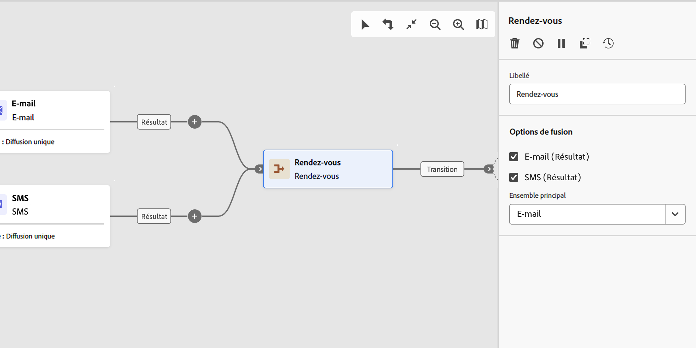

# Rendez-vous {#join}

>[!CONTEXTUALHELP]
>id="acw_orchestration_and-join"
>title="Activité Rendez-vous"
>abstract="L’activité **Rendez-vous** vous permet de synchroniser plusieurs branches d’exécution d’un workflow. Elle est déclenchée une fois toutes les activités précédentes terminées. Cela permet de s’assurer que certaines activités sont terminées avant de continuer à exécuter le workflow."

L’activité **Rendez-vous** est une activité de **contrôle de flux**. Il synchronise plusieurs branches d’exécution d’un workflow.

Cette activité ne déclenche sa transition sortante qu’une fois toutes les transitions entrantes activées. En d’autres termes, il s’active une fois toutes les activités précédentes terminées. Cela permet de s’assurer que certaines activités sont terminées avant de continuer à exécuter le workflow.

## Configurer l’activité Rendez-vous {#and-join-configuration}

>[!CONTEXTUALHELP]
>id="acw_orchestration_and-join_merging"
>title="Options de fusion"
>abstract="Sélectionnez les activités auxquelles vous souhaitez adhérer. Dans l’**Ensemble principal**, choisissez la population de transition entrante à conserver."

Pour configurer l’activité **Rendez-vous**, procédez comme suit :

1. Ajoutez plusieurs activités, telles que des activités de canal, pour former au moins deux branches d’exécution différentes.
1. Ajoutez une activité **Rendez-vous** à l’une des branches.
1. Dans la section **Options de fusion**, cochez toutes les activités précédentes à joindre.
1. Dans le menu déroulant Ensemble de Principal **** choisissez la population de transition entrante à conserver. La transition sortante ne peut contenir que l’une des populations de la transition entrante.

## Exemple {#and-join-example}

L’exemple ci-après montre deux branches d’un workflow avec une diffusion e-mail et SMS. L’activité Rendez-vous se déclenche lorsque les deux transitions entrantes sont activées. Les notifications push sont envoyées uniquement une fois les deux diffusions terminées.

{zoomable="yes"}