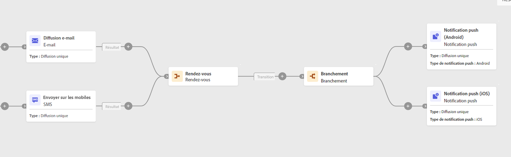

# Rendez-vous {#join}

Le **Et rejoindre** est une activité **Contrôle de flux** activité. Il permet de synchroniser plusieurs branches d&#39;exécution d&#39;un workflow.

Cette activité ne déclenche sa transition sortante qu&#39;une fois toutes les transitions entrantes activées, c&#39;est-à-dire une fois toutes les activités précédentes terminées. Vous pouvez ainsi vous assurer que certaines activités sont terminées avant de continuer à exécuter le workflow.

## Configuration

Procédez comme suit pour configurer la variable **AND-join** activité :

1. Ajoutez plusieurs activités telles que des activités de canal afin de former au moins deux branches d’exécution différentes.
1. Ajoutez un **AND-join** à l’une des branches.
1. Dans le **Options de fusion** , vérifiez toutes les activités précédentes que vous souhaitez rejoindre.
1. Dans le **Principal** , choisissez la population de transition entrante à conserver. La transition sortante ne peut contenir que l&#39;une des populations de la transition entrante.

## Exemple

L&#39;exemple suivant montre deux branches d&#39;un workflow avec une diffusion email et SMS. La jointure ET se déclenche lorsque les deux transitions entrantes sont activées. Les notifications push seront alors envoyées uniquement une fois les deux diffusions terminées.

