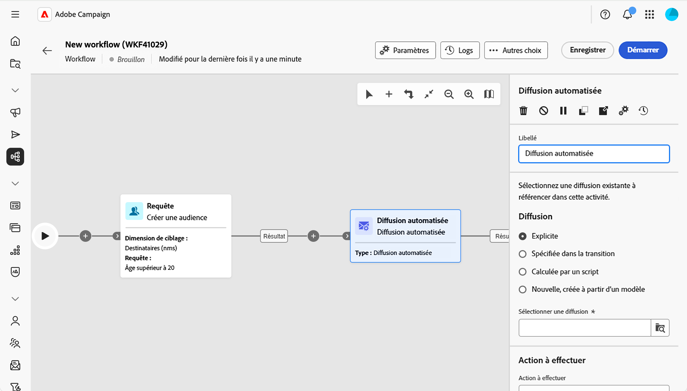
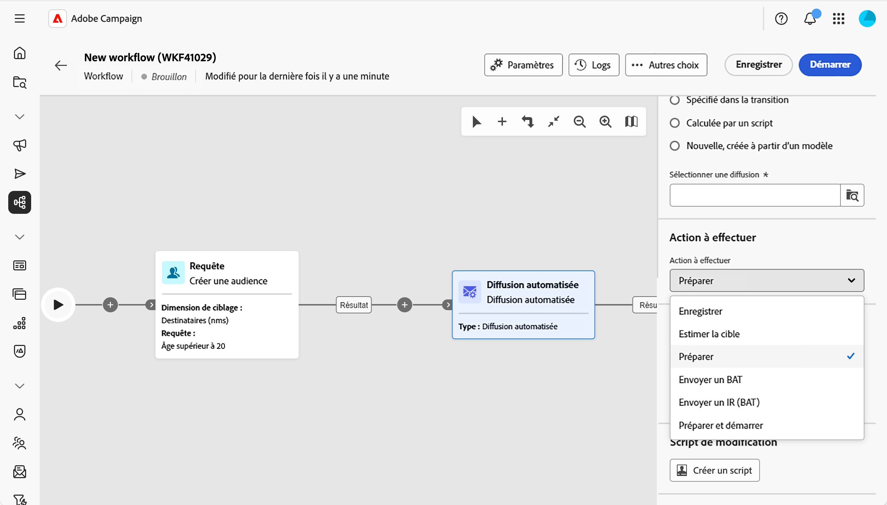
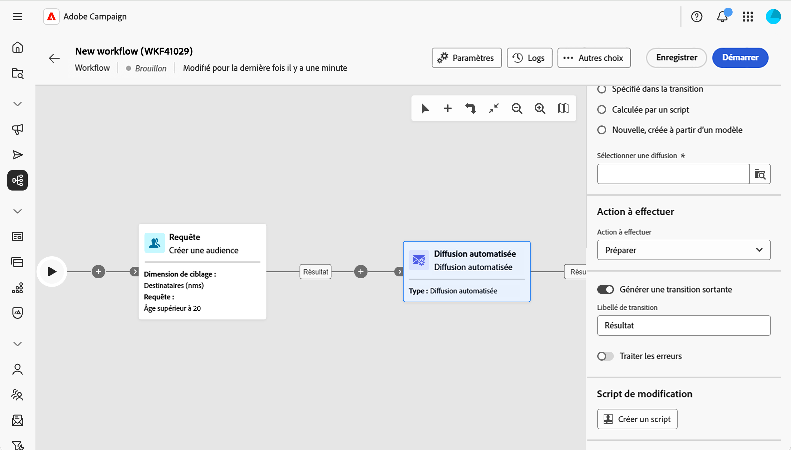

# Diffusion automatisée {#automated-delivery}

>[!CONTEXTUALHELP]
>id="acw_homepage_welcome_rn4"
>title="Activité de diffusion automatisée"
>abstract="L&#39;activité de workflow Diffusion automatisée est désormais disponible dans la palette du workflow. Vous pouvez l’utiliser pour créer ou exécuter des actions de diffusion (préparer, envoyer un BAT, préparer et démarrer, etc.) directement dans votre workflow."
>additional-url="https://experienceleague.adobe.com/docs/campaign-web/v8/release-notes/release-notes.html?lang=fr" text="Voir les notes de mise à jour"

>[!CONTEXTUALHELP]
>id="acw_orchestration_automated-delivery"
>title="Activité de diffusion automatisée"
>abstract="L&#39;activité **Diffusion automatisée** est utilisée à des fins d&#39;automatisation : créez ou réutilisez une diffusion dans votre workflow, puis choisissez l&#39;action à effectuer (préparer, préparer et démarrer, envoyer un bon à tirer, etc.). Vous pouvez sélectionner une diffusion explicite existante créée en dehors du workflow ou créer une diffusion à partir d’un modèle à chaque exécution de l’activité."

L&#39;activité **Diffusion automatisée** vous permet de créer, configurer et exécuter des actions de diffusion directement dans votre workflow. Utilisez-la lorsque vous souhaitez exécuter une diffusion prédéfinie selon un planning ou dans le cadre d’un flux automatisé, ou lorsque vous souhaitez générer une nouvelle diffusion à partir d’un modèle à chaque exécution de l’activité.

<!--
**[Continuous delivery](continuous-delivery.md)** always uses a template. The first run creates one delivery; later runs send to new recipients through that same delivery. **Automated delivery** is different: you either reuse one existing delivery every run, or you create a new delivery from a template each time—so each run can be its own delivery if you want. -->

Pour configurer cette activité, procédez comme suit :

1. Définir les paramètres de diffusion, [en savoir plus](#delivery-settings)
1. Sélectionnez l&#39;action à effectuer, [en savoir plus](#action-to-execute)
1. Configurer la transition, [en savoir plus](#transition-to-execute)
1. Définir un script de modification, [en savoir plus](#script)

## Définition des paramètres de diffusion {#delivery-settings}

Lorsque vous configurez l’activité, vous choisissez l’emplacement d’où provient la diffusion. Deux options sont disponibles dans cette section :

{zoomable="yes"}

* Sélectionnez **Diffusion explicite** lorsque vous souhaitez agir sur une diffusion existante, par exemple une diffusion autonome ou une diffusion créée à partir d&#39;une campagne. Sélectionnez la diffusion à l’aide du bouton **Sélectionner la diffusion**. Chaque fois que le workflow s’exécute et atteint cette activité, il agit sur **la même** diffusion. Aucune nouvelle diffusion n’est créée par exécution. L’activité réutilise la même diffusion. Cela s’avère utile lorsque vous souhaitez préparer ou envoyer plusieurs fois une seule diffusion, par exemple selon un planning ou après une étape de validation.

<!-- by default, the list shows unfinished deliveries in the Deliveries folder. You can browse other folders to select a delivery from another campaign. You choose the action to perform (prepare, prepare and start, send a proof, and so on).-->

* Sélectionnez **Nouvelle, créée depuis un modèle** lorsque vous souhaitez qu&#39;une diffusion **nouvelle** soit créée à chaque exécution de l&#39;activité. Sélectionnez le modèle de diffusion à l’aide du bouton **Sélectionner le modèle**. Chaque exécution génère une nouvelle diffusion basée sur ce modèle. Utilisez cette option lorsque chaque exécution de workflow doit entraîner sa propre diffusion distincte (par exemple, un e-mail par exécution).

<!-- Unlike the Continuous delivery activity, there is no “append” to a previous execution—each run produces a separate delivery. -->

>[!NOTE]
>
>Les options **Spécifiées dans la transition** et **Calculées par script**, utilisées pour les cas d’utilisation avancés, ne peuvent être configurées que dans la console cliente. Consultez la [documentation de Campaign v8](https://experienceleague.adobe.com/fr/docs/campaign/automation/workflows/wf-activities/action-activities/delivery){target="_blank"}.

## Sélectionner l’action à effectuer {#action-to-execute}

Dans cette section, choisissez l&#39;action de l&#39;activité sur la diffusion. Les options disponibles sont les suivantes :

{zoomable="yes"}

* **Enregistrer** : crée et enregistre la diffusion sans l’analyser ni l’envoyer.
* **Estimer la cible** : calcule la cible de la diffusion pour en évaluer le potentiel (première phase d&#39;analyse).
* **Préparer** : exécute l&#39;analyse complète (calcul de la cible et préparation du contenu). La diffusion n’est pas envoyée.
* **Envoyer un bon à tirer (BAT)** : envoie un BAT de la diffusion.
* **Préparer et démarrer** : exécute l&#39;analyse complète (calcul de la cible et préparation du contenu) et envoie la diffusion.

## Configurer la transition {#transition-to-execute}

Cette section vous permet de choisir si vous souhaitez générer des transitions après l’activité. Les options disponibles sont les suivantes :

{zoomable="yes"}

* **Générer une transition sortante** : génère une transition sortante à la fin de l’activité.
* **Libellé de la transition** : permet de personnaliser le libellé affiché sur la transition dans la zone de travail.
* **Traiter les erreurs** : ajoute une transition supplémentaire pour gérer les erreurs.

## Définition d’un script de modification {#script}

Vous pouvez utiliser un script pour modifier le comportement de l’activité, par exemple les paramètres de diffusion tels que le libellé de l’activité. Utilisez cette option lorsque vous avez besoin d’une logique personnalisée pour cette activité.

Cliquez sur **Créer un script** et écrivez votre logique de modification dans l’éditeur.

## Rubriques connexes : {#related}

* [À propos des activités de workflows](about-activities.md)
* [Diffusion continue](continuous-delivery.md)
* [Activités e-mail, SMS, notification push, courrier](channels.md)
* [Modèles de diffusion](../../msg/delivery-template.md)
