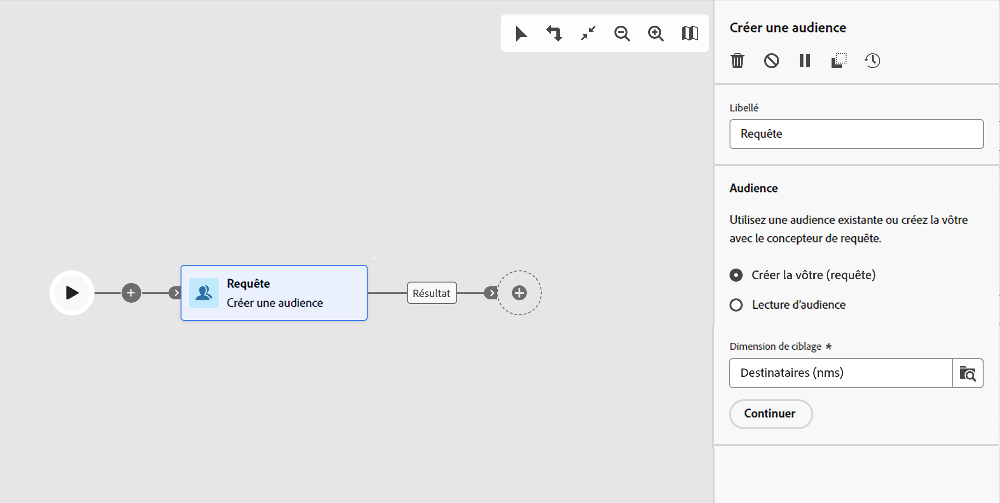
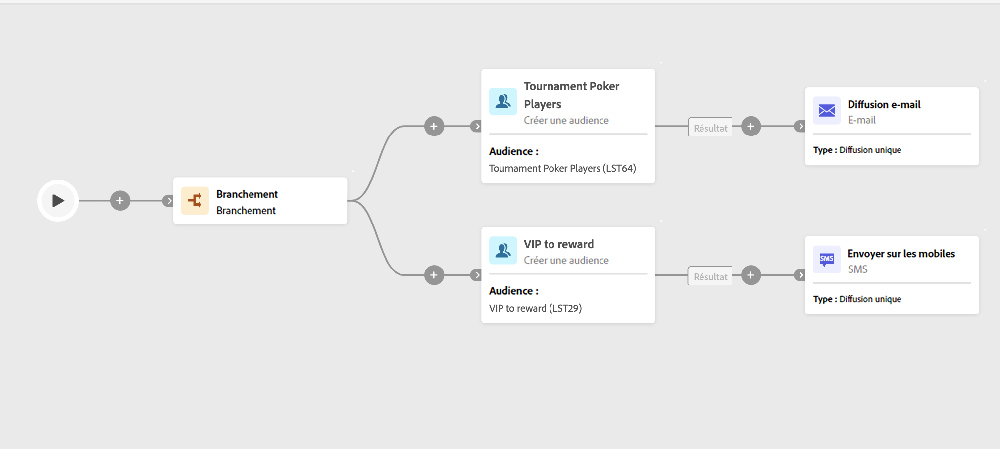

# Créer une audience {#build-audience}

>[!CONTEXTUALHELP]
>id="acw_orchestration_build_audience"
>title="Activité Créer une audience"
>abstract="L’activité **Créer une audience** permet de définir l’audience qui va entrer dans le workflow. Lors de l’envoi de messages dans le cadre d’un workflow, l’audience du message n’est pas définie dans l’activité de canal, mais dans l’activité **Créer une audience**."

L’activité **Créer une audience** est une activité de **ciblage**. Cette activité permet de définir l’audience qui va entrer dans le workflow. Lors de l’envoi de messages dans le cadre d’un workflow, l’audience du message n’est pas définie dans l’activité de canal, mais dans l’activité **Créer une audience**.

Pour définir la population de l’audience, vous pouvez :

* sélectionner une audience existante, créée sous forme de liste dans la console cliente ;
* sélectionner une audience Adobe Experience Platform ;
* Créez une audience à l’aide du concepteur de requête en définissant et en combinant des critères de filtrage.

>[!NOTE]
>
>Les audiences chargées à partir d’un fichier ne peuvent pas être ciblées à l’aide d’une activité Créer une audience. Pour ce faire, vous devez utiliser une activité **Charger un fichier** suivie d’une activité **Réconciliation**. [En savoir plus](../../audience/about-recipients.md)

<!--
The **Build audience** activity can be placed at the beginning of the workflow or after any other activity. Any activity can be placed after the **Build audience**.
-->

## Configurer l’activité Créer une audience {#build-audience-configuration}

>[!CONTEXTUALHELP]
>id="acw_orchestration_build_audience_audienceselector"
>title="Audience"
>abstract="Sélectionnez votre audience, de la même manière que vous utilisez une audience lors de la conception d’une nouvelle diffusion."

Pour configurer l’activité **Créer une audience**, procédez comme suit :

1. Ajoutez une activité **Créer une audience**.
1. Définissez un libellé.
1. Définissez le type d’audience : **Créer votre audience** ou **Lecture d’audience**.
1. Configurez votre audience en suivant les étapes présentées dans les onglets ci-dessous.

>[!BEGINTABS]

>[!TAB Créer votre propre (requête)]

Pour créer votre propre requête, procédez comme suit :

1. Sélectionnez **Créer la vôtre (requête)**.
1. Choisissez la **dimension de ciblage**. La dimension de ciblage vous permet de définir la population ciblée par l’opération, comme les personnes destinataires ou bénéficiaires d’un contrat, les opérateurs ou opératrices ou les personnes abonnées. Par défaut, la cible est sélectionnée parmi les personnes destinataires. [En savoir plus sur les dimensions de ciblage](../../audience/targeting-dimensions.md#targeting)
1. Sélectionnez la **Dimension de filtrage** en cliquant sur l’icône en regard de la dimension de ciblage. La dimension de filtrage permet d’appliquer des filtres à la population ciblée en référençant des critères associés sans modifier la dimension de ciblage principale. [En savoir plus sur les dimensions de ciblage](../../audience/targeting-dimensions.md#filtering)
1. Cliquez sur **Continuer**.
1. Utilisez le concepteur de requêtes pour définir votre requête, de la même manière que vous créez une audience lors de la conception d’un nouvel e-mail. [Découvrez comment utiliser le concepteur de requêtes](../../query/query-modeler-overview.md).

>[!TAB Lecture d’audience]

Pour sélectionner une audience existante, procédez comme suit :

1. Sélectionnez **Lecture d’audience**.
1. Cliquez sur **Continuer**.
1. Sélectionnez votre audience, de la même manière que vous utilisez une audience lors de la conception d’une nouvelle diffusion. Reportez-vous à cette [section](../../audience/add-audience.md).

>[!ENDTABS]

## Exemples {#build-audience-examples}

Voici un exemple de workflow avec deux activités **Créer une audience**. La première cible l’audience des joueurs et joueuses de poker, suivie d’une diffusion e-mail. La seconde cible l’audience des clientes et clients VIP, suivie d’une diffusion SMS.

