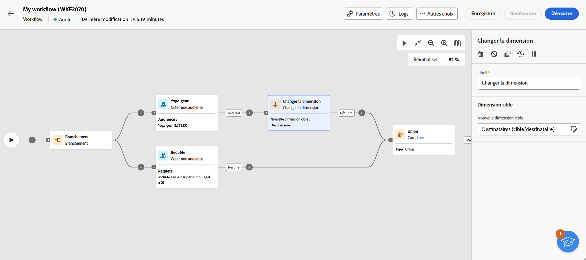

# Créer une audience {#build-audience}

>[!CONTEXTUALHELP]
>id="acw_orchestration_build_audience"
>title="Activité Créer une audience"
>abstract="La variable **Créer une audience** l&#39;activité permet de définir l&#39;audience qui va entrer dans le workflow. Lors de l’envoi de messages dans le cadre d’un workflow, l’audience du message n’est pas définie dans l’activité du canal, mais dans la variable **Créer une audience** activité."

L’activité **Créer une audience** est une activité de **ciblage**. Cette activité permet de définir l’audience qui va entrer dans le workflow. Lors de l’envoi de messages dans le cadre d’un workflow, l’audience du message n’est pas définie dans l’activité du canal, mais dans la variable **Créer une audience** activité.

Pour définir la population de l’audience, vous pouvez :

* sélectionner une audience existante, créée sous forme de liste dans la console cliente ;
* sélectionner une audience Adobe Experience Platform ;
* créer une nouvelle audience avec le créateur de règles en définissant et combinant des critères de filtrage.

>[!NOTE]
>
>Dans ce contexte, vous ne pouvez pas charger d’audience à partir d’un fichier. Pour cela, vous devez créer une diffusion email autonome. [En savoir plus](../../audience/about-recipients.md)

<!--
The **Build audience** activity can be placed at the beginning of the workflow or after any other activity. Any activity can be placed after the **Build audience**.
-->

## Configuration de l’activité de création d’audience{#build-audience-configuration}

>[!CONTEXTUALHELP]
>id="acw_orchestration_build_audience_dimension"
>title="Sélectionner la dimension de ciblage"
>abstract="La dimension de ciblage permet de définir la population ciblée par l’opération : destinataires, bénéficiaires d’un contrat, opérateurs ou opératrices, abonné(e)s, etc. Par défaut, la cible est sélectionnée parmi les destinataires."

Pour configurer l’activité **Créer une audience**, procédez comme suit :

1. Ajoutez une activité **Créer une audience**.
1. Définissez un libellé.
1. Définissez le type d’audience : **Créer votre audience** ou **Lecture d’audience**.

Pour créer votre propre requête, procédez comme suit :

1. Sélectionnez **Créer la vôtre (requête)**.
1. Choisissez la **dimension de ciblage**. La dimension de ciblage permet de définir la population ciblée par l’opération : destinataires, bénéficiaires d’un contrat, opérateurs ou opératrices, abonné(e)s, etc. Par défaut, la cible est sélectionnée parmi les destinataires. Consultez la [documentation v8](https://experienceleague.adobe.com/docs/campaign/automation/workflows/introduction/wf-type/targeting-workflows.html?lang=fr#targeting-and-filtering-dimensions){target="_blank"}.
1. Cliquez sur **Continuer**.
1. Utilisez le créateur de règles pour définir votre requête, de la même manière que vous créez une audience lors de la conception d’un nouvel e-mail. Reportez-vous à cette [section](../../audience/segment-builder.md).

Pour sélectionner une audience existante, procédez comme suit :

1. Sélectionnez **Lecture d’audience**.
1. Cliquez sur **Continuer**.
1. Sélectionnez votre audience, de la même manière que vous utilisez une audience lors de la conception d’un e-mail. Reportez-vous à cette [section](../../audience/add-audience.md).

>[!IMPORTANT]
>
>Si vous souhaitez utiliser une **[!UICONTROL Créer une audience]** activité ciblant une audience Experience Platform, vous devez ajouter une **[!UICONTROL Changement de dimension]** activité après celle-ci, pour vous assurer que la dimension de ciblage de l’audience est définie sur &quot;Destinataire&quot;. Un exemple de workflow est disponible au bas de cette page.

## Exemples{#build-audience-examples}

Voici un exemple de workflow avec deux activités **Créer une audience**. La première cible l’audience des joueurs et joueuses de poker, suivie d’une diffusion e-mail. La seconde cible l’audience des clientes et clients VIP, suivie d’une diffusion SMS.

Voici un autre exemple de workflow dans lequel une audience Adobe Experience Platform est combinée à une audience Adobe Campaign. Pour combiner ces audiences, une **[!UICONTROL Changement de dimension]** l’activité avec la dimension de ciblage &quot;Destinataire&quot; est ajoutée après l’audience Adobe Experience Platform. [Découvrez comment configurer une activité Modification de dimension](change-dimension.md)

