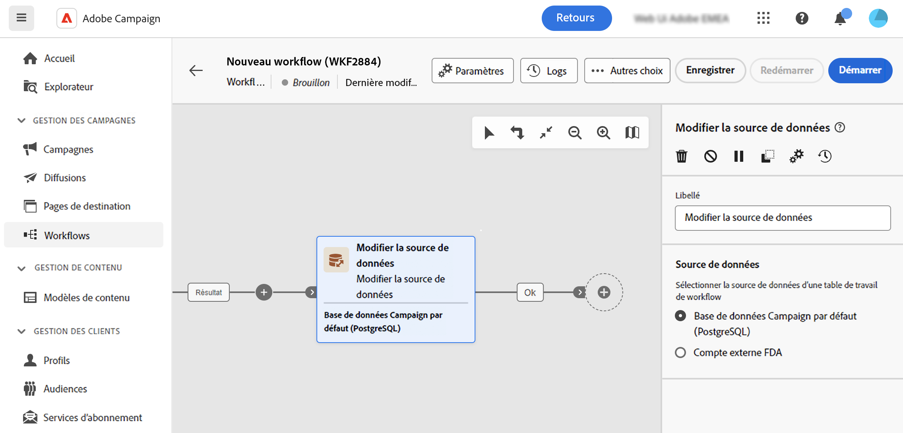

# Modifier la source de données {#change-data-source}

>[!CONTEXTUALHELP]
>id="acw_orchestration_change_data_source"
>title="Modifier la source de données"
>abstract="L’activité **Modifier la source de données** vous permet de sélectionner une autre source de données pour la table de travail de votre workflow."

L’activité **Modifier la source de données** est une activité de **ciblage**. Cette activité permet de modifier la source de données utilisée par la table de travail de votre workflow. Vous bénéficiez ainsi d’une plus grande flexibilité grâce à la gestion des données dans vos différentes bases de données et à l’amélioration des performances.

Dans les workflows, les données véhiculées d’une activité à l’autre via les transitions sont stockées dans une **table de travail** temporaire. Par défaut, les tables de travail sont créées dans la même base de données que la source des données traitées. Par exemple, lors de l’interrogation de la table Profils stockée dans la base de données cloud, une table de travail est créée sur la même base de données cloud.

Dans certains cas, les données ne sont pas disponibles dans la base de données actuelle ou ne sont pas suffisamment efficaces pour effectuer des opérations unitaires. Vous devrez peut-être donc forcer le workflow à utiliser une autre base de données pour effectuer ces opérations en ajoutant une activité **[!UICONTROL Modifier la source de données]**.

Des informations détaillées sur l’architecture de Campaign sont disponibles dans la [documentation de Campaign v8 (console cliente)](https://experienceleague.adobe.com/docs/campaign/campaign-v8/config/architecture/architecture.html?lang=fr).

>[!IMPORTANT]
>
>Notez que les activités **[!UICONTROL Changer la dimension]** et **[!UICONTROL Modifier la source de données]** ne doivent pas être ajoutées sur une même ligne. Si vous devez utiliser les deux activités consécutivement, incluez une activité **[!UICONTROL Enrichissement]** entre les deux. Cela garantit une bonne exécution et évite les erreurs et conflits potentiels.

>[!NOTE]
>
>L’activité **Modifier la source de données** peut traiter un maximum d’un million d’enregistrements par exécution. Contactez votre représentant ou représentante Adobe si vous avez besoin d’augmenter cette limite.

<!--

Let's say you want to send VIP customers a unique offer code that they can redeem on your online store. To do this, you need to:

1. Query VIP customers on the "Profiles" table located on the Cloud database,
1. Retrieve an offer code for each targeted profile through API calls,
1. Update each profile with the assigned offer code,
1. Send an email to the profiles with their offer code.

In this situation, it is recommended to execute the offer code assignment operation on the local database, which is better suited for unitary operations. To do this, you need to add a **[!UICONTROL Change data source]** activity before the operation in order to execute it on the Campaign local database.

Before executing the operation, the working table is copied to the local database so that the operation can run there. Once done, the system detects that the profiles that we want to update are on another location. The data is therefore automatically copied back to the Cloud database where the "Profiles" table is located.
-->

## Configurer l’activité Modifier la source de données {#configure}

Pour configurer l’activité **Modifier la source de données**, procédez comme suit :

1. Ajoutez une activité **Modifier la source de données** à votre workflow.

1. Définissez la source de données où déplacer la table de travail :

   * **[!UICONTROL Base de données Campaign par défaut (PostgreSQL)]** : utilisez la base de données locale Campaign par défaut.
   * **[!UICONTROL Compte externe FDA]** : utilisez des bases de données cloud externes connectées à Adobe Campaign par le biais de la fonctionnalité Federated Data Access.

     >[!AVAILABILITY]
     >
     >La configuration de Campaign et la connexion à des systèmes externes sont limitées aux utilisateurs et utilisatrices expérimentés et ne sont disponibles que depuis la console cliente. [En savoir plus](https://experienceleague.adobe.com/docs/campaign/campaign-v8/connect/fda.html?lang=fr){target="_blank"}

1. Configurez votre workflow pour effectuer les opérations souhaitées à l’aide de la nouvelle source de données.

<!--
## Example {#example}

The workflow below illustrates the use case detailed earlier, sending VIP customers offer codes that they can redeem on our online store.

-->