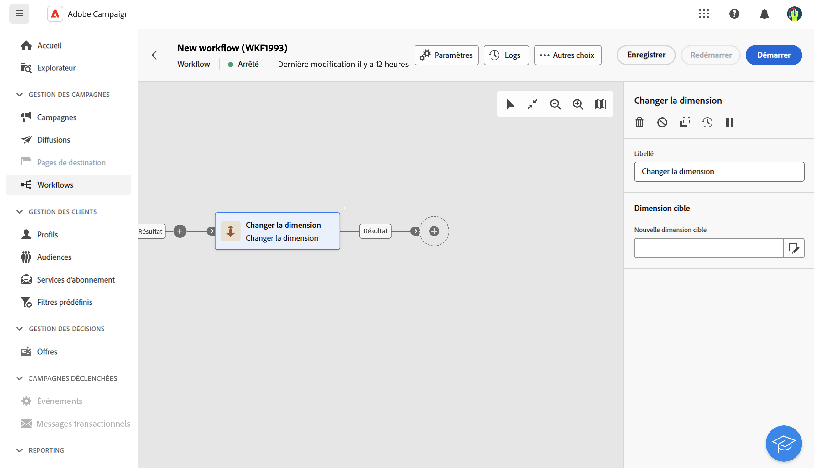
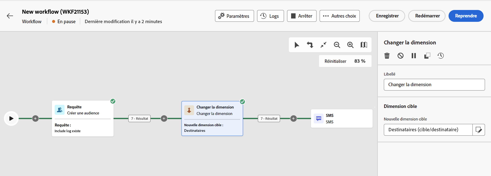

# Changement de dimension {#change-dimension}

>[!CONTEXTUALHELP]
>id="acw_orchestration_dimension_complement"
>title="Générer un complément"
>abstract="Vous pouvez générer une transition sortante supplémentaire avec la population restante, qui a été exclue en tant que doublon. Pour ce faire, activez l’option **Générer un complément**."

>[!CONTEXTUALHELP]
>id="acw_orchestration_change_dimension"
>title="Activité Changement de dimension"
>abstract="Cette activité vous permet de modifier la dimension de ciblage à mesure que vous créez une audience. Elle déplace l’axe en fonction du modèle de données et de la dimension d’entrée. Par exemple, vous pouvez passer de la dimension « contrats » à la dimension « clientèle »."

L’activité **Changement de dimension** est une activité de **ciblage**. Cette activité permet de modifier la dimension de ciblage au fur et à mesure de la construction de votre workflow. Elle déplace l’axe en fonction du modèle de données et de la dimension d’entrée. [Découvrez les dimensions de ciblage](../../audience/about-recipients.md#targeting-dimensions).

Par exemple, vous pouvez passer de la dimension de ciblage d’un workflow « Personnes destinataires » à « Application des abonnées et abonnés » afin d’envoyer des notifications push aux personnes destinataires ciblées.

>[!IMPORTANT]
>
>Notez que les activités **[!UICONTROL Changer la dimension]** et **[!UICONTROL Modifier la source de données]** ne doivent pas être ajoutées sur une même ligne. Si vous devez utiliser les deux activités consécutivement, incluez une activité **[!UICONTROL Enrichissement]** entre les deux. Cela garantit une bonne exécution et évite les erreurs et conflits potentiels.

## Configurer l’activité Changement de dimension {#configure}

Pour configurer l’activité **Changement de dimension**, procédez comme suit :

1. Ajoutez une activité **Changement de dimension** à votre workflow.

   

1. Définissez la **Nouvelle dimension cible**. Lors du changement de dimension, tous les enregistrements sont conservés. D’autres options ne sont pas encore disponibles.

1. Exécutez le workflow pour consulter le résultat. Comparez les données contenues dans les tables avant et après l’activité Changement de dimension, puis comparez la structure des tables du workflow.

## Exemple {#example}

Dans cet exemple, envoyez une diffusion SMS à tous les profils ayant effectué un achat. Utilisez d’abord une activité **[!UICONTROL Créer une audience]** liée à une dimension de ciblage « Achat » personnalisée pour cibler tous les achats qui se sont produits.

Utilisez ensuite une activité **[!UICONTROL Changement de dimension]** pour changer la dimension de ciblage du workflow sur « Personnes destinataires ». Cela permet de cibler les destinataires qui correspondent à la requête.

