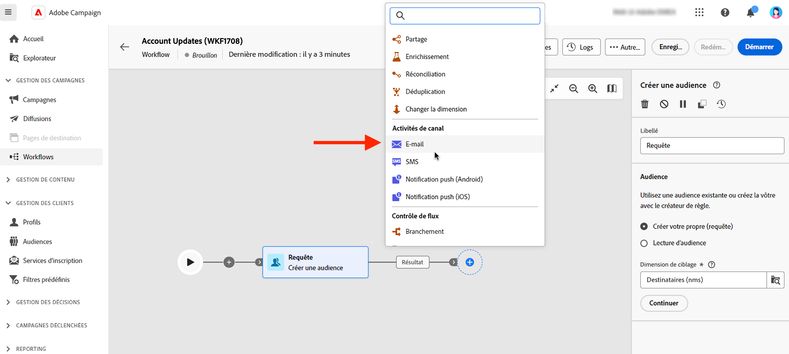
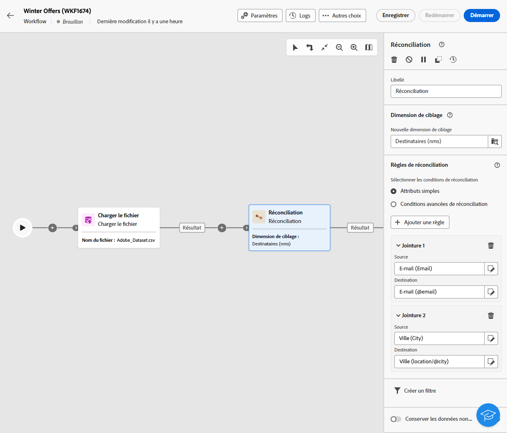
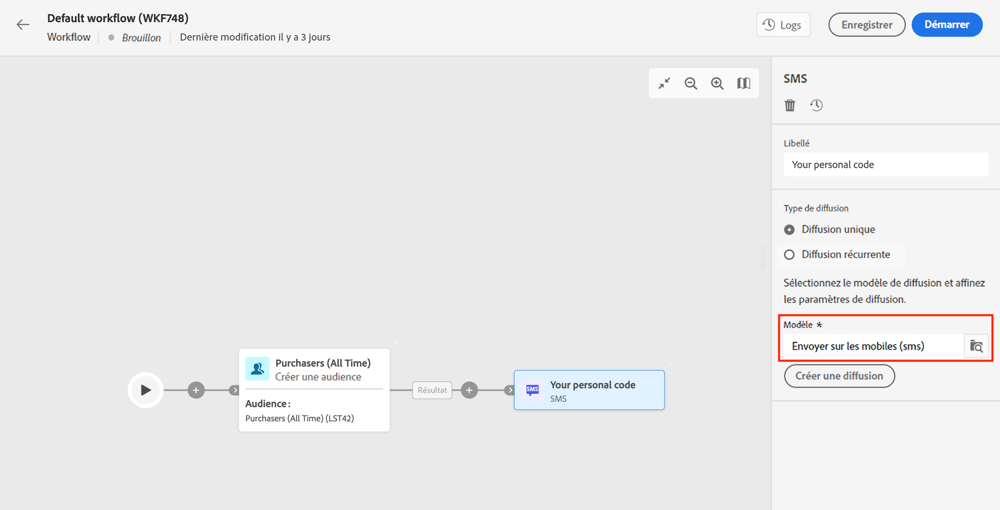
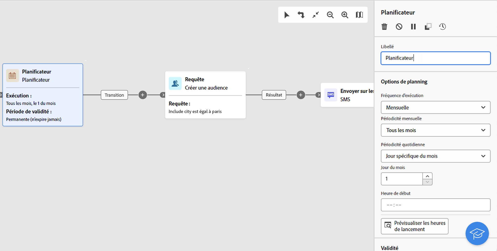

# Activités e-mail, SMS, notification push, courrier {#channel}

Adobe Campaign Web vous permet d’automatiser et d’exécuter des campagnes marketing sur les canaux e-mail, SMS, courrier et notification Push. Vous pouvez combiner des activités de canal dans la zone de travail du workflow afin de créer des workflows cross-canal qui déclenchent des actions en fonction du comportement de la clientèle et des données.

Vous pouvez par exemple créer une campagne de bienvenue par e-mail qui inclut une série de messages sur différents canaux, tels que les canaux e-mails, SMS, notifications Push et courrier. Vous pouvez également envoyer un e-mail de relance une fois qu’un client ou une cliente effectue un achat, ou encore envoyer un message d’anniversaire personnalisé par SMS.

Grâce aux activités de canal, vous pouvez créer des campagnes personnalisées et complètes qui impliquent la clientèle sur plusieurs points de contact et génèrent des conversions.

>[!NOTE]
>
>Vous pouvez également créer une diffusion ponctuelle, en dehors du contexte d’un workflow de campagne. En savoir plus dans ces sections :
>* [Créer une diffusion par e-mail autonome](../../email/create-email.md)
>* [Créer une diffusion par SMS autonome](../../sms/create-sms.md)
>* [Créer une diffusion par notification push autonome](../../push/create-push.md)
>* [Créer une diffusion par courrier autonome](../../direct-mail/create-direct-mail.md)

## Conditions préalables {#channel-activity-prereq}

Commencez à créer votre workflow avec les activités pertinentes :

* Avant d’insérer une activité de canal, définissez l’audience. L’audience est la cible principale de votre diffusion : il s’agit des profils qui reçoivent les messages. Lors de l’envoi de messages dans le cadre d’un workflow de campagne, l’audience du message n’est pas définie dans l’activité de canal, mais dans l’activité dédiée, par exemple :

   * une activité **Créer une audience** ; [En savoir plus](build-audience.md).

     

   * une activité **Chargement de fichier** suivie d’une activité **Réconciliation**. [En savoir plus](load-file.md).

     

* Pour envoyer une diffusion récurrente, démarrez votre workflow avec une activité **Planificateur**. Utilisez une activité **Planificateur** pour les diffusions ponctuelles afin de définir la date de contact de celles-ci. Cette date de contact peut également être définie dans les paramètres de la diffusion. Consultez [cette section](scheduler.md).

## Configurer l’activité Canal {#create-a-delivery-in-a-workflow}

>[!CONTEXTUALHELP]
>id="acw_orchestration_email"
>title="Activité e-mail"
>abstract="L’activité e-mail facilite l’envoi d’e-mails dans votre workflow et vous permet d’envoyer des messages ponctuels et récurrents. Elle automatise le processus d’envoi d’e-mails à une cible calculée dans le même workflow. Vous pouvez combiner des activités de canal dans la zone de travail du workflow afin de créer des workflows cross-canal qui déclenchent des actions en fonction du comportement de la clientèle et des données."

>[!CONTEXTUALHELP]
>id="acw_orchestration_sms"
>title="Activité SMS"
>abstract="L’activité SMS facilite l’envoi de SMS dans votre workflow et vous permet d’envoyer des messages ponctuels et récurrents. Elle automatise le processus d’envoi de SMS à une cible calculée dans le même workflow. Vous pouvez combiner des activités de canal dans la zone de travail du workflow afin de créer des workflows cross-canal qui déclenchent des actions en fonction du comportement de la clientèle et des données."

>[!CONTEXTUALHELP]
>id="acw_orchestration_push_ios"
>title="Activité notification push iOS"
>abstract="L’activité notification push iOS simplifie le processus d’envoi de notifications push iOS dans le cadre de votre workflow. Elle permet la diffusion de messages ponctuels et récurrents, en automatisant l’envoi de notifications Push iOS à une cible prédéfinie dans le même workflow. Vous pouvez combiner des activités de canal dans la zone de travail du workflow afin de créer des workflows cross-canal qui déclenchent des actions en fonction du comportement de la clientèle et des données."

>[!CONTEXTUALHELP]
>id="acw_orchestration_push_android"
>title="Activité notification push Android"
>abstract="L’activité notification push Android simplifie le processus d’envoi de notifications push Android dans le cadre de votre workflow. Elle permet la diffusion de messages ponctuels et récurrents, en automatisant l’envoi de notifications Push Android à une cible prédéfinie dans le même workflow. Vous pouvez combiner des activités de canal dans la zone de travail du workflow afin de créer des workflows cross-canal qui déclenchent des actions en fonction du comportement de la clientèle et des données."

>[!CONTEXTUALHELP]
>id="acw_orchestration_directmail"
>title="Activité Courrier"
>abstract="L’activité Courrier facilite l’envoi de courrier depuis votre workflow, en vous permettant d’envoyer des messages ponctuels et récurrents. Elle automatise le processus de génération du fichier d’extraction requis par les fournisseurs de services postaux. Vous pouvez combiner des activités de canal dans la zone de travail du workflow afin de créer des workflows cross-canal qui déclenchent des actions en fonction du comportement de la clientèle et des données."

Pour configurer une diffusion dans le cadre d’un workflow, procédez comme suit :

1. Ajoutez une activité de canal : **[!UICONTROL E-mail]**, **[!UICONTROL SMS]**, **[!UICONTROL Notification push (Android)]**, **[!UICONTROL Notification Push (iOS)]** ou **[!UICONTROL Courrier]**.

1. Sélectionnez le **Type de diffusion** : unique ou récurrent.

   * **Diffusion unique** : il s’agit d’une diffusion ponctuelle, envoyée une seule fois, par exemple un e-mail pour le Black Friday.
   * **Diffusion récurrente** : cette diffusion est envoyée plusieurs fois en fonction de sa fréquence d’exécution définie dans une [activité Planificateur](scheduler.md). À chaque exécution du workflow, l’audience est recalculée et la diffusion est envoyée avec le contenu et l’audience mis à jour. Il peut s’agir d’une newsletter hebdomadaire ou d’un e-mail d’anniversaire récurrent.

1. Choisissez un **modèle** de diffusion. Les modèles sont des paramètres de diffusion préconfigurés, spécifiques à un canal. Un modèle intégré est disponible pour chaque canal et prérempli par défaut. [En savoir plus](../../msg/delivery-template.md)

   

   Sélectionnez le modèle dans le volet de gauche de la configuration de l’activité de canal. Si l’audience précédemment sélectionnée n’est pas compatible avec le canal, vous ne pouvez pas sélectionner de modèle. Pour résoudre ce problème, modifiez l’activité **Créer une audience** et sélectionnez une audience ayant le mapping de ciblage approprié. Pour plus d’informations sur les mappings de ciblage, consultez [cette section](../../audience/targeting-dimensions.md).

1. Cliquez sur **Créer une diffusion**. Définissez les paramètres et le contenu de votre message de la même manière que vous créez une diffusion autonome. Testez et simulez le contenu. [En savoir plus](../../msg/gs-messages.md)

1. Revenez à votre workflow. Pour continuer votre workflow, activez l’option **Générer une transition sortante** pour ajouter une transition après l’activité de canal.

1. Cliquez sur **Démarrer** pour lancer le workflow.

   Par défaut, le lancement d’un workflow déclenche l’étape de préparation du message, sans envoyer immédiatement le message.

1. Ouvrez votre activité de canal pour confirmer l’envoi avec le bouton **Vérifier et envoyer**.

1. Dans le tableau de bord de la diffusion, cliquez sur **Envoyer**.

## Exemples {#cross-channel-workflow-sample}

Voici un exemple de workflow cross-canal avec une segmentation et deux diffusions. Le workflow cible la clientèle qui vit à Paris et qui s’intéresse aux machines à café. Parmi cette population, un e-mail est envoyé à la clientèle régulière, et un SMS est envoyé à la clientèle VIP.

Vous pouvez également créer un workflow récurrent pour envoyer un SMS personnalisé chaque premier jour du mois à 20 heures à tous les clientes et clients habitant à Paris.

<!--
description, which use case you can perform (common other activities that you can link before or after the activity)

how to add and configure the activity

example of a configured activity within a workflow
The Email delivery activity allows you to configure the sending of an email in a workflow. 
-->

<!-- Scheduled emails available?

This can be a single send email and sent just once, or it can be a recurring email.
* Single send emails are standard emails, sent once.
* Recurring emails allow you to send the same email multiple times to different targets over a defined period. You can aggregate the deliveries per period in order to get reports that correspond to your needs.

When linked to a scheduler, you can define recurring emails.
Email recipients are defined upstream of the activity in the same workflow, via an Audience targeting activity.

-->

<!--The message preparation is triggered according to the workflow execution parameters. From the message dashboard, you can select whether to request or not a manual confirmation to send the message (required by default). You can start the workflow manually or place a scheduler activity in the workflow to automate execution.-->