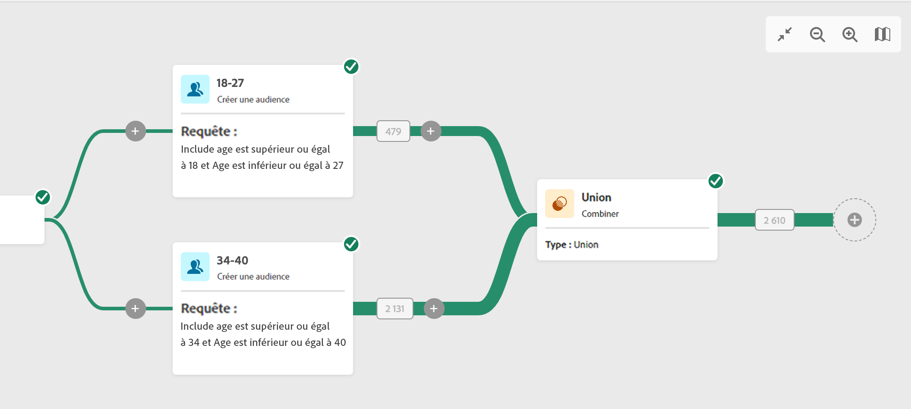
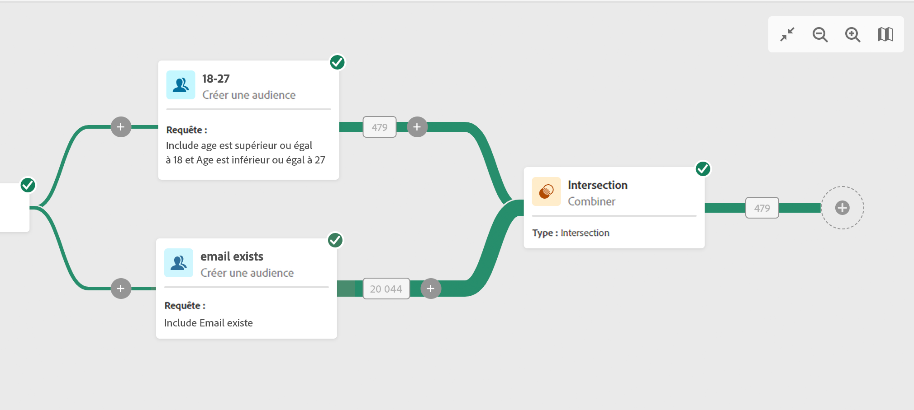
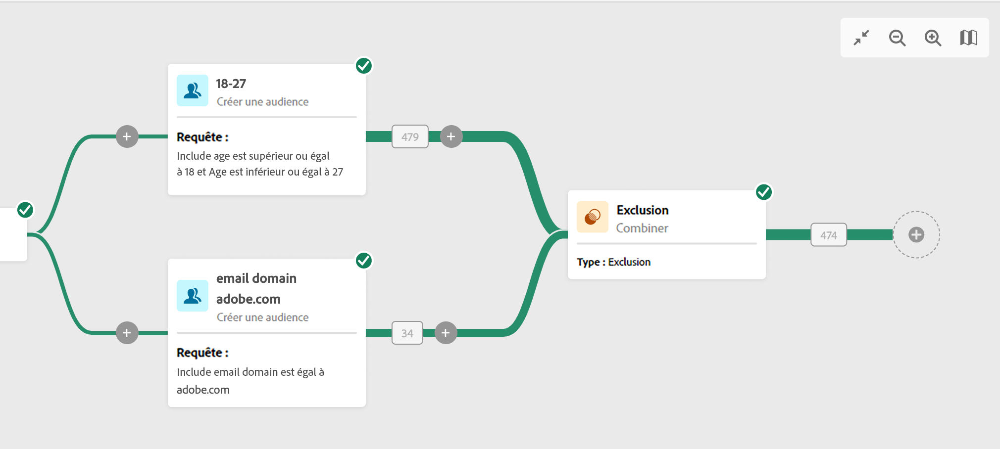

# Combiner {#combine}

Cette activité vous permet d&#39;effectuer une segmentation sur votre population entrante. Il est ainsi possible de regrouper plusieurs populations, d&#39;en exclure une partie ou de ne conserver que les données communes entre plusieurs cibles. Voici les types de segmentation disponibles :

<!--
The **Combine** activity can be placed after any other activity, but not at the beginning of the workflow. Any activity can be placed after the **Combine**.
-->

* Le **Union** permet de regrouper le résultat de plusieurs activités dans une seule cible.
* Le **Intersection** permet de ne conserver que les éléments communs aux différentes populations entrantes dans l&#39;activité.
* Le **Exclusion** permet d&#39;exclure des éléments d&#39;une population selon certains critères.

## Paramétrage général {#general}

Pour commencer à configurer le **Combiner** activité :

1. Ajoutez plusieurs activités, telles que **Créer une audience** pour former au moins deux branches d&#39;exécution différentes.
1. Ajouter un **Combiner** à l’une des branches précédentes.
1. Sélectionnez le type de segmentation : [union](#union), [intersection](#intersection) ou [exclusion](#exclusion).
1. Cliquez sur **Continuer**.
1. Dans le **Définit la jointure** , vérifiez toutes les activités précédentes que vous souhaitez rejoindre.

## Union {#union}

Pour le **Union**, vous devez sélectionner la variable **Type de réconciliation** pour définir la gestion des doublons :

* **Uniquement les clés** : c&#39;est le mode par défaut. L&#39;activité ne conserve qu&#39;un élément lorsque des éléments provenant des différentes transitions entrantes ont la même clé. Cette option ne peut être utilisée que si les populations en entrée sont homogènes.
* **Une sélection de colonnes** : sélectionnez cette option pour définir la liste des colonnes sur lesquelles sera appliquée la réconciliation des données. Vous devez d&#39;abord sélectionner l&#39;ensemble principal (celui qui contient les données sources), puis les colonnes à utiliser pour la jointure.

## Intersection {#intersection}

Pour le **Intersection**, procédez comme suit :

1. Sélectionnez la **Type de réconciliation** pour définir comment les doublons sont traités. Pour plus d&#39;informations, consultez la section [Union](#union).
1. Vous pouvez vérifier les **Générer l’achèvement** si vous souhaitez traiter la population restante. Le complémentaire contiendra l’union des résultats de toutes les activités entrantes, moins l’intersection. Une transition sortante supplémentaire sera alors ajoutée à l&#39;activité.

## Exclusion {#exclusion}

Pour le **Exclusion**, procédez comme suit :

1. Dans le **Définit la jointure** , sélectionnez **Principal** des transitions entrantes. C&#39;est l&#39;ensemble à partir duquel des éléments sont exclus. Les autres ensembles correspondent aux éléments devant être exclus de l&#39;ensemble principal.
1. Au besoin, vous pouvez manipuler les tables entrantes. En effet, pour exclure une cible d&#39;une autre dimension, cette cible doit être replacée dans la même dimension de ciblage que la cible principale. Pour ce faire, cliquez sur **Ajouter une règle** dans le **Règles d’exclusion** et indiquez les conditions de changement de dimension. La réconciliation des données est réalisée soit par un attribut, soit par une jointure.
1. Vous pouvez vérifier les **Générer l’achèvement** si vous souhaitez traiter la population restante. Pour plus d&#39;informations, consultez la section [Intersection](#intersection).

## Exemples      

Dans l’exemple suivant, nous avons ajouté une **union** qui récupère tous les profils des deux requêtes : personnes de 18 à 27 ans et personnes de 34 à 40 ans.

L’exemple suivant illustre la variable **intersection** entre deux activités de requête. Il est utilisé ici pour récupérer les profils qui ont entre 18 et 27 ans et dont l&#39;adresse email a été renseignée.

Les éléments suivants **exclusion** exemple affiche deux requêtes configurées pour filtrer les profils qui ont entre 18 et 27 ans et ont un domaine de messagerie adobe. Les profils avec un domaine de messagerie Adobe sont ensuite exclus du premier ensemble.

