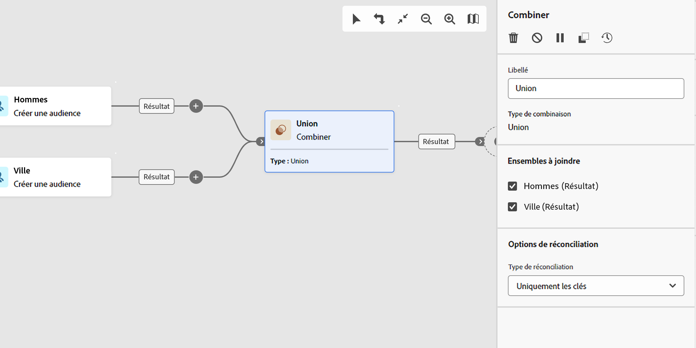

# Combiner {#combine}

>[!CONTEXTUALHELP]
>id="acw_orchestration_combine"
>title="Activité Combiner"
>abstract="L’activité **Combiner** permet d’effectuer une segmentation sur votre population entrante. Vous pouvez regrouper plusieurs populations, en exclure une partie ou ne conserver que les données communes à plusieurs cibles."

L’activité **Combiner** est une activité de **ciblage**. Cette activité vous permet d’effectuer une segmentation sur votre population entrante. Vous pouvez regrouper plusieurs populations, en exclure une partie ou ne conserver que les données communes à plusieurs cibles. Les types de segmentation disponibles sont les suivants :

<!--
The **Combine** activity can be placed after any other activity, but not at the beginning of the workflow. Any activity can be placed after the **Combine**.
-->

* l’**Union** regroupe le résultat de plusieurs activités dans une cible unique.
* l’**Intersection** conserve uniquement les éléments communs aux différentes populations entrantes dans l’activité.
* l’**Exclusion** exclut des éléments d’une population selon certains critères.

## Configurer l’activité Combiner {#combine-configuration}

>[!CONTEXTUALHELP]
>id="acw_orchestration_intersection_merging_options"
>title="Options de fusion des intersections"
>abstract="L’intersection conserve uniquement les éléments communs aux différentes populations entrantes dans l’activité. Dans la section Ensembles à joindre, cochez les activités précédentes à joindre."

>[!CONTEXTUALHELP]
>id="acw_orchestration_exclusion_merging_options"
>title="Options de fusion des exclusions"
>abstract="L’exclusion exclut des éléments d’une population selon certains critères. Dans la section Ensembles à joindre, cochez les activités précédentes à joindre."

>[!CONTEXTUALHELP]
>id="acw_orchestration_combine_options"
>title="Sélectionner le type de segmentation"
>abstract="Sélectionnez comment combiner des audiences. L’**Union** regroupe le résultat de plusieurs activités dans une cible unique. L’**intersection** conserve uniquement les éléments communs aux différentes populations entrantes dans l’activité. L’**Exclusion** exclut des éléments d’une population selon certains critères."

Pour commencer à configurer l’activité **Combiner**, procédez comme suit :

1. Ajoutez plusieurs activités, telles que **Créer une audience**, pour former au moins deux branches d’exécution différentes.
1. Ajoutez une activité **Combiner** à l’une des branches précédentes.
1. Sélectionnez le type de segmentation : [union](#union), [intersection](#intersection) ou [exclusion](#exclusion).
1. Cliquez sur **Continuer**.
1. Dans la section **Ensembles à joindre**, cochez les activités précédentes à joindre.

## Union {#combine-union}

>[!CONTEXTUALHELP]
>id="acw_orchestration_combine_reconciliation"
>title="Options de réconciliation"
>abstract="Sélectionnez le **type de réconciliation** pour définir comment gérer les doublons. Par défaut, l’option **Clés** est activée, ce qui signifie que l’activité ne conserve qu’un élément lorsque des éléments provenant de différentes transitions entrantes possèdent la même clé. Utilisez l’option **Une sélection de colonnes** pour définir la liste des colonnes sur lesquelles est appliquée la réconciliation des données."

Dans l’activité **Combiner**, configurez une **Union** en sélectionnant le **Type de réconciliation** afin de définir le mode de traitement des doublons :

* **Uniquement les clés** : il s’agit du mode par défaut. L’activité ne conserve qu’un élément lorsque des éléments provenant des différentes transitions entrantes possèdent la même clé. Cette option ne peut être utilisée que si les populations entrantes sont homogènes.
* **Une sélection de colonnes** : sélectionnez cette option pour définir la liste des colonnes sur lesquelles est appliquée la réconciliation des données. Vous devez d’abord sélectionner l’ensemble principal (les données sources), puis les colonnes à utiliser pour la jointure.

## Intersection {#combine-intersection}

>[!CONTEXTUALHELP]
>id="acw_orchestration_intersection_reconciliation_options"
>title="Options de réconciliation des intersections"
>abstract="Sélectionnez le **type de réconciliation** pour définir comment gérer les doublons. Par défaut, l’option **Clés** est activée, ce qui signifie que l’activité ne conserve qu’un élément lorsque des éléments provenant de différentes transitions entrantes possèdent la même clé. Utilisez l’option **Une sélection de colonnes** pour définir la liste des colonnes sur lesquelles est appliquée la réconciliation des données."

Dans l’activité **Combiner**, configurez une **Intersection** en procédant comme suit :

1. Sélectionnez le **Type de réconciliation** pour définir la manière dont les doublons sont traités. Pour plus d’informations, consultez la section [Union](#union).
1. Cochez l&#39;option **Générer le complémentaire** si vous souhaitez exploiter la population restante. Le complémentaire contiend l’union des résultats de toutes les activités entrantes, moins l’intersection. Une transition sortante supplémentaire est alors ajoutée à l’activité.

## Exclusion {#combine-exclusion}

>[!CONTEXTUALHELP]
>id="acw_orchestration_exclusion_options"
>title="Règles d’exclusion"
>abstract="Au besoin, manipulez les tables entrantes. Pour exclure une cible d’une autre dimension, replacez cette cible dans la même dimension de ciblage que la cible principale. Cliquez sur Ajouter une règle dans la section Règles d’exclusion et indiquez les conditions de changement de dimension. La réconciliation des données s’effectue au moyen d’un attribut ou d’une jointure."

>[!CONTEXTUALHELP]
>id="acw_orchestration_combine_sets"
>title="Sélectionner des ensembles à combiner"
>abstract="Dans la section **Ensembles à joindre**, sélectionnez **Ensemble principal** parmi les transitions entrantes. C’est l’ensemble à partir duquel des éléments sont exclus. Les autres ensembles correspondent aux éléments devant être exclus de l’ensemble principal."

>[!CONTEXTUALHELP]
>id="acw_orchestration_combine_exclusion"
>title="Règles d’exclusion"
>abstract="Au besoin, manipulez les tables entrantes. Pour exclure une cible d’une autre dimension, replacez cette cible dans la même dimension de ciblage que la cible principale. Cliquez sur Ajouter une règle dans la section Règles d’exclusion et indiquez les conditions de changement de dimension. La réconciliation des données s’effectue au moyen d’un attribut ou d’une jointure."

>[!CONTEXTUALHELP]
>id="acw_orchestration_combine_complement"
>title="Combiner la génération de complément"
>abstract="Activez l’option Générer un complément pour traiter la population restante dans une transition supplémentaire."

Dans l’activité **Combiner**, configurez une **Exclusion** en procédant comme suit :

1. Dans la section **Ensembles à joindre**, sélectionnez **Ensemble principal** parmi les transitions entrantes. C’est l’ensemble à partir duquel des éléments sont exclus. Les autres ensembles correspondent aux éléments devant être exclus de l’ensemble principal.
1. Au besoin, manipulez les tables entrantes. Pour exclure une cible d’une autre dimension, replacez cette cible dans la même dimension de ciblage que la cible principale. Cliquez sur **Ajouter une règle** dans la section **Règles d’exclusion** et indiquez les conditions de changement de dimension. La réconciliation des données s’effectue au moyen d’un attribut ou d’une jointure.
1. Cochez l&#39;option **Générer le complémentaire** si vous souhaitez exploiter la population restante. Pour plus d’informations, consultez la section [Intersection](#intersection).

## Exemples {#combine-examples}

Dans l’exemple suivant, une activité **Combiner** utilise une **union** pour récupérer tous les profils des deux requêtes : les personnes âgées de 18 à 27 ans et les personnes âgées de 34 à 40 ans.

L’exemple suivant montre l’**intersection** de deux activités de requête. Elle récupère les profils qui ont entre 18 et 27 ans et dont l’adresse e-mail a été renseignée.

L’exemple d’**exclusion** suivant présente deux requêtes configurées pour filtrer les profils ayant entre 18 et 27 ans et ayant un domaine d’e-mail Adobe. Les profils avec un domaine d’e-mail Adobe sont ensuite exclus du premier ensemble.

