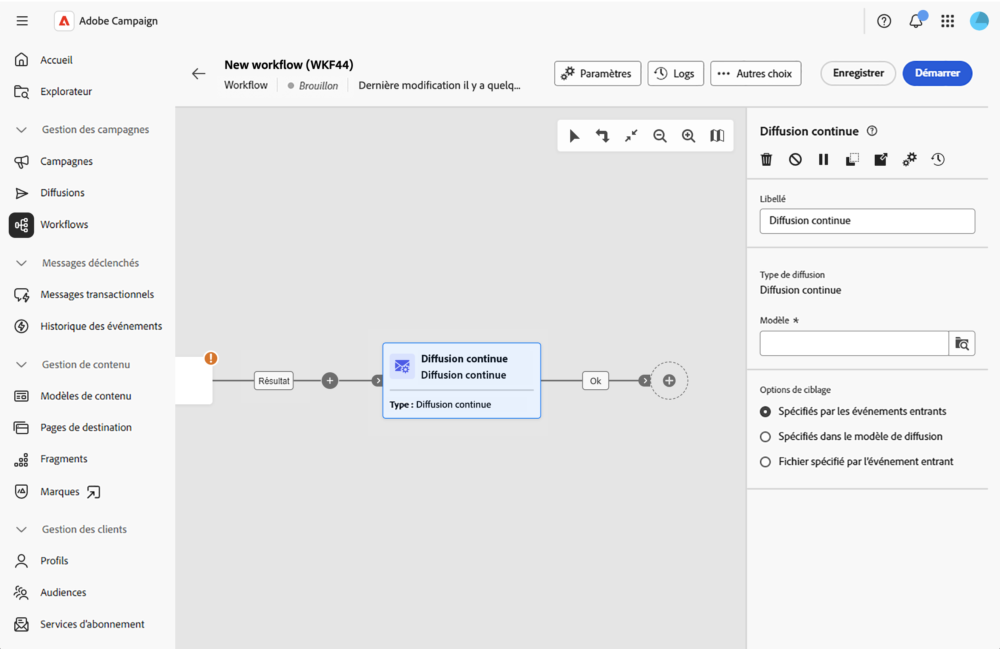

# Diffusion continue {#continuous-delivery}

L&#39;activité **Diffusion au fil de l&#39;eau** vous permet d&#39;ajouter de nouveaux destinataires à une diffusion existante. Ce type de diffusion évite d’avoir à créer une diffusion à chaque fois, ce qui le rend plus efficace pour les alertes ou notifications à faible volume envoyées selon les besoins.

Une diffusion continue crée une instance de diffusion unique. Tous les logs de diffusion (broadLog) et les logs de tracking référencent cette diffusion, ce qui simplifie la surveillance et le reporting.

## Configuration de l’activité de diffusion au fil de l’eau {#configure}

1. Ajoutez une activité **Diffusion au fil de l’eau** à la zone de travail du workflow.

   {zoomable="yes"}

1. Saisissez un **[!UICONTROL libellé]** personnalisé pour l’activité (facultatif). Par défaut, il est intitulé « Diffusion au fil de l’eau ».

1. En regard du champ **[!UICONTROL Modèle]**, cliquez sur l’icône de recherche pour sélectionner un modèle de diffusion. Seuls les modèles (et non les diffusions standard) peuvent être sélectionnés. Le modèle définit le canal de diffusion, le contenu et la configuration.

1. Dans les **[!UICONTROL Options de ciblage]**, choisissez le mode de définition de la population cible :

   * **[!UICONTROL Spécifiée par les événements entrants]** : la cible provient de la transition entrante (des activités en amont comme Créer une audience ou Requête incrémentale). Il s’agit de l’option la plus courante.

   * **[!UICONTROL Spécifiée dans le modèle de diffusion]** : la cible est définie dans le modèle même.

   * **[!UICONTROL Fichier spécifié dans l&#39;événement en entrée]** : la cible est fournie via un fichier transmis par le workflow.

L’activité de diffusion au fil de l’eau génère automatiquement une transition sortante pour continuer votre workflow.

## Rubriques connexes {#related}

* [À propos des activités de workflows](about-activities.md)
* [Diffusion automatisée](automated-delivery.md)
* [Activités e-mail, SMS, notification push, courrier](channels.md)
* [Modèles de diffusion](../../msg/delivery-template.md)
