# Chargement (SGBD) {#data-loading-rdbms}

>[!CONTEXTUALHELP]
>id="acw_orchestration_data_loading_rdbms"
>title="Activité Chargement de données (SGBD)"
>abstract="L’activité **Chargement de données (SGBD)** est une activité de **Gestion des données**. Utilisez cette activité pour charger des données directement à partir d’une base de données relationnelle externe dans votre workflow. Les données extraites sont disponibles tout au long du workflow et peuvent être utilisées pour le ciblage, l’enrichissement ou un traitement ultérieur des données."

L’activité **Chargement de données (SGBD)** est une activité de **Gestion des données**. Utilisez cette activité pour charger des données directement à partir d’une base de données relationnelle externe dans votre workflow. Les données extraites sont disponibles tout au long du workflow et peuvent être utilisées pour le ciblage, l’enrichissement ou un traitement ultérieur des données.

<!--
This activity relies on the [Federated Data Access (FDA)](https://experienceleague.adobe.com/docs/campaign/campaign-v8/connect/fda.html){target="_blank"} option, which lets Adobe Campaign process information stored in one or more external databases without changing the structure of the Adobe Campaign data.
-->

>[!NOTE]
>
>Pour améliorer les performances, envisagez plutôt d’utiliser une activité **[!UICONTROL Créer une audience]** (type de requête) avec des données externes, lorsque la quantité de données à collecter depuis la base de données externe le permet.
>
>Une activité **[!UICONTROL Chargement de données (SGBD)]** doit être la première activité d’une branche de workflow. Elle ne peut pas être ajoutée après une autre activité dans la zone de travail.

Tout d’abord, ajoutez une activité **Chargement de données (SGBD)** comme première activité d’une branche de workflow.

L’activité est divisée en quatre sections :

* **[!UICONTROL Paramètres cible]** : choisissez l’emplacement de stockage des données chargées. [En savoir plus](#target-settings)
* **[!UICONTROL Paramètres source]** : choisissez comment accéder à la base de données externe contenant les données à charger. [En savoir plus](#source-settings)
* **[!UICONTROL Informations collectées]** : définissez les colonnes à collecter dans la table externe. [En savoir plus](#information-collected)
* **[!UICONTROL Filtrage source]** : définissez un filtre pour ne collecter qu’une partie des données de la table externe. [En savoir plus](#filter)

Notez que les deux dernières sections n’apparaissent que lorsque les **[!UICONTROL paramètres source]** sont définis.

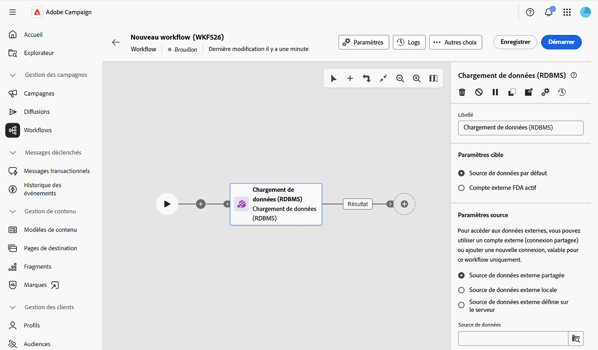

## Paramètres cible {#target-settings}

Dans la section **[!UICONTROL Paramètres cible]** choisissez l’emplacement de stockage des données chargées. Deux options sont disponibles : **[!UICONTROL Source de données par défaut]** et **[!UICONTROL Compte externe FDA actif]**.

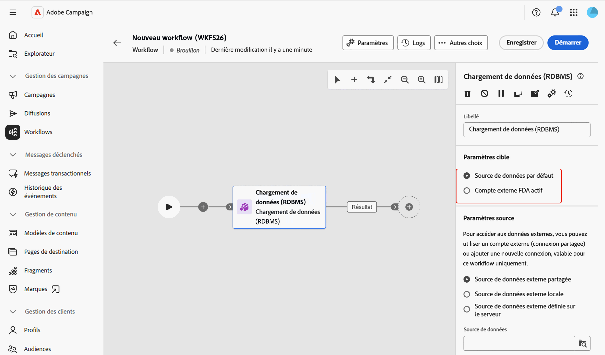

### Source de données par défaut {#default-data-source}

Cette option est sélectionnée par défaut. Elle permet de stocker les données chargées dans la base de données par défaut de Campaign. Il vous suffit de sélectionner l’option.

### Compte externe FDA actif {#active-fda-external-account}

Cette option vous permet de stocker les données chargées dans un compte externe.

1. Cliquez sur le bouton situé à droite du champ **[!UICONTROL Source de données]**.
1. Sélectionnez le compte à utiliser.

   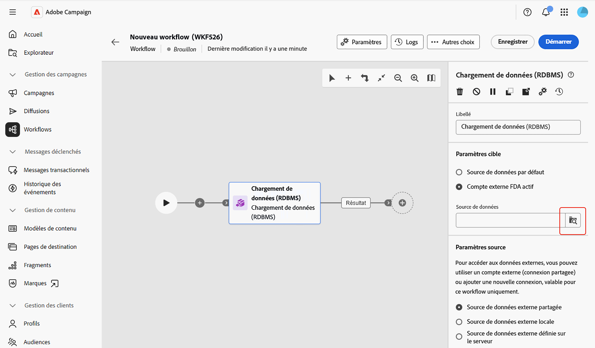

## Paramètres source {#source-settings}

Dans la section **[!UICONTROL Paramètres source]**, choisissez comment accéder à la base de données externe contenant les données à charger. Trois options sont disponibles : **[!UICONTROL Source de données externe partagée]**, **[!UICONTROL Source de données externe locale]** et **[!UICONTROL Source de données externe définie par le serveur]**.

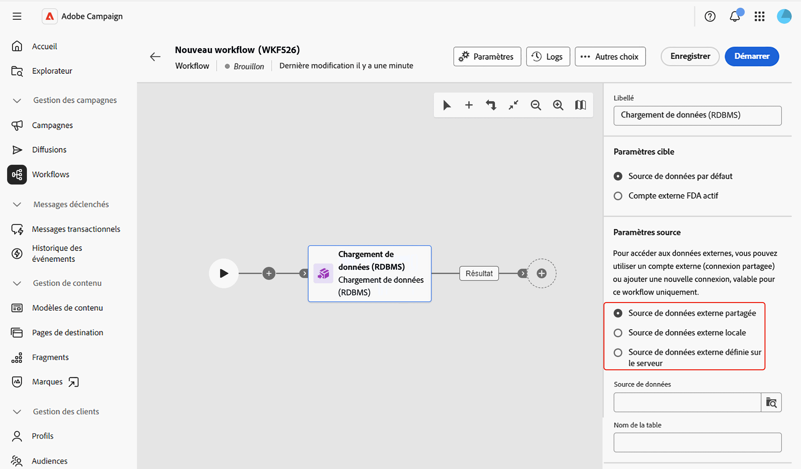

### Source de données externe partagée {#shared-data-source}

Cette option est sélectionnée par défaut. Elle vous permet d’utiliser un compte externe déjà configuré par un administrateur ou une administratrice Campaign. [Découvrez comment configurer un compte externe](../../administration/create-external-account.md).

1. Cliquez sur le bouton situé à droite du champ **[!UICONTROL Source de données]** et sélectionnez le compte à utiliser.

   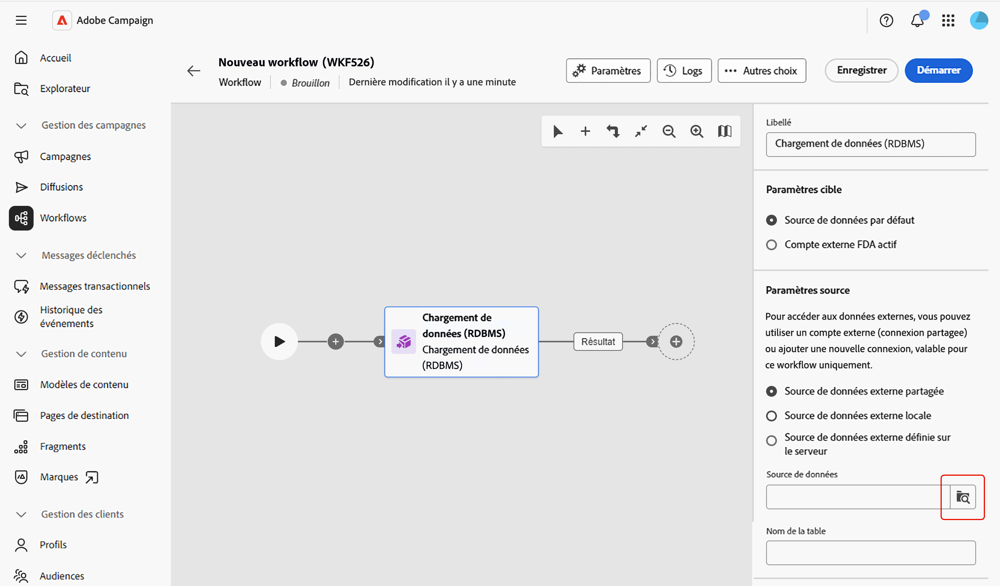

1. Cliquez sur le bouton **[!UICONTROL Parcourir]** en regard du champ **[!UICONTROL Nom de la table]** et sélectionnez la table contenant les données à charger.

   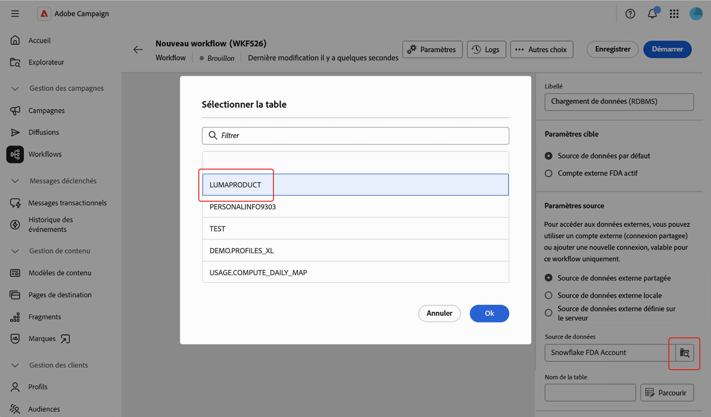

### Source de données externe locale {#local-external-data-source}

Cette option vous permet de définir une connexion à une base de données externe directement dans l’activité, pour une utilisation temporaire uniquement dans ce workflow. Cette connexion n’est pas enregistrée en tant que compte externe.

1. Cliquez sur le bouton **[!UICONTROL Définir la source de données]** et sélectionnez le moteur de base de données auquel se connecter.

   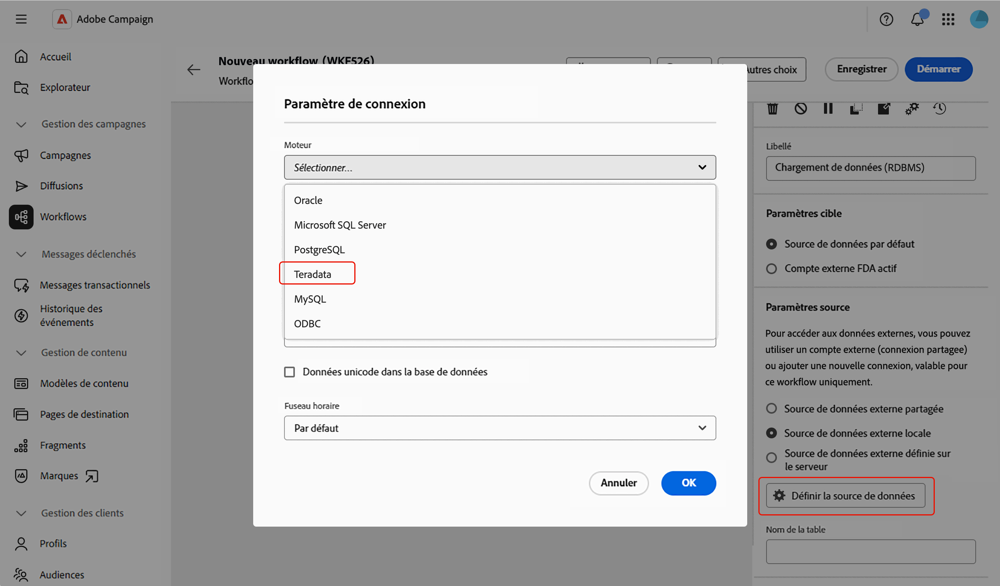

1. Remplissez les champs de connexion affichés pour le moteur sélectionné.

   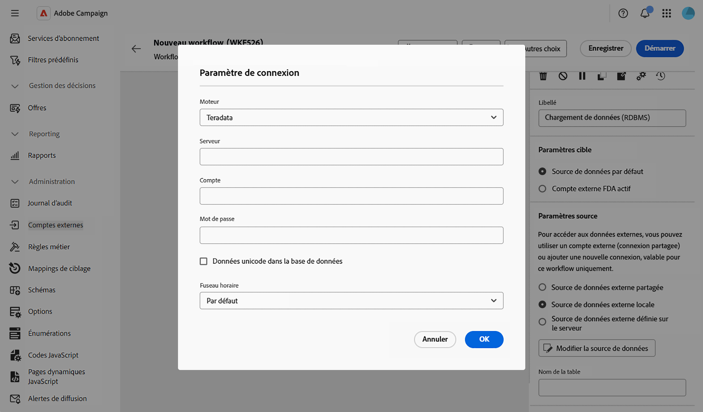

<!--
1. Click **[!UICONTROL Ok]** to confirm. The button is then relabeled **[!UICONTROL Edit data source]**, allowing you to open the dialog again to change the connection settings.
-->

1. Saisissez le nom de la table à charger dans le champ **[!UICONTROL Nom de la table]**.

### Source de données externe définie sur le serveur {#server-defined-external-data-source}

Cette option vous permet d’utiliser une connexion à la base de données déjà définie au niveau du serveur.

1. Saisissez le nom de la connexion à utiliser dans le champ **[!UICONTROL Nom de la connexion]**.
1. Saisissez le nom de la table à charger dans le champ **[!UICONTROL Nom de la table]**.

   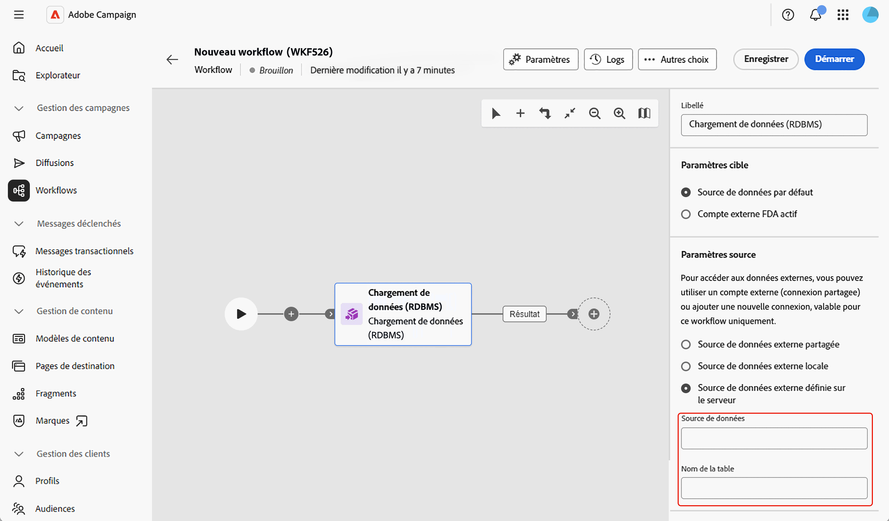

## Informations collectées {#information-collected}

Une fois la table paramétrée, la section **[!UICONTROL Informations collectées]** permet de définir quelles colonnes sont collectées dans la table externe :

1. Cochez l&#39;option **[!UICONTROL Conserver toutes les données de la source]** (par défaut) si vous devez collecter chaque colonne de la table sélectionnée.
1. Cliquez sur **[!UICONTROL Ajouter une colonne à extraire]** pour collecter des colonnes spécifiques à la place ou en plus.

   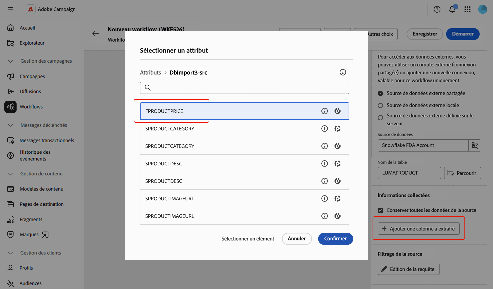

<!--
In the **[!UICONTROL Select attribute]** dialog, scoped to the schema of the selected table, pick an attribute and confirm. [Learn how to select attributes and add them to favorites](../../get-started/attributes.md)
-->

1. Sélectionnez un attribut et confirmez. L’attribut est ajouté sous la forme d’une ligne avec un champ **[!UICONTROL Colonne]** et un champ **[!UICONTROL Libellé]** modifiable. Utilisez l’icône Supprimer pour le supprimer.

   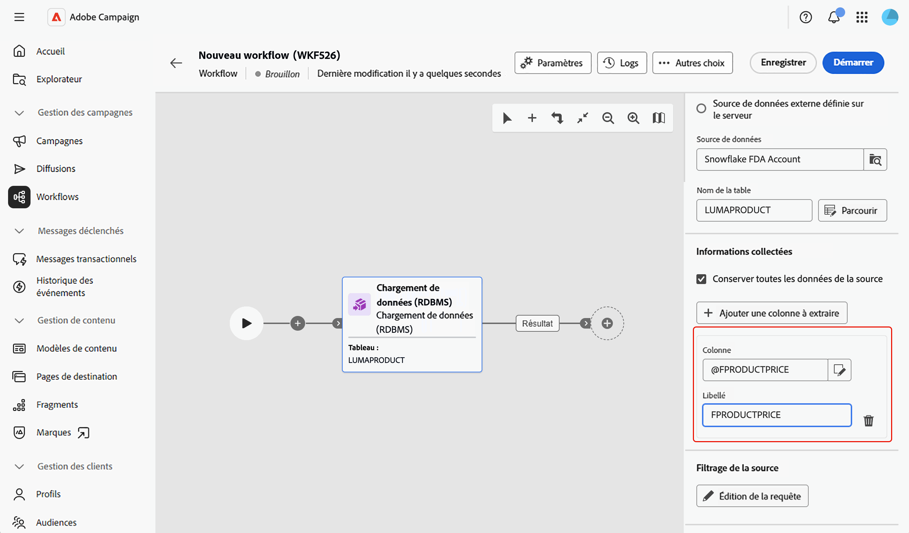

<!--
## Link to another table (optional) {#link}

NOT CONFIRMED — restore and verify before publishing.

Source: transcript of the ACC Web UI - Handsoff 12-06 demo (Herve Phulpin, ~20:49-21:04 mark). At the time of that demo, this part of the activity was explicitly described as unfinished: "the next part is not yet available", "this part is missing", "we are not able to add a link condition". No screenshot of a completed, working flow for this section has been captured since. Two related sub-bugs were still open against NEO-95826 at last check: NEO-97147 ("DBMS activity transition results not shown") and NEO-97148 ("local external data table name is not a picker").

If you need to reconcile the loaded data with an existing table, such as the Recipients table, add a link:

1. Click **Add link**.
1. Select the table to link to. You can browse tables from the Campaign database or from the external data source.
1. Define the join condition between the loaded table and the target table:
   * Simple join: Select the attributes to match between the two tables.
   * Advanced join: Use the query modeler to build the join condition.

[Learn more about link definitions in the Enrichment activity](enrichment.md#create-links).
-->

## Filtrage de la source (facultatif) {#filter}

Pour ne collecter qu’une partie des données de la table externe, vous pouvez définir un filtre :

1. Dans la section **[!UICONTROL Filtrage de la source]**, cliquez sur **[!UICONTROL Modifier la requête]**.

   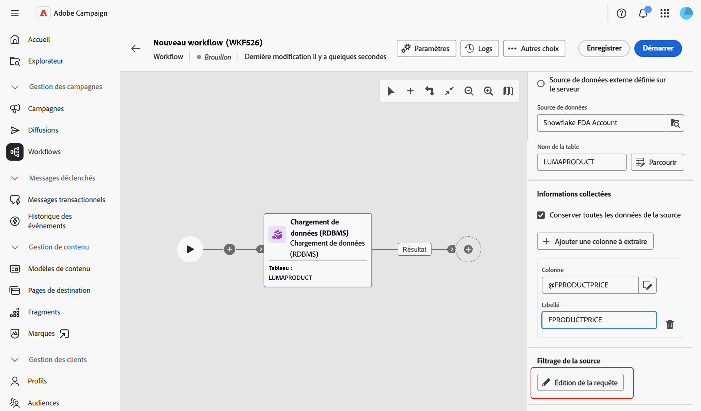

1. Le concepteur de requête s’ouvre sur un écran dédié, défini sur le schéma de la table sélectionnée. Utilisez-le pour créer une condition sur les attributs de la table. [Découvrir comment utiliser le concepteur de requête](../../query/query-modeler-overview.md)

   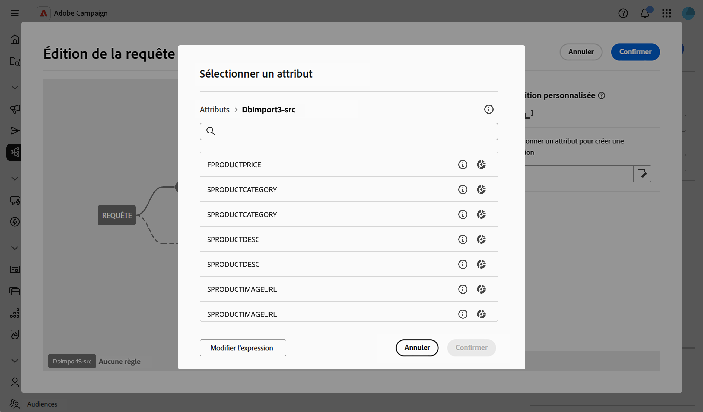

<!--
>[!NOTE]
>
>Some advanced options available for this activity in the client console, such as computing the table name from the inbound transition, are not yet exposed in the Campaign Web User Interface.
-->