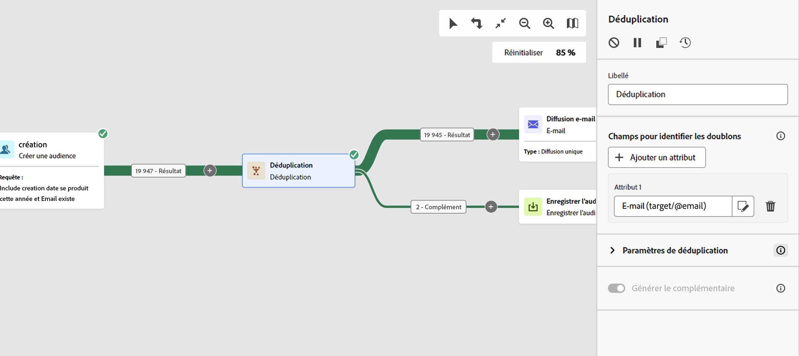

# Déduplication {#deduplication}

>[!CONTEXTUALHELP]
>id="acw_orchestration_deduplication_fields"
>title="Champs pour identifier les doublons"
>abstract="Dans la section **Champs pour identifier les doublons**, cliquez sur le bouton **Ajouter un attribut** pour indiquer les champs pour lesquels des valeurs identiques permettent d’identifier les doublons, par exemple : adresse e-mail, prénom, nom, etc. L’ordre des champs permet de spécifier ceux à traiter en premier."

>[!CONTEXTUALHELP]
>id="acw_orchestration_deduplication"
>title="Activité Déduplication"
>abstract="La **déduplication** supprime les doublons dans les résultats des activités entrantes. Elle est principalement utilisée à la suite des activités de ciblage et avant les activités utilisant les données ciblées."

>[!CONTEXTUALHELP]
>id="acw_orchestration_deduplication_complement"
>title="Générer un complément"
>abstract="Vous pouvez générer une transition sortante supplémentaire avec la population restante, qui a été exclue en tant que doublon. Pour ce faire, activez l’option **Générer un complément**."

>[!CONTEXTUALHELP]
>id="acw_orchestration_deduplication_settings"
>title="Paramètres de déduplication"
>abstract="Pour supprimer des doublons dans les données entrantes, définissez la méthode de déduplication dans les champs ci-dessous. Par défaut, un seul enregistrement est conservé. Sélectionnez également le mode de déduplication en fonction d’une expression ou d’un attribut. Par défaut, l’enregistrement à conserver en dehors des doublons est sélectionné de manière aléatoire."

L’activité **Déduplication** est une activité de **ciblage**. Cette activité supprime les doublons dans les résultats des activités entrantes, tels que les profils dupliqués dans la liste des destinataires. L’activité **Déduplication** est généralement utilisée à la suite des activités de ciblage et avant les activités utilisant les données ciblées.

## Configurer l’activité Déduplication {#deduplication-configuration}

Pour configurer l’activité **Déduplication**, procédez comme suit :

1. Ajoutez une activité **Déduplication** à votre workflow.

1. Dans la section **Champs pour identifier les doublons**, cliquez sur le bouton **Ajouter un attribut** pour indiquer les champs pour lesquels des valeurs identiques permettent d’identifier les doublons, par exemple : adresse e-mail, prénom, nom, etc. L’ordre des champs permet de spécifier ceux à traiter en premier. [Découvrez comment sélectionner des attributs et les ajouter aux favoris](../../get-started/attributes.md).

1. Dans la section **Paramètres de déduplication**, sélectionnez le nombre de **Doublons à conserver** uniques. La valeur par défaut de ce champs est 1. La valeur 0 conserve tous les doublons.

   Par exemple, si des enregistrements A et B sont considérés comme des doublons d’un enregistrement Y, et qu’un enregistrement C est considéré comme un doublon d&#39;un enregistrement Z :

   * Si la valeur du champ est 1 : seuls les enregistrements Y et Z sont conservés.
   * Si la valeur du champ est 0 : tous les enregistrements sont conservés.
   * Si la valeur du champ est 2 : les enregistrements C et Z sont conservés et deux enregistrements parmi A, B et Y sont conservés, au hasard ou en fonction de la méthode de déduplication choisie.

1. Sélectionnez la **méthode de déduplication** à utiliser :

   * **Sélection aléatoire** : sélectionne au hasard parmi les doublons l’enregistrement à conserver.
   * **À partir d’une expression** : conserve les enregistrements dont la valeur de l’expression renseignée est la plus petite ou la plus grande.
   * **Valeurs non vides** : conserve les enregistrements pour lesquels l’expression n’est pas vide.
   * **Par ordonnancement de valeurs** : définit un ordre de priorité des valeurs pour un ou plusieurs champs. Pour définir les valeurs, cliquez sur **Attributs** pour sélectionner un champ ou créez une expression, puis ajoutez les valeurs dans le tableau correspondant. Cliquez sur le bouton **Ajouter** situé au-dessus de la liste des valeurs pour définir un nouveau champ.

1. Cochez l’option **Générer le complément** si vous souhaitez exploiter la population restante. Le complémentaire est constitué de tous les doublons. Une transition supplémentaire sera alors ajoutée à l’activité.

## Exemple {#deduplication-example}

Dans l’exemple suivant, utilisez une activité Déduplication pour exclure les doublons de la cible avant l’envoi d’une diffusion. Les profils dupliqués identifiés sont ajoutés à une audience dédiée qui peut être réutilisée si nécessaire. Choisissez l’adresse **e-mail** pour identifier les doublons. Conservez une entrée et sélectionnez la méthode de déduplication **aléatoire**.

