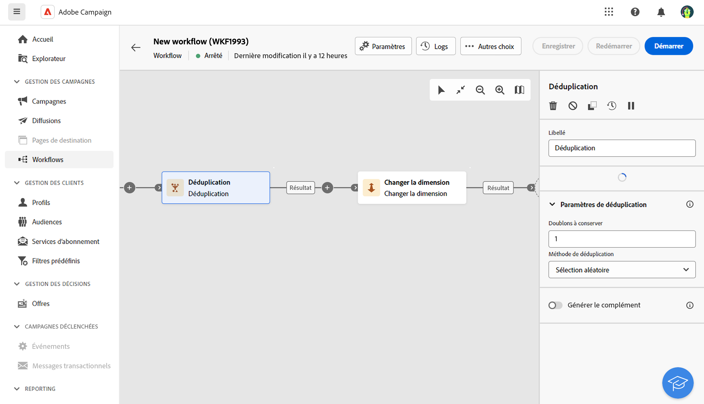

# Déduplication {#deduplication}

>[!CONTEXTUALHELP]
>id="acw_orchestration_deduplication_fields"
>title="Branchement  activité"
>abstract="L&#39;activité Déduplication permet de..."

La variable **Déduplication** est une activité **Ciblage** activité. Cette activité permet de supprimer les doublons dans le ou les résultats des activités entrantes. La variable **Déduplication** est généralement utilisée à la suite des activités de ciblage et avant les activités permettant l&#39;utilisation des données ciblées.

## Configuration

Pour configurer la variable **Planificateur** activité :

1. Ajouter un **Déduplication** à votre workflow.

   

1. Dans le **Champs permettant d’identifier des doublons** , cliquez sur le bouton **Ajouter un attribut** pour indiquer les champs pour lesquels des valeurs identiques permettent d&#39;identifier les doublons : adresse email, prénom, nom, etc. L’ordre des champs vous permet de spécifier ceux à traiter en premier.

1. Sélectionnez le nombre d’attributs uniques **Doublons à conserver**. La valeur par défaut de ce champs est 1. La valeur 0 permet de conserver tous les doublons.

<!--
    For example, if records A and B are considered duplicates of record Y, and a record C is considered as a duplicate of record Z:

    * If the value of the field is 1: only the Y and Z records are kept.
    * If the value of the field is 0: all the records are kept.
    * If the value of the field is 2: records C and Z are kept and two records from A, B, and Y are kept, by chance or depending on the deduplication method selected thereafter.

-->

1. Sélectionnez la variable **Méthode de déduplication** pour utiliser :

   * **Sélection aléatoire**: sélectionne au hasard parmi les doublons l&#39;enregistrement à conserver.
   * **A partir d&#39;une expression** : permet de conserver les enregistrements dont la valeur de l&#39;expression renseignée est la plus petite ou la plus grande. Tri ++ des expressions ++
   * **Par ordonnancement de valeurs** : permet de définir un ordre de priorité des valeurs pour un ou plusieurs champs. Pour définir les valeurs, cliquez sur **Attribut** pour sélectionner un champ ou créer une expression, ajoutez la ou les valeurs dans le tableau correspondant. Cliquez sur le bouton Ajouter situé au-dessus de la liste des valeurs pour définir un nouveau champ. ++ Tri

1. Vérifiez les **Générer le complémentaire** si vous souhaitez exploiter la population restante. Le complémentaire est constitué de tous les doublons. Une transition supplémentaire sera alors ajoutée à l&#39;activité.

## Exemple

