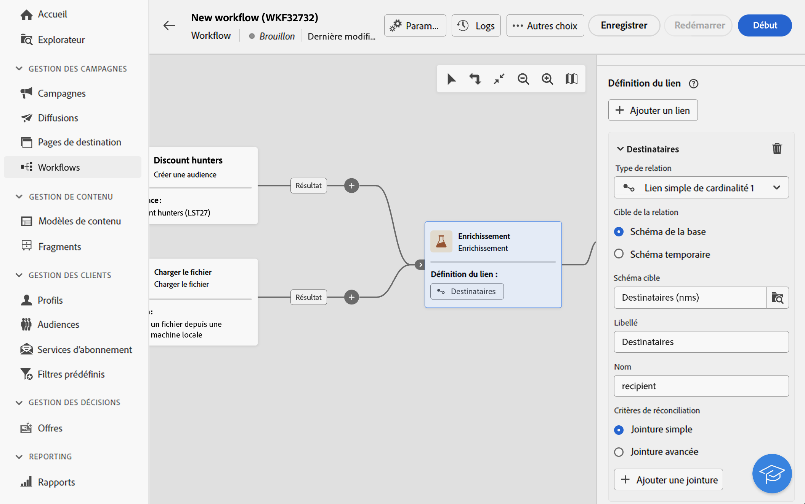
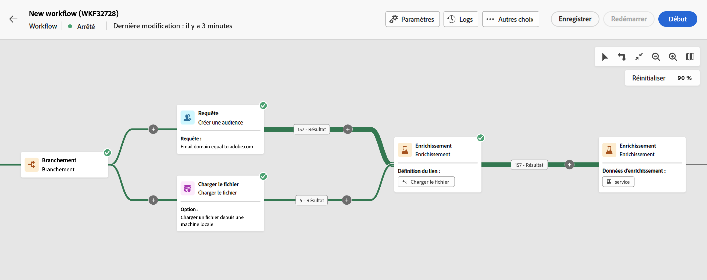

# Enrichissement {#enrichment}

>[!CONTEXTUALHELP]
>id="acw_orchestration_enrichment"
>title="Activité Enrichissement"
>abstract="L’activité **Enrichissement** permet d’enrichir les données ciblées avec des informations supplémentaires provenant de la base de données. Elle est généralement utilisée dans un workflow après les activités de segmentation."

>[!CONTEXTUALHELP]
>id="acw_orchestration_enrichment_data"
>title="Activité Enrichissement"
>abstract="Une fois que les données d’enrichissement ont été ajoutées au workflow, vous pouvez les utiliser dans les activités ajoutées après l’activité Enrichissement pour segmenter les clientes et clients en groupes distincts en fonction de leurs comportements, préférences et besoins. Vous pouvez également vous en servir pour créer des messages et des campagnes marketing personnalisés qui résonneront davantage auprès de votre audience cible."

>[!CONTEXTUALHELP]
>id="acw_orchestration_enrichment_simplejoin"
>title="Créez un lien entre les données de la table de travail et la base de données Adobe Campaign. Par exemple, si vous chargez des données depuis un fichier contenant le numéro de compte, le pays et l&#39;email des destinataires, vous devez créer un lien vers la table des pays afin de mettre à jour ces informations dans leurs profils."
>abstract="Définition du lien"

>[!CONTEXTUALHELP]
>id="acw_orchestration_enrichment_reconciliation"
>title="Réconciliation des enrichissements"
>abstract="Réconciliation des enrichissements"

>[!CONTEXTUALHELP]
>id="acw_targetdata_personalization_enrichmentdata"
>title="Données d’enrichissement"
>abstract="Sélectionnez les données à utiliser pour enrichir votre workflow. Vous pouvez sélectionner deux types de données d’enrichissement : un seul attribut d’enrichissement de la dimension cible ou un lien de collection, qui est un lien avec une cardinalité 1-N entre les tables."

L’activité **Enrichissement** est une activité de **ciblage**. Elle permet d’enrichir les données ciblées avec des informations supplémentaires provenant de la base de données. Elle est généralement utilisée dans un workflow après les activités de segmentation.

Les données d’enrichissement tirent leur origine des sources suivantes :

* **La même table de travail** que celle ciblée dans votre workflow :

  *Ciblez un groupe de clientes et de clients et ajoutez le champ « Date de naissance » au tableau de travail actuel.*

* **Une autre table de travail** :

  *Ciblez un groupe de clients et de clientes et ajoutez les champs « Montant » et « Type de produit » provenant du tableau « Achat »*.

Une fois que les données d’enrichissement ont été ajoutées au workflow, vous pouvez les utiliser dans les activités ajoutées après l’activité d’**enrichissement** pour segmenter les clientes et les clients en groupes distincts en fonction de leurs comportements, préférences et besoins. Vous pouvez également vous en servir pour créer des messages et des campagnes marketing personnalisés qui résonneront davantage auprès de votre audience cible.

Par exemple, vous pouvez ajouter à la table de travail du workflow des informations relatives aux achats des clientes et clients et utiliser ces données pour personnaliser les e-mails en fonction de leur dernier achat ou du montant dépensé pour ces achats.

## Ajouter une activité Enrichissement {#enrichment-configuration}

Pour configurer l’activité **Enrichissement**, procédez comme suit :

1. Ajoutez des activités telles que **Créer une audience** et **Combiner**.
1. Ajoutez une activité **Enrichissement**.
1. Si plusieurs transitions ont été configurées dans votre workflow, vous pouvez utiliser la variable **[!UICONTROL Principal]** champ pour définir la transition à utiliser comme ensemble principal pour enrichir les données.

## Ajouter des données d’enrichissement {#enrichment-add}

1. Cliquez sur **Ajouter des données d’enrichissement** et sélectionnez l’attribut à utiliser pour enrichir les données.

   Vous pouvez sélectionner deux types de données d&#39;enrichissement : un seul attribut d&#39;enrichissement de la dimension cible ou un lien de collection. Chacun de ces types est présenté dans les exemples ci-dessous :
   * [Attribut d’enrichissement unique](#single-attribute)
   * [Lien de collection](#collection-link)

   >[!NOTE]
   >
   >Le **bouton Modifier l’expression** dans l’écran de sélection d’attributs vous permet de créer des expressions avancées pour sélectionner l’attribut. [Découvrez comment travailler avec l’éditeur d’expression](../../query/expression-editor.md).

   

## Création de liens entre les tableaux {#create-links}

>[!CONTEXTUALHELP]
>id="acw_homepage_welcome_rn3"
>title="Liens entre les tables"
>abstract="Vous pouvez maintenant créer un lien entre les données de la table de travail et la base de données Adobe Campaign dans l&#39;activité de workflow Enrichissement ."
>additional-url="https://experienceleague.adobe.com/docs/campaign-web/v8/release-notes/release-notes.html?lang=fr" text="Voir les notes de mise à jour"

La variable **[!UICONTROL Définition de lien]** permet de créer un lien entre les données de la table de travail et la base de données Adobe Campaign. Par exemple, si vous chargez des données depuis un fichier contenant le numéro de compte, le pays et l&#39;email des destinataires, vous devez créer un lien vers la table des pays afin de mettre à jour ces informations dans leurs profils.

Plusieurs types de liens sont disponibles :

* **[!UICONTROL Lien simple de cardinalité 1]**: chaque enregistrement de l’ensemble principal peut être associé à un seul enregistrement des données liées.
* **[!UICONTROL Lien simple de cardinalité 0 ou 1]**: chaque enregistrement de l’ensemble principal peut être associé à 0 ou 1 enregistrement des données liées, mais pas plus d’un.
* **[!UICONTROL Lien de collection de cardinalité N]**: chaque enregistrement de l’ensemble principal peut être associé à 0, 1 ou plus (N) d’enregistrements des données liées.

Pour créer un lien, procédez comme suit :

1. Dans le **[!UICONTROL Définition de lien]** , cliquez sur le bouton **[!UICONTROL Ajouter un lien]** bouton .

   

1. Dans le **Type de relation** , sélectionnez le type de lien à créer.

1. Identifiez la cible à laquelle vous souhaitez lier l&#39;ensemble principal :

   * Pour associer une table existante dans la base de données, choisissez **[!UICONTROL Schéma de base de données]** et sélectionnez le tableau de votre choix dans le **[!UICONTROL Schéma cible]** champ .
   * Pour créer un lien avec les données de la transition entrante, choisissez **Schéma temporaire** et sélectionnez la transition dont vous souhaitez utiliser les données.

1. Définissez les critères de réconciliation pour faire correspondre les données de l&#39;ensemble principal avec le schéma lié. Deux types de jointures sont disponibles :

   * **Jointure simple**: sélectionnez un attribut spécifique pour faire correspondre les données des deux schémas. Cliquez sur **Ajouter une jointure** et sélectionnez la variable **Source** et **Destination** attributs à utiliser comme critères de réconciliation.
   * **Jointure avancée**: créez une jointure à l’aide de conditions avancées. Cliquez sur **Ajouter une jointure** et cliquez sur le bouton **Création d’une condition** pour ouvrir le créateur de modèles de requête.

Un exemple de workflow utilisant des liens est disponible dans la [Exemples](#link-example) .

## Exemples {#example}

### Attribut d’enrichissement unique {#single-attribute}

Ici, nous ajoutons un seul attribut d’enrichissement, par exemple, la date de naissance. Procédez comme suit :

1. Cliquez dans le champ **Attribut**.
1. Sélectionnez un champ simple dans la dimension de ciblage, la date de naissance dans notre exemple.
1. Cliquez sur **Confirmer**.

### Lien de collecte {#collection-link}

Dans ce cas pratique plus complexe, nous sélectionnons un lien de collecte qui est un lien avec une cardinalité 1-N entre les tableaux. Récupérons les trois derniers achats inférieurs à 100 USD. Pour cela, vous devez définir :

* un attribut d’enrichissement : le champ **Montant total** ;
* le nombre de lignes à récupérer : 3 ;
* un filtre : filtrez les éléments supérieurs à 100 USD ;
* un tri : tri descendant sur le champ **Date de commande**.

#### Ajouter l’attribut {#add-attribute}

C’est là que vous sélectionnez le lien de collecte à utiliser comme données d’enrichissement.

1. Cliquez dans le champ **Attribut**.
1. Cliquez sur **Afficher les attributs avancés**.
1. Sélectionnez le champ **Montant total** dans le tableau **Achats**.

#### Définir les paramètres de la collecte{#collection-settings}

Définissez ensuite la manière dont les données sont collectées et le nombre d’enregistrements à récupérer.

1. Sélectionnez **Collecter des données** dans le menu déroulant **Sélectionner la manière de collecter les données**.
1. Saisissez « 3 » dans le champ **Lignes à récupérer (Colonnes à créer)**.

Si vous souhaitez, par exemple, obtenir le montant moyen des achats d’un client ou une cliente, sélectionnez **Données agrégées**, puis **Moyenne** dans le menu déroulant **Fonction d’agrégat**.

#### Définir des filtres{#collection-filters}

Ici, nous définissons la valeur maximale de l’attribut d’enrichissement. Nous filtrons les éléments supérieurs à 100 $. [Découvrez comment utiliser le concepteur de requête](../../query/query-modeler-overview.md)

1. Cliquez sur **Modifier les filtres**.
1. Ajoutez les deux filtres suivants : **Montant total** existe ET **Montant total** est inférieur à 100. Le premier filtre les valeurs NULL, car elles apparaissent comme la valeur la plus élevée.
1. Cliquez sur **Confirmer**.

#### Définir le tri{#collection-sorting}

Nous devons maintenant appliquer un tri pour récupérer les trois **derniers** achats.

1. Activez l’option **Activer le tri**.
1. Cliquez dans le champ **Attribut**.
1. Sélectionnez le champ **Date de commande**.
1. Cliquez sur **Confirmer**.
1. Sélectionnez **Descendant** dans le menu déroulant **Tri**.

### Enrichissement avec des données liées {#link-example}

L&#39;exemple ci-dessous montre un workflow paramétré pour créer un lien entre deux transitions. La première transition cible les données de profil à l&#39;aide d&#39;une activité Requête , tandis que la seconde transition regroupe les données d&#39;achat stockées dans un fichier chargé via une activité Chargement de fichier .

* Le premier **Enrichissement** l’activité relie notre ensemble principal (données issues de la variable **Requête** ) avec le schéma de la propriété **Chargement de fichier** activité. Cela nous permet de faire correspondre chaque profil ciblé par la requête avec les données d&#39;achat correspondantes.
* Une seconde **Enrichissement** l’activité est ajoutée afin d’enrichir les données de la table de workflow avec les données d’achat provenant de la **Chargement de fichier** activité. Cela nous permet d’utiliser ces données dans d’autres activités, par exemple pour personnaliser les messages envoyés aux clients avec des informations sur leur achat.

  

<!--

Add other fields
use it in delivery

cardinality between the tables (1-N)
1. select attribute to use as enrichment data

    display advanced fields option
    i button

    note: attributes from the target dimension

1. Select how the data is collected
1. number of records to retrieve if want to retrieve a collection of multiple records
1. Apply filters and build rule

    select an existing filter
    save the filter for reuse
    view results of the filter visually or in code view

1. sort records using an attribute

leverage enrichment data in campaign

where we can use the enrichment data: personalize email, other use cases?

## Example

-->
