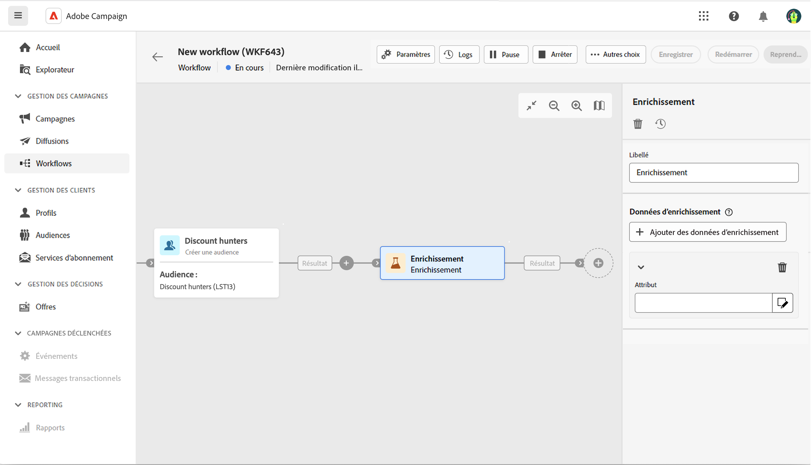
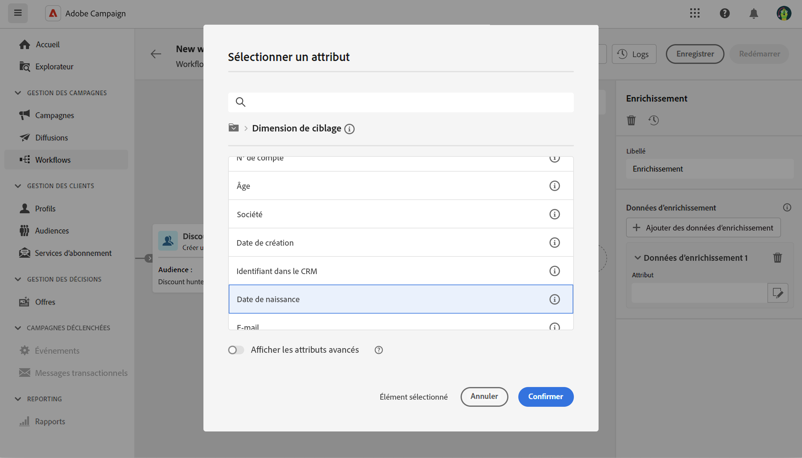
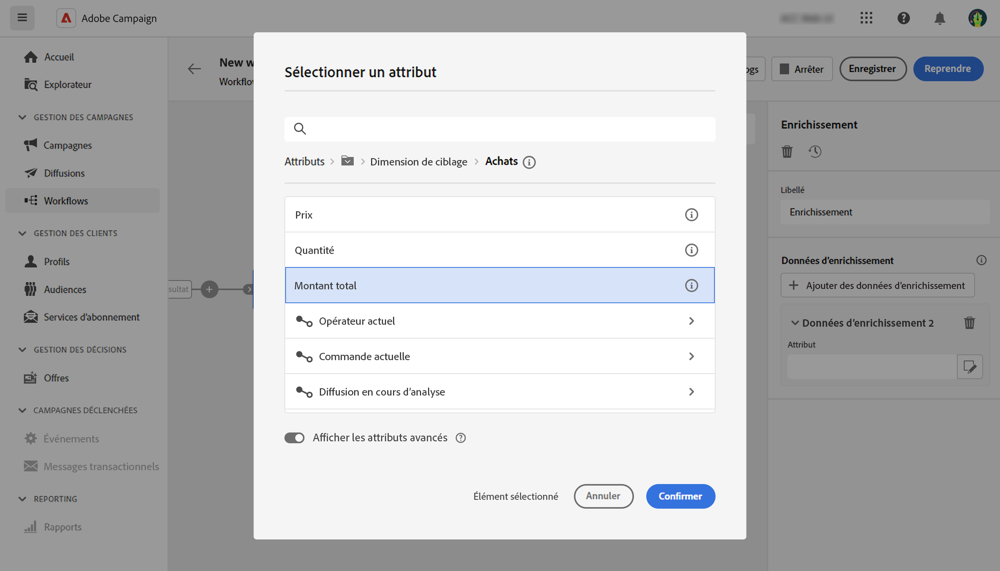
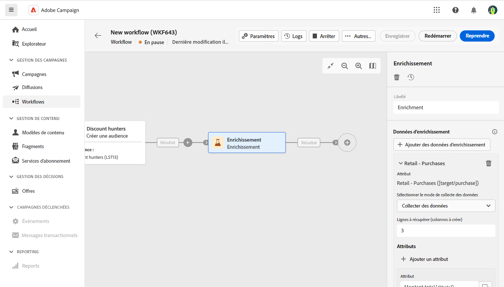
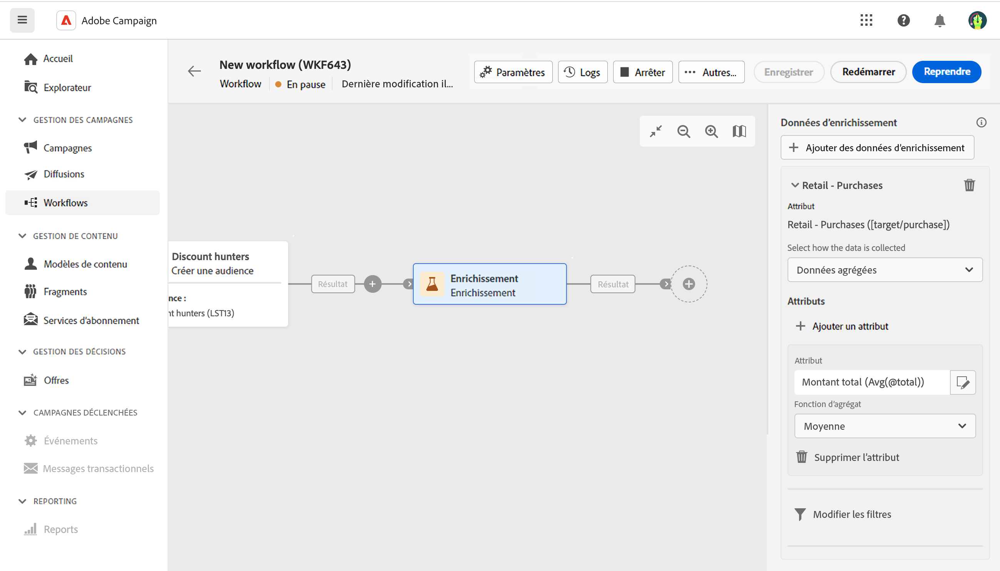
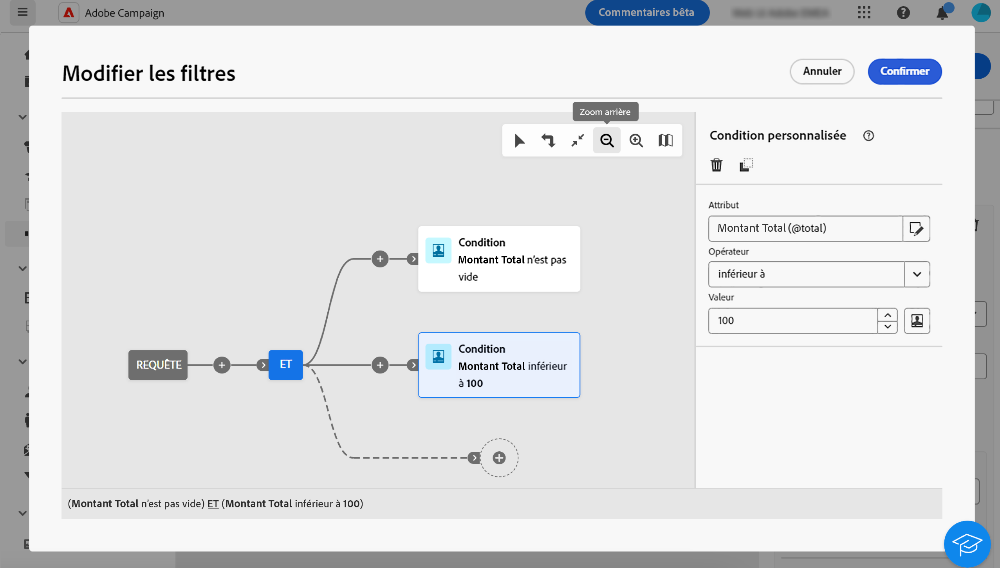
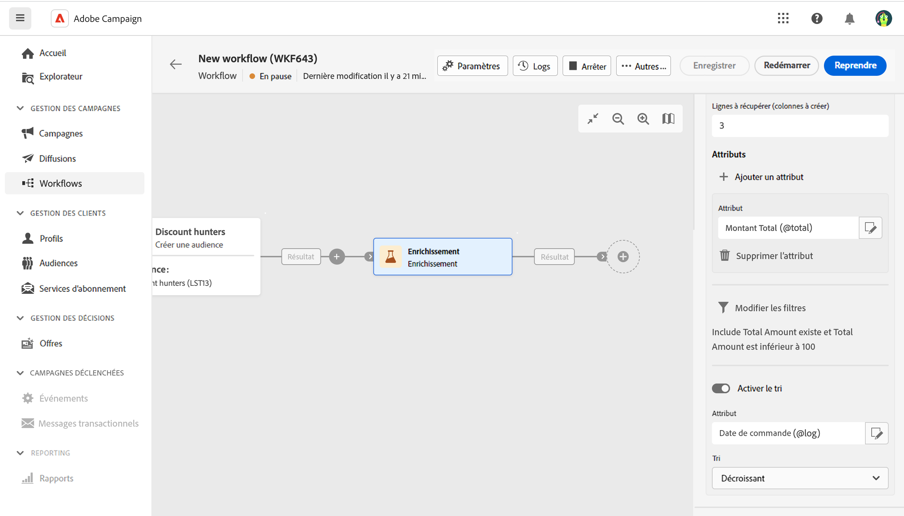

# Enrichissement {#enrichment}

>[!CONTEXTUALHELP]
>id="acw_orchestration_enrichment_data"
>title="Enrichissement activité"
>abstract="L’activité Enrichissement permet d’enrichir les données ciblées avec des informations supplémentaires provenant de la base de données. Elle est généralement utilisée dans un workflow après les activités de ciblage. Une fois que les données d’enrichissement ont été ajoutées au workflow, vous pouvez les utiliser dans les activités ajoutées après l’activité Enrichissement pour segmenter les clients en groupes distincts en fonction de leurs comportements, préférences et besoins. Vous pouvez également vous en servir pour créer des messages et des campagnes marketing personnalisés qui résonneront davantage auprès de votre audience cible."

L’activité d’**enrichissement** est une activité de **ciblage**. Elle permet d’enrichir les données ciblées avec des informations supplémentaires provenant de la base de données. Elle est généralement utilisée dans un workflow après les activités de segmentation.

Les données d’enrichissement tirent leur origine des sources suivantes :

* **Le même tableau de travail** que celui ciblé dans votre workflow :

  *Ciblez un groupe de clients et de clientes et ajoutez le champ « Date de naissance » au tableau de travail actuel.*

* **Un autre tableau de travail** :

  *Ciblez un groupe de clients et de clientes et ajoutez les champs « Montant » et « Type de produit » provenant du tableau « Achat »*.

Une fois que les données d’enrichissement ont été ajoutées au workflow, vous pouvez les utiliser dans les activités ajoutées après l’activité d’**enrichissement** pour segmenter les clients et les clientes en groupes distincts en fonction de leurs comportements, préférences et besoins. Vous pouvez également vous en servir pour créer des messages et des campagnes marketing personnalisés qui résonneront davantage auprès de votre audience cible.

Par exemple, vous pouvez ajouter au tableau de travail du workflow des informations relatives aux achats des clients et clientes et utiliser ces données pour personnaliser les e-mails en fonction de leur dernier achat ou du montant dépensé pour ces achats.

## Configuration générale {#general}

Procédez comme suit pour configurer l’activité d’**enrichissement** :

1. Ajoutez des activités telles que **Créer une audience** et **Combiner**.
1. Ajoutez une activité d’**enrichissement**.
1. Cliquez sur **Ajouter des données d’enrichissement**.

Vous pouvez sélectionner deux types de données d’enrichissement : un [attribut d’enrichissement unique](#single-attribute) de la dimension cible, ou un [lien de collection](#collection-link).

## Attribut d’enrichissement unique {#single-attribute}

Ici, nous ajoutons un seul attribut d’enrichissement, par exemple, la date de naissance. Procédez comme suit :

1. Cliquez dans le champ **Attribut**.
1. Sélectionnez un champ simple dans la dimension de ciblage, la date de naissance dans notre exemple.
1. Cliquez sur **Confirmer**.

## Lien de collection {#collection-link}

Dans ce cas pratique plus complexe, nous allons sélectionner un lien de collection qui est un lien avec une cardinalité 1-N entre les tableaux. Récupérons les trois derniers achats inférieurs à 100 $. Pour cela, vous devez définir :

* un attribut d’enrichissement : le champ **Montant total** ;
* le nombre de lignes à récupérer : 3 ;
* un filtre : filtrez les éléments supérieurs à 100 $ ;
* un tri : tri descendant sur le champ **Date de commande**.

### Ajouter l’attribut

C’est là que vous sélectionnez le lien de collection à utiliser comme données d’enrichissement.

1. Cliquez dans le champ **Attribut**.
1. Cliquez sur **Afficher les attributs avancés**.
1. Sélectionnez le champ **Montant total** dans le tableau **Achats**.

### Définir les paramètres de la collection

Définissez ensuite la manière dont les données sont collectées et le nombre d’enregistrements à récupérer.

1. Sélectionnez **Collecter des données** dans le menu déroulant **Sélectionner la manière de collecter les données**.
1. Saisissez « 3 » dans le champ **Lignes à récupérer (Colonnes à créer)**.

Si vous souhaitez, par exemple, obtenir le montant moyen des achats d’un client ou une cliente, sélectionnez **Données agrégées**, puis **Moyenne** dans le menu déroulant **Fonction d’agrégat**.

### Définir des filtres

Ici, nous définissons la valeur maximale de l’attribut d’enrichissement. Nous filtrons les éléments supérieurs à 100 $.

1. Cliquez sur **Modifier les filtres**.
1. Ajoutez les deux filtres suivants : **Montant total** existe ET **Montant total** est inférieur à 100. Le premier filtre les valeurs NULL, car elles apparaissent comme la valeur la plus élevée.
1. Cliquez sur **Confirmer**.

### Définir le tri

Nous devons maintenant appliquer un tri pour récupérer les trois **derniers** achats.

1. Activez l’option **Activer le tri**.
1. Cliquez dans le champ **Attribut**.
1. Sélectionnez le champ **Date de commande**.
1. Cliquez sur **Confirmer**.
1. Sélectionnez **Descendant** dans le menu déroulant **Tri**.

<!--

Add other fields
use it in delivery

cardinality between the tables (1-N)
1. select attribute to use as enrichment data

    display advanced fields option
    i button

    note: attributes from the target dimension

1. Select how the data is collected
1. number of records to retrieve if want to retrieve a collection of multiple records
1. Apply filters and build rule

    select an existing filter
    save the filter for reuse
    view results of the filter visually or in code view

1. sort records using an attribute

leverage enrichment data in campaign

where we can use the enrichment data: personalize email, other use cases?

## Example

-->