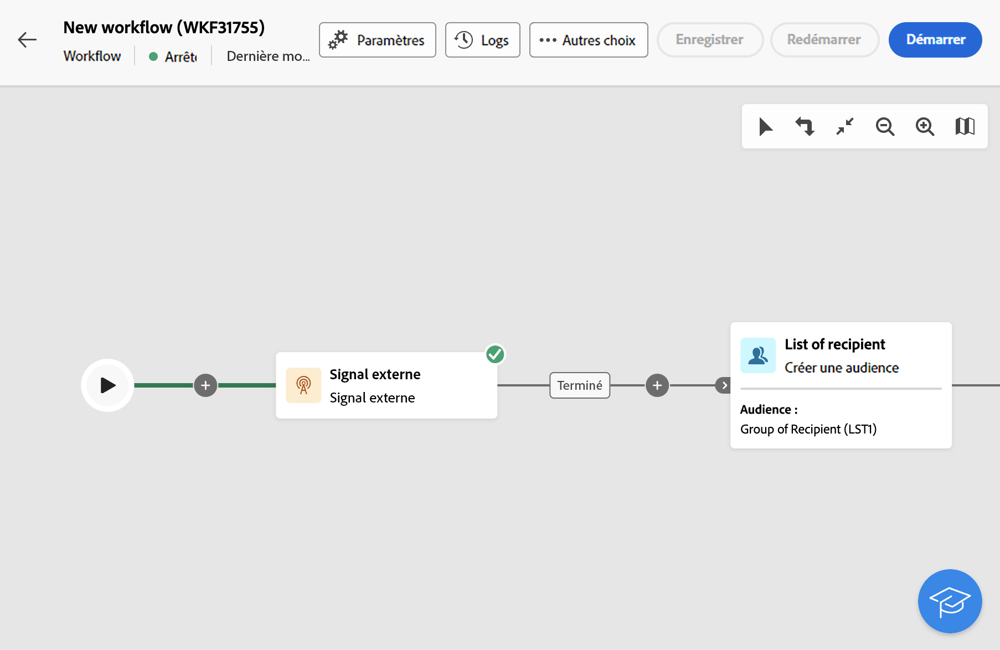
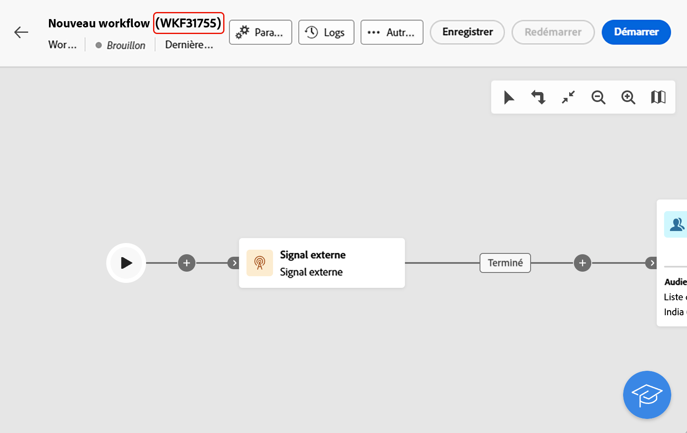
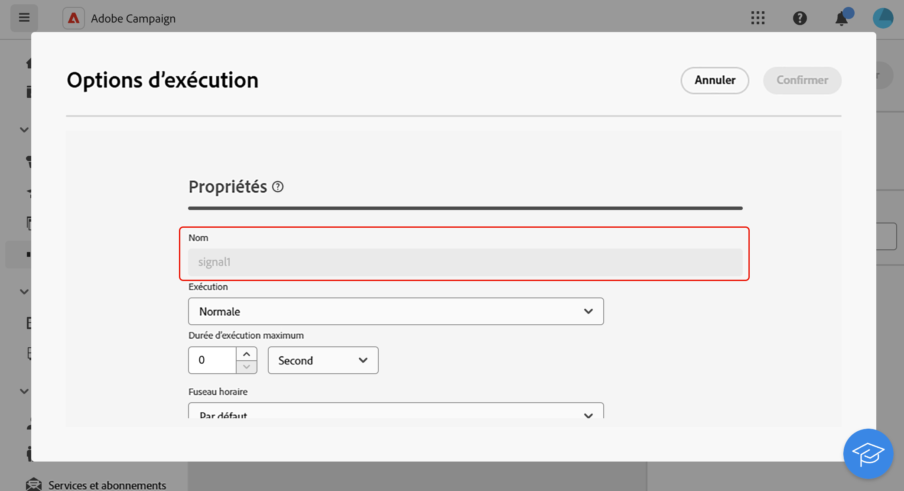
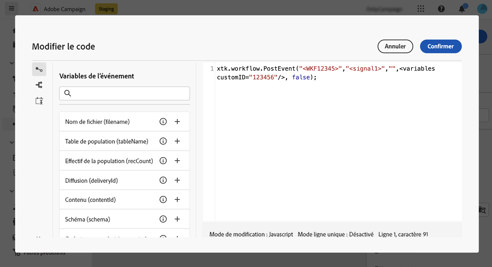

<?xml version="1.0" encoding="UTF-8"?>
<xliff xmlns="urn:oasis:names:tc:xliff:document:1.2" xmlns:okp="okapi-framework:xliff-extensions" xmlns:its="http://www.w3.org/2005/11/its" xmlns:itsxlf="http://www.w3.org/ns/its-xliff/" version="1.2" its:version="2.0">
<file original="help/v8/workflows/activities/external-signal.md.mdsc" source-language="en-US" target-language="en-XX" datatype="x-text/markdown">
<body>
<trans-unit id="tu13" xml:space="preserve">
<source xml:lang="en-US">https://experienceleague.adobe.com/en/docs/campaign/automation/workflows/advanced-management/javascript-in-workflows#trigger-example</source>
<target xml:lang="en-XX">https://experienceleague.adobe.com/fr/docs/campaign/automation/workflows/advanced-management/javascript-in-workflows#trigger-example</target>
</trans-unit>
<trans-unit id="tu33" xml:space="preserve">
<source xml:lang="en-US">https://experienceleague.adobe.com/en/tools/campaign-api</source>
<target xml:lang="en-XX">https://experienceleague.adobe.com/fr/tools/campaign-api</target>
</trans-unit>
<trans-unit id="tu1" restype="x-YAML_METADATA_HEADER_VALUE" xml:space="preserve">
<source xml:lang="en-US">Use the External signal activity</source>
<target xml:lang="en-XX">Utiliser l’activité Signal externe</target>
</trans-unit>
<trans-unit id="tu2" restype="x-YAML_METADATA_HEADER_VALUE" xml:space="preserve">
<source xml:lang="en-US">Learn how to use the External signal workflow activity</source>
<target xml:lang="en-XX">Découvrez comment utiliser l’activité de workflow Signal externe</target>
</trans-unit>
<trans-unit id="tu3" xml:space="preserve">
<source xml:lang="en-US">External signal</source>
<target xml:lang="en-XX">Signal externe</target>
</trans-unit>
<trans-unit id="tu4" xml:space="preserve">
<source xml:lang="en-US">External Signal</source>
<target xml:lang="en-XX">Signal externe</target>
</trans-unit>
<trans-unit id="tu5" xml:space="preserve">
<source xml:lang="en-US">The <ph id="1" ctype="x-STRONG_EMPHASIS">**</ph>External signal<ph id="2" ctype="x-STRONG_EMPHASIS">**</ph> activity lets you trigger the execution of a workflow from another workflow or an API call.</source>
<target xml:lang="en-XX">L’activité <ph id="1" ctype="x-STRONG_EMPHASIS">**</ph>Signal externe<ph id="2" ctype="x-STRONG_EMPHASIS">**</ph> permet de déclencher l’exécution d’un workflow à parti d’un autre workflow ou d’un appel API.</target>
</trans-unit>
<trans-unit id="tu6" xml:space="preserve">
<source xml:lang="en-US">External Signal Parameters</source>
<target xml:lang="en-XX">Paramètres de signal externe</target>
</trans-unit>
<trans-unit id="tu7" xml:space="preserve">
<source xml:lang="en-US">External Signal Parameters</source>
<target xml:lang="en-XX">Paramètres de signal externe</target>
</trans-unit>
<trans-unit id="tu8" xml:space="preserve">
<source xml:lang="en-US">End triggers</source>
<target xml:lang="en-XX">Déclencheurs de fin</target>
</trans-unit>
<trans-unit id="tu9" xml:space="preserve">
<source xml:lang="en-US">End triggers</source>
<target xml:lang="en-XX">Déclencheurs de fin</target>
</trans-unit>
<trans-unit id="tu10" xml:space="preserve">
<source xml:lang="en-US">The <ph id="1" ctype="x-STRONG_EMPHASIS">**</ph>External signal<ph id="2" ctype="x-STRONG_EMPHASIS">**</ph> activity is a <ph id="3" ctype="x-STRONG_EMPHASIS">**</ph>Flow control<ph id="4" ctype="x-STRONG_EMPHASIS">**</ph> activity. It lets you trigger the execution of a workflow from another workflow or an API call.</source>
<target xml:lang="en-XX">L’activité <ph id="1" ctype="x-STRONG_EMPHASIS">**</ph>Signal externe<ph id="2" ctype="x-STRONG_EMPHASIS">**</ph> est une activité de <ph id="3" ctype="x-STRONG_EMPHASIS">**</ph>contrôle de flux<ph id="4" ctype="x-STRONG_EMPHASIS">**</ph>. Elle permet de déclencher l’exécution d’un workflow à partir d’un autre workflow ou d’un appel API.</target>
</trans-unit>
<trans-unit id="tu11" xml:space="preserve">
<source xml:lang="en-US"><ph id="1" ctype="x-regxph" equiv-text="&lbrack;!NOTE">[!NOTE]</ph></source>
<target xml:lang="en-XX"><ph id="1" ctype="x-regxph" equiv-text="&lbrack;!NOTE">[!NOTE]</ph></target>
</trans-unit>
<trans-unit id="tu12" xml:space="preserve">
<source xml:lang="en-US">This page explains the main steps to configure an <ph id="1" ctype="x-STRONG_EMPHASIS">**[!UICONTROL </ph>External Signal<ph id="3" ctype="x-LINK_REF">]**</ph> activity in Campaign Web User Interface and trigger it from another workflow or an API call. Detailed information on how to trigger a workflow, best practices, and how to work with Campaign APIs is available in the <ph id="5" ctype="x-LINK">&lbrack;</ph>Campaign v8 (client console) documentation<ph id="6" ctype="x-LINK">[#$tu13]</ph>.</source>
<target xml:lang="en-XX">Cette page explique les principales étapes pour configurer une activité <ph id="1" ctype="x-STRONG_EMPHASIS">**[!UICONTROL </ph>Signal externe<ph id="3" ctype="x-LINK_REF">]**</ph> dans l’interface d’utilisation de Campaign Web et la déclencher à partir d’un autre workflow ou d’un appel API. Des informations détaillées sur le déclenchement d’un workflow et ses bonnes pratiques, ainsi que sur l’utilisation des API Campaign, sont disponibles dans la <ph id="5" ctype="x-LINK">&lbrack;</ph>documentation de Campaign v8 (console cliente)<ph id="6" ctype="x-LINK">[#$tu13]</ph>.</target>
</trans-unit>
<trans-unit id="tu14" xml:space="preserve">
<source xml:lang="en-US">Follow these steps to configure the <ph id="1" ctype="x-STRONG_EMPHASIS">**</ph>External signal<ph id="2" ctype="x-STRONG_EMPHASIS">**</ph> activity and trigger its execution:</source>
<target xml:lang="en-XX">Suivez ces étapes pour configurer l’activité <ph id="1" ctype="x-STRONG_EMPHASIS">**</ph>Signal externe<ph id="2" ctype="x-STRONG_EMPHASIS">**</ph> et déclencher son exécution :</target>
</trans-unit>
<trans-unit id="tu15" xml:space="preserve">
<source xml:lang="en-US">Add an <ph id="1" ctype="x-STRONG_EMPHASIS">**</ph>External signal<ph id="2" ctype="x-STRONG_EMPHASIS">**</ph> activity into your workflow.</source>
<target xml:lang="en-XX">Ajoutez une activité <ph id="1" ctype="x-STRONG_EMPHASIS">**</ph>Signal externe<ph id="2" ctype="x-STRONG_EMPHASIS">**</ph> à votre workflow.</target>
</trans-unit>
<trans-unit id="tu16" xml:space="preserve">
<source xml:lang="en-US">Complete the configuration of your workflow, and start its execution. The <ph id="1" ctype="x-STRONG_EMPHASIS">**[!UICONTROL </ph>External Signal<ph id="3" ctype="x-LINK_REF">]**</ph> activity displays as "Pending," waiting to be triggered.</source>
<target xml:lang="en-XX">Effectuez la configuration de votre workflow et démarrez son exécution. L’activité <ph id="1" ctype="x-STRONG_EMPHASIS">**[!UICONTROL </ph>Signal externe<ph id="3" ctype="x-LINK_REF">]**</ph> s’affiche comme étant forme « En attente », c’est-à-dire en attente de déclenchement.</target>
</trans-unit>
<trans-unit id="tu17" xml:space="preserve">
<source xml:lang="en-US"><ph id="1" ctype="x-IMAGE"></ph></source>
<target xml:lang="en-XX"><ph id="1" ctype="x-IMAGE"></ph></target>
</trans-unit>
<trans-unit id="tu18" xml:space="preserve">
<source xml:lang="en-US">Retrieve the following information:</source>
<target xml:lang="en-XX">Récupérez les informations suivantes :</target>
</trans-unit>
<trans-unit id="tu19" xml:space="preserve">
<source xml:lang="en-US">The <ph id="1" ctype="x-STRONG_EMPHASIS">**</ph>workflow's internal name<ph id="2" ctype="x-STRONG_EMPHASIS">**</ph>, which displays next to its label.</source>
<target xml:lang="en-XX"><ph id="1" ctype="x-STRONG_EMPHASIS">**</ph>Nom interne du workflow<ph id="2" ctype="x-STRONG_EMPHASIS">**</ph>, qui s’affiche en regard de son libellé.</target>
</trans-unit>
<trans-unit id="tu20" xml:space="preserve">
<source xml:lang="en-US">View example</source>
<target xml:lang="en-XX">Afficher l’exemple</target>
</trans-unit>
<trans-unit id="tu21" xml:space="preserve">
<source xml:lang="en-US"><ph id="1" ctype="x-IMAGE"></ph></source>
<target xml:lang="en-XX"><ph id="1" ctype="x-IMAGE"></ph></target>
</trans-unit>
<trans-unit id="tu22" xml:space="preserve">
<source xml:lang="en-US">The <ph id="1" ctype="x-STRONG_EMPHASIS">**</ph>External signal activity's name<ph id="2" ctype="x-STRONG_EMPHASIS">**</ph>, which displays in the workflow's <ph id="3" ctype="x-STRONG_EMPHASIS">**[!UICONTROL </ph>Execution options<ph id="5" ctype="x-LINK_REF">]**</ph>.</source>
<target xml:lang="en-XX"><ph id="1" ctype="x-STRONG_EMPHASIS">**</ph>Nom de l’activité Signal externe<ph id="2" ctype="x-STRONG_EMPHASIS">**</ph>, qui s’affiche dans les <ph id="3" ctype="x-STRONG_EMPHASIS">**[!UICONTROL </ph>options d’exécution<ph id="5" ctype="x-LINK_REF">]**</ph> du workflow.</target>
</trans-unit>
<trans-unit id="tu23" xml:space="preserve">
<source xml:lang="en-US">View example</source>
<target xml:lang="en-XX">Afficher l’exemple</target>
</trans-unit>
<trans-unit id="tu24" xml:space="preserve">
<source xml:lang="en-US"><ph id="1" ctype="x-IMAGE"></ph></source>
<target xml:lang="en-XX"><ph id="1" ctype="x-IMAGE"></ph></target>
</trans-unit>
<trans-unit id="tu25" xml:space="preserve">
<source xml:lang="en-US">To trigger the workflow, execute the <ph id="1" ctype="x-CODE">`PostEvent`</ph> JavaScript function. This function lets you pass variables with the values of your choice and use them in the triggered workflow.</source>
<target xml:lang="en-XX">Pour déclencher le workflow, exécutez la fonction JavaScript <ph id="1" ctype="x-CODE">`PostEvent`</ph>. Cette fonction vous permet de transmettre des variables avec les valeurs de votre choix et de les utiliser dans le workflow déclenché.</target>
</trans-unit>
<trans-unit id="tu26" xml:space="preserve">
<source xml:lang="en-US">The <ph id="1" ctype="x-CODE">`PostEvent`</ph> function can be executed either from another workflow or from an API call.</source>
<target xml:lang="en-XX">La fonction <ph id="1" ctype="x-CODE">`PostEvent`</ph> peut être exécutée à partir d’un autre workflow ou d’un appel API.</target>
</trans-unit>
<trans-unit id="tu27" xml:space="preserve">
<source xml:lang="en-US">To trigger an <ph id="1" ctype="x-STRONG_EMPHASIS">**[!UICONTROL </ph>External signal<ph id="3" ctype="x-LINK_REF">]**</ph> activity from a workflow, execute the PostEvent function from the <ph id="5" ctype="x-STRONG_EMPHASIS">**[!UICONTROL </ph>Initialization script<ph id="7" ctype="x-LINK_REF">]**</ph> pane, accessible from the activity's <ph id="9" ctype="x-STRONG_EMPHASIS">**[!UICONTROL </ph>Execution options<ph id="11" ctype="x-LINK_REF">]**</ph>. For the <ph id="13" ctype="x-STRONG_EMPHASIS">**[!UICONTROL </ph>JavaScript code<ph id="15" ctype="x-LINK_REF">]**</ph> activity, execute the function from the activity's script.</source>
<target xml:lang="en-XX">Pour déclencher une activité <ph id="1" ctype="x-STRONG_EMPHASIS">**[!UICONTROL </ph>Signal externe<ph id="3" ctype="x-LINK_REF">]**</ph> à partir d’un workflow, exécutez la fonction PostEvent à partir du volet <ph id="5" ctype="x-STRONG_EMPHASIS">**[!UICONTROL </ph>Script d’initialisation<ph id="7" ctype="x-LINK_REF">]**</ph>, accessible à partir des <ph id="9" ctype="x-STRONG_EMPHASIS">**[!UICONTROL </ph>options d’exécution<ph id="11" ctype="x-LINK_REF">]**</ph> de l’activité. Pour l’activité <ph id="13" ctype="x-STRONG_EMPHASIS">**[!UICONTROL </ph>Code JavaScript<ph id="15" ctype="x-LINK_REF">]**</ph>, exécutez la fonction à partir du script de l’activité.</target>
</trans-unit>
<trans-unit id="tu28" xml:space="preserve">
<source xml:lang="en-US">The syntax is as follows:</source>
<target xml:lang="en-XX">La syntaxe est la suivante :</target>
</trans-unit>
<trans-unit id="tu29" xml:space="preserve">
<source xml:lang="en-US">View example</source>
<target xml:lang="en-XX">Afficher l’exemple</target>
</trans-unit>
<trans-unit id="tu30" xml:space="preserve">
<source xml:lang="en-US">In this example, the "signal1" External signal activity is triggered. It has been added to the workflow whose internal name is "WKF12345." A variable named "customID" is passed with the value "123456."</source>
<target xml:lang="en-XX">Dans cet exemple, l’activité Signal externe « signal1 » est déclenchée. Elle a été ajoutée au workflow dont le nom interne est « WKF12345 ». Une variable nommée « customID » est transmise avec la valeur « 123456 ».</target>
</trans-unit>
<trans-unit id="tu31" xml:space="preserve">
<source xml:lang="en-US"><ph id="1" ctype="x-IMAGE"></ph></source>
<target xml:lang="en-XX"><ph id="1" ctype="x-IMAGE"></ph></target>
</trans-unit>
<trans-unit id="tu32" xml:space="preserve">
<source xml:lang="en-US">To trigger an <ph id="1" ctype="x-STRONG_EMPHASIS">**[!UICONTROL </ph>External signal<ph id="3" ctype="x-LINK_REF">]**</ph> activity from an API call, follow the steps detailed in the Campaign API documentation. <ph id="5" ctype="x-LINK">&lbrack;</ph>Learn how to use the static <ph id="6" ctype="x-CODE">`PostEvent`</ph> method<ph id="7" ctype="x-LINK">[#$tu33]</ph>.</source>
<target xml:lang="en-XX">Pour déclencher une activité <ph id="1" ctype="x-STRONG_EMPHASIS">**[!UICONTROL </ph>Signal externe<ph id="3" ctype="x-LINK_REF">]**</ph> à partir d’un appel API, suivez les étapes détaillées dans la documentation de l’API Campaign. <ph id="5" ctype="x-LINK">&lbrack;</ph>Découvrir comment utiliser la méthode statique <ph id="6" ctype="x-CODE">`PostEvent`</ph><ph id="7" ctype="x-LINK">[#$tu33]</ph>.</target>
</trans-unit>
</body>
</file>
</xliff>