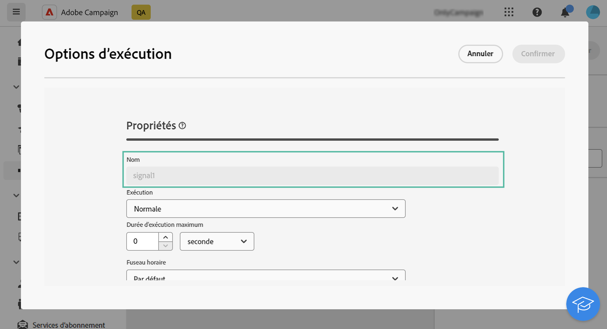

# Signal externe {#external-signal}

<!--External Signal End-->

>[!CONTEXTUALHELP]
>id="acw_orchestration_externalsignal"
>title="Signal externe"
>abstract="L’activité **Signal externe** permet de déclencher l’exécution d’un workflow à parti d’un autre workflow ou d’un appel API."

>[!CONTEXTUALHELP]
>id="acw_orchestration_externalsignal_parameters"
>title="Paramètres de signal externe"
>abstract="Paramètres de signal externe"

>[!CONTEXTUALHELP]
>id="acw_orchestration_end_trigger"
>title="Déclencheurs de fin"
>abstract="Déclencheurs de fin"

L’activité **Signal externe** est une activité de **contrôle de flux**. Elle permet de déclencher l’exécution d’un workflow à partir d’un autre workflow ou d’un appel API.

>[!NOTE]
>
>Cette page présente les principales étapes pour configurer une activité **[!UICONTROL Signal externe]** dans l’interface d’utilisation de Campaign Web et la déclencher à partir d’un autre workflow ou d’un appel API. Des informations détaillées sur le déclenchement d’un workflow et ses bonnes pratiques, ainsi que sur l’utilisation des API Campaign, sont disponibles dans la [documentation de Campaign v8 (console cliente)](https://experienceleague.adobe.com/fr/docs/campaign/automation/workflows/advanced-management/javascript-in-workflows#trigger-example).

Suivez ces étapes pour configurer l’activité **Signal externe** et déclencher son exécution :

1. Ajoutez une activité **Signal externe** à votre workflow.

1. Effectuez la configuration de votre workflow et démarrez son exécution. L’activité **[!UICONTROL Signal externe]** s’affiche comme étant forme « En attente », c’est-à-dire en attente de déclenchement.

   

1. Récupérez les informations ci-dessous :

   * **Nom interne du workflow**, qui s’affiche en regard de son libellé.

     +++Afficher l’exemple

     

+++

   * **Nom de l’activité Signal externe**, qui s’affiche dans les **[!UICONTROL options d’exécution]** du workflow.

     +++Afficher l’exemple

     

+++

1. Pour déclencher le workflow, vous devez exécuter la fonction JavaScript `PostEvent`. Cette fonction vous permet de transmettre des variables avec les valeurs de votre choix et de les utiliser dans le workflow déclenché.

   La fonction `PostEvent` peut être exécutée à partir d’un autre workflow ou d’un appel API.

   * Pour déclencher une activité **[!UICONTROL Signal externe]** à partir d’un workflow, exécutez la fonction PostEvent à partir du volet **[!UICONTROL Script d’initialisation]**, accessible à partir des **[!UICONTROL options d’exécution]** de l’activité. Pour l’activité **[!UICONTROL Code JavaScript]**, exécutez la fonction à partir du script de l’activité.

     La syntaxe est la suivante :

     ```
     xtk.workflow.PostEvent("<workflow-internal-name>","<signal-activity-name>","",<variables <variable-name>="<value>"/>, false);
     ```

   +++Afficher l’exemple

   Dans cet exemple, nous déclenchons l’activité Signal externe « signal1 » qui a été ajoutée au workflow dont le nom interne est « WKF12345 ». Nous transmettons également une variable nommée « customID », avec la valeur « 123456 ».

   

+++

   * Pour déclencher une activité **[!UICONTROL Signal externe]** à partir d’un appel API, suivez les étapes détaillées dans la documentation de l’API Campaign. [Découvrir comment utiliser la méthode statique `PostEvent`](https://experienceleague.adobe.com/developer/campaign-api/api/sm-workflow-PostEvent.html?lang=fr)
