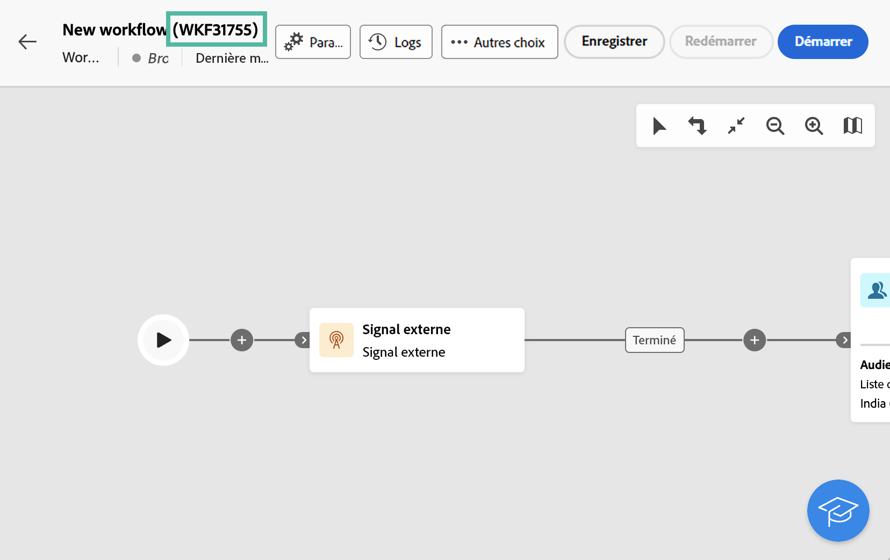

# Signal externe {#external-signal}

<!--External Signal End-->

>[!CONTEXTUALHELP]
>id="acw_orchestration_externalsignal"
>title="Signal externe"
>abstract="La variable **Signal externe** activité vous permet de déclencher l’exécution d’un workflow à partir d’un autre workflow ou d’un appel API."

>[!CONTEXTUALHELP]
>id="acw_orchestration_externalsignal_parameters"
>title="Paramètres de signal externe"
>abstract="Paramètres de signal externe"

>[!CONTEXTUALHELP]
>id="acw_orchestration_end_trigger"
>title="Déclencheurs de fin"
>abstract="Déclencheurs de fin"

La variable **Signal externe** est une activité **Contrôle de flux** activité. Il vous permet de déclencher l’exécution d’un workflow à partir d’un autre workflow ou d’un appel API.

>[!NOTE]
>
>Cette page présente les principales étapes de configuration d’une **[!UICONTROL Signal externe]** dans l&#39;interface utilisateur web de Campaign et déclenchez-la à partir d&#39;un autre workflow ou d&#39;un appel API. Des informations détaillées sur le déclenchement d’un workflow et ses bonnes pratiques, ainsi que sur l’utilisation des API Campaign, sont disponibles dans la section [Documentation de Campaign v8 (console cliente)](https://experienceleague.adobe.com/en/docs/campaign/automation/workflows/advanced-management/javascript-in-workflows#trigger-example)

Pour configurer la variable **Signal externe** et déclencher son exécution :

1. Ajoutez un **Signal externe** dans votre workflow.

1. Effectuez la configuration de votre workflow et démarrez son exécution. La variable **[!UICONTROL Signal externe]** L’activité s’affiche sous la forme &quot;En attente&quot;, en attente de déclenchement.

   

1. Récupérez les informations ci-dessous :

   * La variable **nom interne du workflow**, qui s’affiche en regard de son libellé.

     +++Exemple d’affichage

     

+++

   * La variable **Nom de l’activité Signal externe**, qui s’affiche dans le **[!UICONTROL Options d&#39;exécution]**.

     +++Exemple d’affichage

     

+++

1. Pour déclencher le workflow, vous devez exécuter la `PostEvent` Fonction JavaScript. Cette fonction vous permet de transmettre des variables avec les valeurs de votre choix et de les exploiter dans le workflow déclenché.

   La variable `PostEvent` peut être exécutée à partir d’un autre workflow ou d’un appel API.

   * Pour déclencher une **[!UICONTROL Signal externe]** à partir d’un workflow, exécutez la fonction PostEvent à partir de la fonction **[!UICONTROL Script d&#39;initialisation]** , accessible à partir du **[!UICONTROL Options d&#39;exécution]**. Pour le **[!UICONTROL Code JavaScript]** , exécutez la fonction à partir du script de l’activité.

     La syntaxe est la suivante :

     ```
     xtk.workflow.PostEvent("<workflow-internal-name>","<signal-activity-name>","",<variables <variable-name>="<value>"/>, false);
     ```

   +++Exemple d’affichage

   Dans cet exemple, nous déclenchons l&#39;activité Signal externe &quot;signal1&quot; qui a été ajoutée au workflow dont le nom interne est &quot;WKF12345&quot;. Nous transmettons également une variable nommée &quot;customID&quot;, avec la valeur &quot;123456&quot;.

   

+++

   * Pour déclencher une **[!UICONTROL Signal externe]** à partir d’un appel API, suivez les étapes détaillées dans la documentation de l’API Campaign. [Découvrez comment utiliser le `PostEvent` method](https://experienceleague.adobe.com/developer/campaign-api/api/sm-workflow-PostEvent.html?lang=fr)
