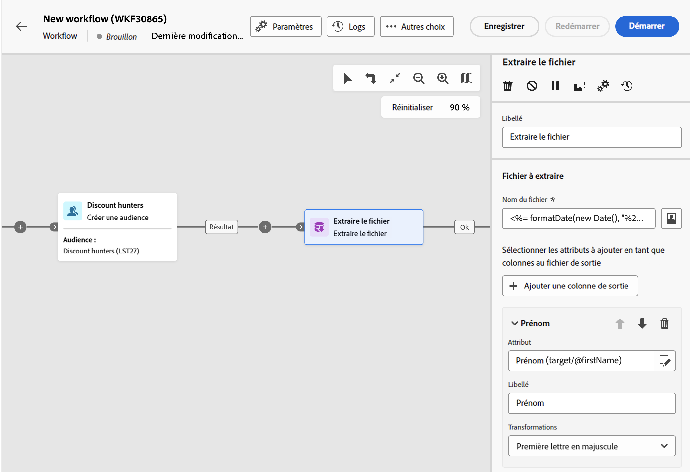
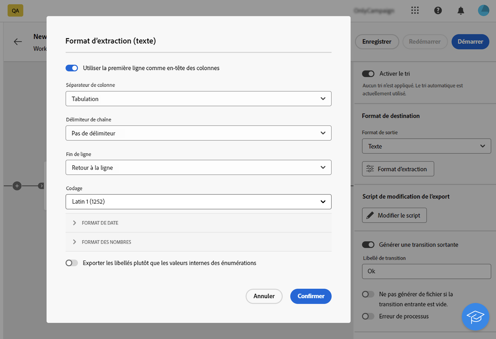
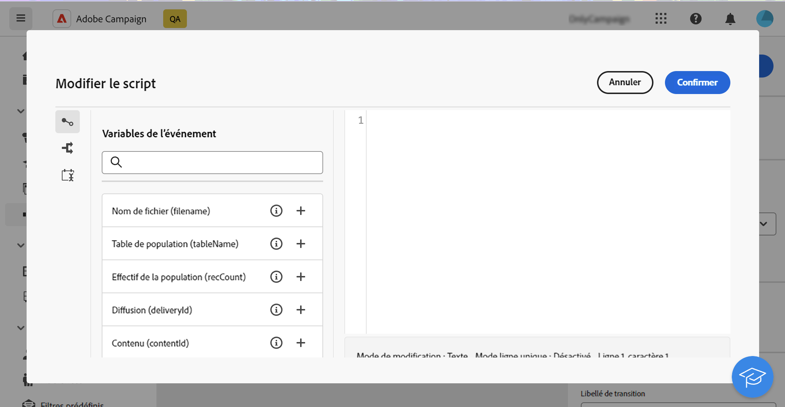
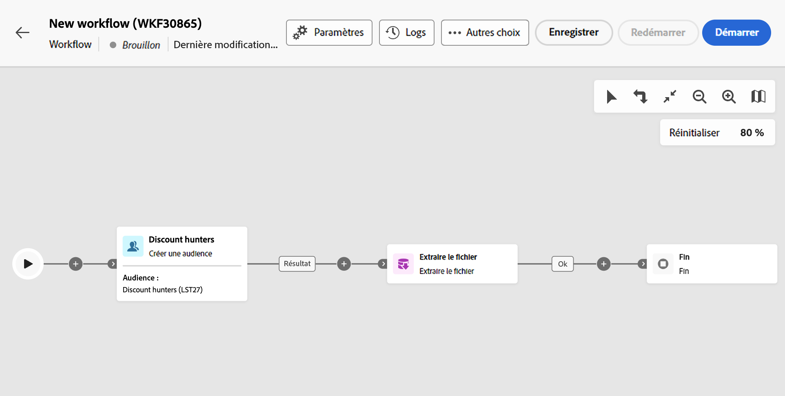
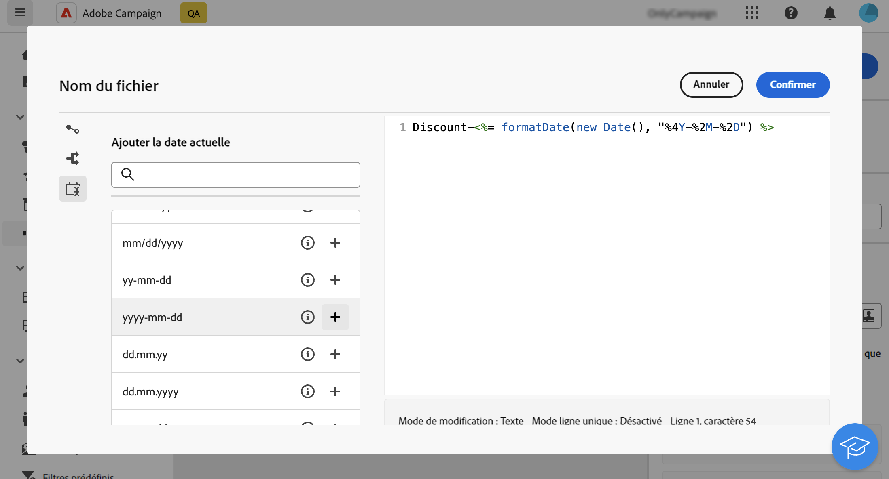
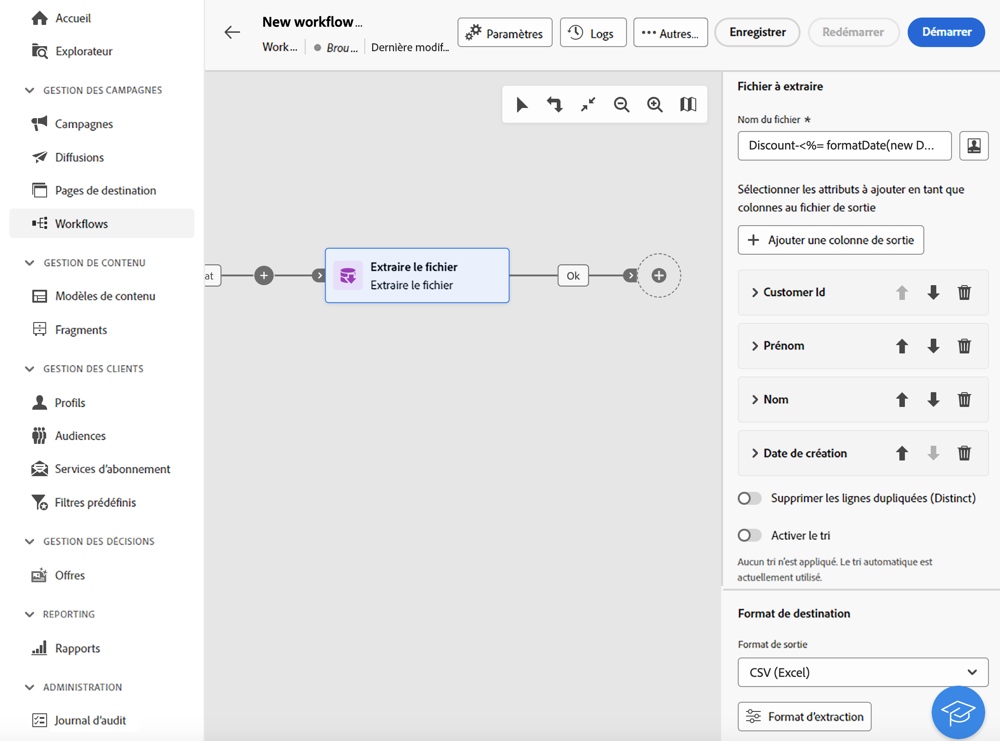

# Extraction de fichier {#extract-file}

>[!CONTEXTUALHELP]
>id="acw_orchestration_extractfile"
>title="Extraction de fichier"
>abstract="L’activité **Extraction de fichier** permet d’exporter des données présentes dans Adobe Campaign sous la forme d’un fichier externe. Les données peuvent ensuite être exportées vers un emplacement de serveur tel que SFTP, l’espace de stockage dans le cloud ou votre serveur de campagne à l’aide d’une activité Transfert de fichier."

L’activité **Extraction de fichier** est une activité de **Gestion des données**. Utilisez cette activité pour exporter des données présentes dans Adobe Campaign sous la forme d’un fichier externe. Les données peuvent ensuite être exportées vers un emplacement de serveur tel que SFTP, l’espace de stockage dans le cloud ou votre serveur de campagne à l’aide d’une activité Transfert de fichier.

Pour configurer l’activité **Extraction de fichier**, ajoutez une activité **Extraction de fichier** dans votre workflow, puis suivez les étapes ci-dessous.

## Configurer le fichier à extraire {#extract-configuration}

>[!CONTEXTUALHELP]
>id="acw_orchestration_extractfile_file"
>title="Fichier à extraire"
>abstract="Sélectionnez le fichier à extraire."

La section **[!UICONTROL Fichier à extraire]** vous permet de configurer les propriétés du fichier et les données à inclure.

1. Dans le champ **[!UICONTROL Nom du fichier]**, indiquez le nom du fichier à extraire.

   Vous pouvez personnaliser le nom du fichier à l’aide de variables d’événement, de conditions et de fonctions de date/heure. Pour ce faire, cliquez sur l’icône **[!UICONTROL Ouvrir la boîte de dialogue de personnalisation]** pour ouvrir l’éditeur d’expression. [Découvrez comment travailler avec les variables d’événement et l’éditeur d’expression](../event-variables.md).

1. Indiquez les colonnes à présenter dans le fichier extrait. Pour ce faire, procédez comme suit :

   1. Cliquez sur **[!UICONTROL Ajouter une colonne de sortie]**.
   1. Choisissez l’attribut à afficher dans la colonne, puis confirmez. Les attributs disponibles dépendent de la dimension de ciblage du workflow. [Découvrez comment sélectionner des attributs et les ajouter aux favoris](../../get-started/attributes.md).
   1. Une fois la colonne ajoutée, vous pouvez modifier son **[!UICONTROL libellé]** et l’**[!UICONTROL attribut]** associé.
   1. Si vous souhaitez appliquer une transformation aux valeurs de la colonne, sélectionnez-la dans la liste déroulante. Par exemple, vous pouvez mettre toutes les valeurs de la colonne sélectionnée en majuscules.

1. Répétez ces étapes pour ajouter autant de colonnes que nécessaire à votre fichier d’extraction. Pour changer la position d’une colonne, utilisez les flèches haut et bas.

1. Pour supprimer toutes les lignes dupliquées du fichier extrait, activez l’option **[!UICONTROL Supprimer les doublons (Liste)]**.

1. Pour trier le fichier extrait en fonction d’un attribut, activez l’option **[!UICONTROL Activer le tri]**, choisissez ensuite l’attribut par lequel vous souhaitez trier le fichier, ainsi que la méthode de tri souhaitée (ascendant ou descendant). Vous pouvez trier n’importe quel attribut de la dimension de ciblage actuelle, qu’il ait été ajouté ou non aux colonnes du fichier.

## Configurer le format de fichier extrait {#file}

>[!CONTEXTUALHELP]
>id="acw_orchestration_extractfile_destinationformat"
>title="Format de destination"
>abstract="Sélectionnez les différentes options pour paramétrer le formatage du fichier extrait."

La section de format **[!UICONTROL Destination]** vous permet de configurer le format du fichier extrait.

1. Choisissez le **[!UICONTROL Format de sortie]** du fichier extrait : **Texte**, **Texte contenant des colonnes fixes**, **CSV (Excel)** ou **XML**.

1. Cliquez sur le bouton **[!UICONTROL Format d’extraction]** pour accéder à des options spécifiques liées au format sélectionné. Pour plus d’informations, développez la section ci-dessous.

+++ Options de format d’extraction disponibles

   * **[!UICONTROL Utiliser la première ligne comme en-tête des colonnes]** (formats Texte/CSV (Excel)) : activez cette option pour utiliser la première colonne comme en-tête.
   * **[!UICONTROL Séparateur de colonne]** (format texte) : spécifiez le caractère à utiliser comme séparateur de colonne dans le fichier de sortie.
   * **[!UICONTROL Délimiteur de chaîne]** (format texte) : indiquez comment délimiter les chaînes dans le fichier de sortie.
   * **[!UICONTROL Fin de ligne]** (format texte) : indiquez comment délimiter la fin des lignes dans le fichier de sortie.
   * **[!UICONTROL Encodage]** : choisissez l’encodage du fichier de sortie.
   * **[!UICONTROL Format et séparateurs de date]** : indiquez le format des dates dans le fichier de sortie.
   * **[!UICONTROL Format des nombres]** : indiquez le format des nombres dans le fichier de sortie.
   * **[!UICONTROL Exporter les libellés plutôt que les valeurs internes des énumérations]** : activez cette option si vous exportez des valeurs d’énumération et souhaitez récupérer les libellés de colonnes plus faciles à comprendre que les identifiants internes.

+++

   

## Ajouter une étape de post-traitement {#script}

>[!CONTEXTUALHELP]
>id="acw_orchestration_extractfile_postprocessing"
>title="Post-traitement"
>abstract="Définissez une étape de post-traitement à appliquer, comme la compression ou le chiffrement."

Le **[!UICONTROL script de modification de l’export]** vous permet d’appliquer une étape de traitement à exécuter lors de l’extraction des données, comme la compression ou le chiffrement. Pour ce faire, cliquez sur le bouton **[!UICONTROL Modifier le script]**.

L’éditeur d’expression s’ouvre, vous permettant de saisir la commande à appliquer au fichier. Le volet de gauche fournit des syntaxes prédéfinies que vous pouvez utiliser pour créer votre script. [Découvrez comment travailler avec les variables d’événement et l’éditeur d’expression](../event-variables.md).

## Options additionnelles {#additiona-options}

>[!CONTEXTUALHELP]
>id="acw_orchestration_extractfile_outbound"
>title="Transition sortante"
>abstract="Activez l’option **Générer une transition sortante** pour ajouter une transition sortante après l’activité en cours."

>[!CONTEXTUALHELP]
>id="acw_orchestration_extractfile_error"
>title="Traiter les erreurs"
>abstract="Activez l’option **Traiter les erreurs** pour ajouter une transition sortante qui contient les erreurs."

Une fois l’extraction du fichier de sortie configurée, des options supplémentaires liées aux transitions et à la gestion des erreurs sont disponibles :

* **[!UICONTROL Générer une transition sortante]** : activez cette option pour ajouter une transition sortante et configurer son libellé.
* **[!UICONTROL Ne pas générer de fichier si la transition entrante est vide]** : activez cette option pour ignorer l’extraction du fichier si la transition entrante ne contient aucune donnée.
* **[!UICONTROL Erreur de traitement]** : activez cette option pour ajouter une transition sortante en cas d’erreur lors de l’extraction du fichier.

## Exemple {#example}

Dans l’exemple suivant, une activité **Créer une audience** est suivie d’une activité **Extraction de fichier** pour extraire tous les profils ciblés dans un fichier CSV.

.

* Le champ **[!UICONTROL Nom du fichier]** est configuré pour inclure la date de l’extraction.

  

* Des colonnes sont ajoutées pour afficher les prénoms et les noms des profils, leurs identifiants client et les dates de création dans la base de données.

  