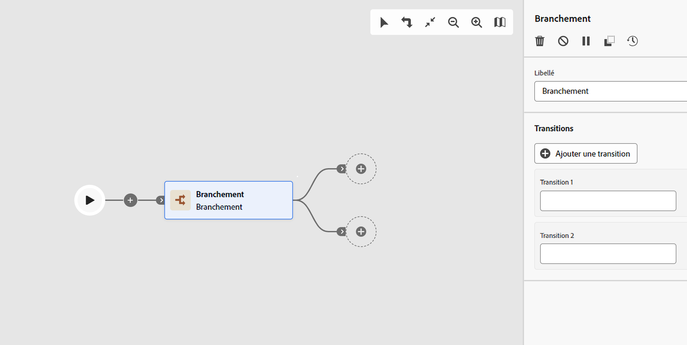
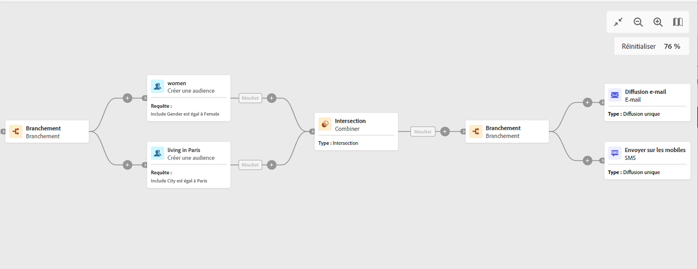

# Branchement {#fork}

>[!CONTEXTUALHELP]
>id="acw_orchestration_fork"
>title="Activité Branchement"
>abstract="L&#39;activité **Branchement** permet de créer des transitions sortantes afin de lancer plusieurs activités en parallèle."

>[!CONTEXTUALHELP]
>id="acw_orchestration_fork_transitions"
>title="Transitions de l’activité Branchement"
>abstract="Par défaut, deux transitions sont créées avec une activité **Branchement**. Cliquez sur le bouton **Ajouter une transition** pour définir une transition sortante supplémentaire, puis renseignez son libellé."

L’activité **Branchement** est une activité de **contrôle de flux**. Elle permet de créer des transitions sortantes afin de lancer plusieurs activités simultanément.

Vous pouvez également créer une branche distincte à l’aide du bouton de la barre d’outils **Ajouter une branche** (**+**). Voir [Orchestrer des activités](../orchestrate-activities.md#toolbar).

## Configurer l’activité Branchement {#fork-configuration}

Pour configurer l’activité **Branchement**, procédez comme suit :

1. Ajoutez une activité **Branchement** à votre workflow.
1. Cliquez sur **Ajouter une transition** pour ajouter une nouvelle transition sortante. Par défaut, deux transitions sont définies.
1. Ajoutez un Libellé à chaque diffusion.

## Exemple {#fork-example}

Dans l’exemple suivant, deux activités **Branchement** sont utilisées :

* Une avant les deux requêtes, pour les exécuter simultanément.
* Une après l’intersection, pour envoyer simultanément un e-mail et un SMS à la population ciblée.

