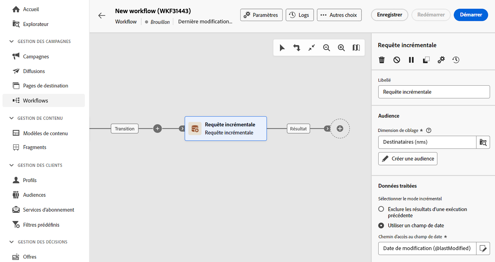
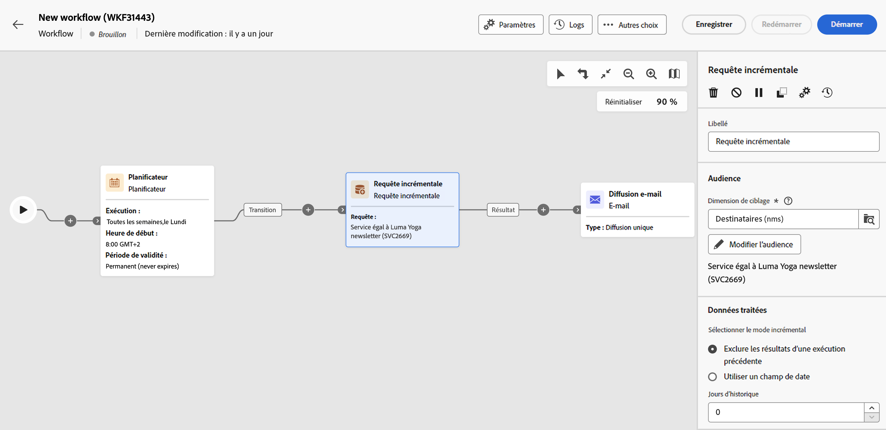

# Requête incrémentale {#incremental-query}

>[!CONTEXTUALHELP]
>id="acw_orchestration_incrementalquery"
>title="Requête incrémentale"
>abstract="L’activité **Requête incrémentale** est une activité de **Ciblage** qui vous permet d’interroger la base de données à l’aide du concepteur de requête. À chaque nouvelle exécution de cette activité, les résultats des exécutions précédentes sont exclus. Cela vous permet de ne cibler que les nouveaux éléments."

>[!CONTEXTUALHELP]
>id="acw_orchestration_incrementalquery_history"
>title="Historique des requêtes incrémentales"
>abstract="Historique des requêtes incrémentales"

>[!CONTEXTUALHELP]
>id="acw_orchestration_incrementalquery_processeddata"
>title="Données traitées des requêtes incrémentales"
>abstract="Données traitées des requêtes incrémentales"

L’activité **Requête incrémentale** est une activité de **Ciblage** qui vous permet d’interroger la base de données à des moments planifiés. À chaque nouvelle exécution de cette activité, les résultats des exécutions précédentes sont exclus. Cela permet de ne cibler que les éléments nouveaux.

>[!NOTE]
>
>Tandis que la console cliente de Campaign intègre l’activité **[!UICONTROL Requête incrémentale]** avec un planificateur intégré, l’interface d’utilisation de Campaign Web traite cette fonctionnalité séparément. Pour planifier des exécutions de requêtes incrémentales, ajoutez une activité **[!UICONTROL Planificateur]** dans le workflow avant l’activité **[!UICONTROL Requête incrémentale]**. [Découvrez comment configurer une activité Planificateur](scheduler.md).

L’activité **[!UICONTROL Requête incrémentale]** peut être utilisée pour différents objectifs :

* segmentation d’individus afin de définir la cible d’un message, une audience, ou d’autres opérations.
* Exporter des données. Par exemple, vous pouvez utiliser l’activité pour exporter régulièrement les nouveaux logs dans des fichiers. Cela se révèle utile pour les outils de reporting externe ou de Business Intelligence.

La population déjà ciblée par les exécutions précédentes est stockée dans le workflow. Deux workflows démarrés à partir du même modèle ne partagent pas le même log. Toutefois, deux tâches basées sur la même requête incrémentielle dans le même workflow utilisent le même log.

Si le résultat d’une requête incrémentale est égal à 0 lors de l’une de ses exécutions, le workflow est mis en pause jusqu’à la prochaine exécution programmée de la requête. Les transitions et les activités qui suivent la requête incrémentale ne sont donc pas traitées avant l’exécution suivante.

## Configurer l’activité Requête incrémentale {#incremental-query-configuration}

Pour configurer l’activité **Requête incrémentale**, procédez comme suit :

[Description : capture d’écran affichant l’interface de configuration de l’activité de Requête incrémentale dans Adobe Campaign.]\

1. Ajoutez une activité **Requête incrémentale** à votre workflow.

1. Dans la section **[!UICONTROL Audience]**, choisissez la **Dimension de ciblage**, puis cliquez sur **[!UICONTROL Continuer]**.

   La dimension de ciblage définit la population ciblée par l’opération, comme les personnes destinataires ou bénéficiaires d’un contrat, les opérateurs ou opératrices ou les personnes abonnées. Par défaut, la cible est sélectionnée parmi les personnes destinataires. [En savoir plus sur les dimensions de ciblage](../../audience/about-recipients.md#targeting-dimensions)

1. Utilisez le concepteur de requêtes pour définir votre requête, de la même manière que vous créez une audience lors de la conception d’un nouvel e-mail. [Découvrir comment utiliser le concepteur de requête](../../query/query-modeler-overview.md)

1. Dans la section **[!UICONTROL Données traitées]**, sélectionnez le mode d’incrémentation à utiliser :

   * **[!UICONTROL Exclure les résultats de l’exécution précédente]** : à chaque exécution de l’activité, les résultats des exécutions précédentes sont exclus.

     Les enregistrements déjà ciblés dans les exécutions précédentes peuvent être consignés dans un log selon un nombre de jours maximum à partir de celui où ils ont été ciblés. Utilisez le champ **[!UICONTROL Historique en jours]** pour définir cette valeur. Si cette valeur est égale à zéro, les personnes destinataires ne sont jamais purgées du log.

   * **[!UICONTROL Utiliser un champ de date]** : cette option permet d’exclure les résultats des exécutions précédentes en fonction d’un champ de date spécifique. Choisissez le champ de date souhaité dans la liste des attributs disponibles pour la dimension de ciblage sélectionnée. Lors des exécutions suivantes du workflow, seules les données qui auront été modifiées ou créées après la date de la dernière exécution seront récupérées.

     Après la première exécution du workflow, le champ **[!UICONTROL Date de dernière exécution]** est disponible. Celui-ci spécifie la date qui sera utilisée pour l’exécution suivante et est automatiquement mis à jour chaque fois que le workflow est exécuté. Vous pouvez remplacer manuellement cette valeur en fonction de vos besoins.

   >[!NOTE]
   >
   >Le mode **[!UICONTROL Utiliser un champ date]** offre davantage de flexibilité selon le champ date sélectionné. Par exemple, si le champ spécifié correspond à une date de modification, le mode de champ de date récupère les données récemment mises à jour. L’autre mode exclut les enregistrements déjà ciblés lors d’une exécution précédente, même s’ils ont été modifiés depuis la dernière exécution du workflow.

## Exemple {#incremental-query-example}

L’exemple suivant illustre la configuration d’un workflow qui filtre les profils dans la base de données Adobe Campaign toutes les semaines. Il cible les personnes abonnées au service Newsletter Yoga et leur envoie un e-mail de bienvenue.

Le workflow comprend les éléments suivants :

* Une activité **[!UICONTROL Planificateur]**, qui exécute le workflow tous les lundis à 6h00.
* Une activité **[!UICONTROL Requête incrémentale]**, qui cible toutes les personnes abonnées actuelles lors de la première exécution et uniquement les nouvelles personnes abonnées lors des exécutions suivantes.
* Une activité **[!UICONTROL Diffusion e-mail]**.