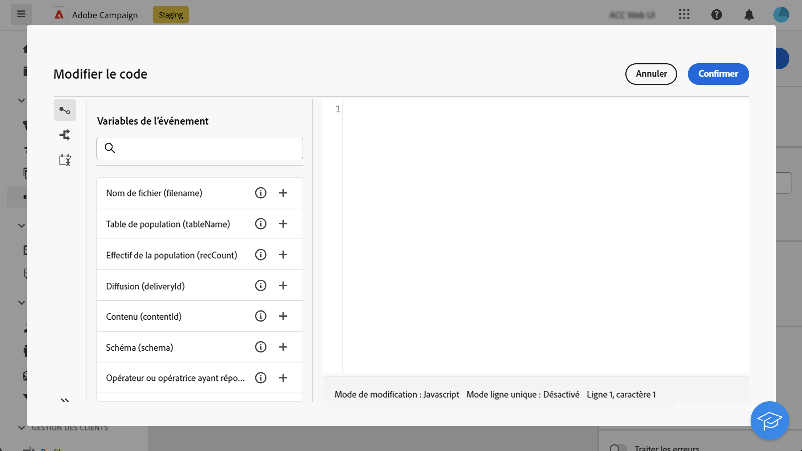
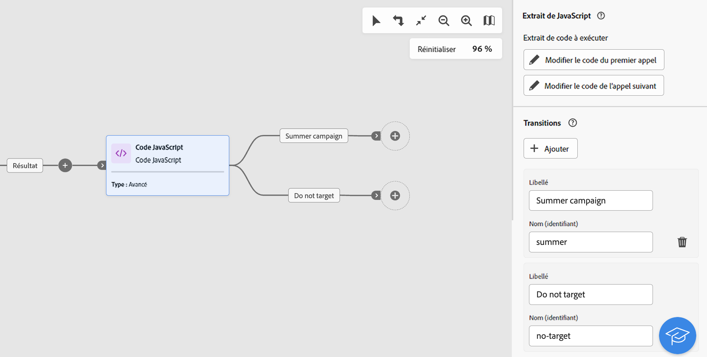
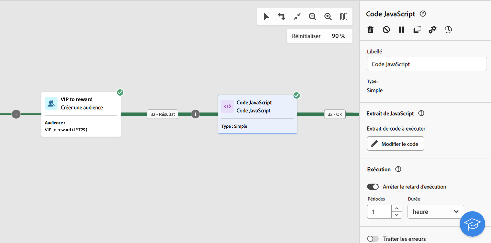
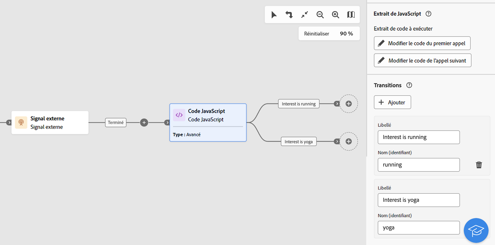

# Code JavaScript {#javascript-code}

>[!CONTEXTUALHELP]
>id="acw_orchestration_javascript"
>title="Code JavaScript"
>abstract="L’activité **Code JavaScript** permet d’exécuter un script JavaScript dans le contexte d’un workflow. Vous pouvez ainsi effectuer des actions ou collecter des informations à partir de la base de données. Utilisez des activités Code JavaScript **simples** pour exécuter un extrait de code lors de l’exécution du workflow. Les activités de code JavaScript **avancées** vous permettent d’effectuer des opérations plus complexes en exécutant deux extraits de code différents dans un ordre séquentiel. Lors du premier démarrage du workflow, le premier appel est exécuté. Chaque fois que le workflow s’exécute de nouveau, le code défini dans le deuxième appel est exécuté."

>[!CONTEXTUALHELP]
>id="acw_orchestration_javascript_snippet"
>title="Extrait JavaScript"
>abstract="Définissez le script à exécuter lors de l’exécution de l’activité. Si vous configurez une activité JavaScript **avancée**, vous devez modifier deux extraits de code : le premier code d’appel à exécuter lors de la première exécution du workflow et le prochain code d’appel à exécuter lors des appels suivants du workflow."

>[!CONTEXTUALHELP]
>id="acw_orchestration_javascript_execution"
>title="Exécution de JavaScript"
>abstract="Configurez le délai d’exécution pour arrêter l’activité après une période d’exécution. Par défaut, la phase d’exécution ne peut pas dépasser 1 heure. Passé ce délai, le processus est abandonné en incluant un message d’erreur et l’exécution de l’activité échoue. Pour ignorer cette limite, définissez la valeur sur 0."

>[!CONTEXTUALHELP]
>id="acw_orchestration_javascript_transition"
>title="Transition JavaScript"
>abstract="Activez l’option **[!UICONTROL Traiter les erreurs]** pour conserver les erreurs qui se produisent pendant l’exécution du script dans une transition de sortie supplémentaire."

L’activité **Code JavaScript** est une activité de **Gestion des données**. Utilisez cette activité pour exécuter un script JavaScript dans le contexte d’un workflow. Vous pouvez ainsi collecter des informations de la base de données ou effectuer d’autres opérations complexes.

## Configurer une activité Code JavaScript {#javascript-code-configuration}

Pour configurer l’activité **Code JavaScript**, procédez comme suit :

1. Ajoutez une activité **Code JavaScript** dans votre workflow.

1. Sélectionnez le type d’activité que vous souhaitez créer :

   * **Simple** : exécutez un extrait de code.
   * **Avancé** : cette option vous permet d’effectuer des opérations plus avancées en exécutant deux extraits de code différents. [Découvrir comment configurer une activité JavaScript avancée](#advanced)

   >[!NOTE]
   >
   >Avec l’interface d’utilisation de Campaign Web, nous avons consolidé deux activités en une seule en fusionnant les fonctionnalités de code JavaScript **Simple** et **Avancé**. Cette consolidation n’a aucun impact sur les fonctionnalités de l’activité.

1. Confirmez, puis cliquez sur le bouton **[!UICONTROL Modifier le code]** pour ouvrir l’éditeur d’expression. Le volet de gauche fournit des syntaxes prédéfinies que vous pouvez utiliser pour créer votre code, y compris des variables d’événement. [Découvrir comment travailler avec des variables d’événement et l’éditeur d’expression](../event-variables.md)

   

1. Dans la section **[!UICONTROL Exécution]**, configurez le délai pour arrêter l’activité après une période d’exécution. Par défaut, la phase d’exécution ne peut pas dépasser 1 heure. Passé ce délai, le processus est abandonné en incluant un message d’erreur et l’exécution de l’activité échoue. Pour ignorer cette limite, définissez la valeur sur 0.

   

1. Activez l’option **[!UICONTROL Traiter les erreurs]** pour conserver les erreurs qui se produisent pendant l’exécution du script dans une transition de sortie supplémentaire.

## Activités de code JavaScript avancées {#advanced}

Les activités JavaScript avancées vous permettent d’effectuer des opérations complexes. Elles vous permettent d’effectuer les opérations suivantes :

* Exécuter deux extraits de code différents. Le premier extrait de code est exécuté lors du premier démarrage du workflow. Chaque fois que le workflow s’exécute de nouveau, l’extrait de code défini dans le deuxième appel est exécuté.
* Ajoutez plusieurs transitions de sortie avec lesquelles vous pouvez interagir dynamiquement à l’aide d’un script.

Pour configurer une activité Code JavaScript avancée, procédez comme suit :

1. Sélectionnez le type **Avancé**, puis configurez le ou les extraits de code à exécuter :

   * Cliquez sur **[!UICONTROL Modifier le code du premier appel]** pour définir le script à exécuter lors du premier appel.
   * Cliquez sur **[!UICONTROL Modifier le code de l’appel suivant]** pour définir le script à exécuter lors des appels suivants du workflow. (Facultatif)

1. Pour ajouter une ou plusieurs transitions de sortie, cliquez sur le bouton **[!UICONTROL Ajouter des transitions]** et indiquez un libellé et un nom interne pour chaque transition.

   Dans cet exemple, nous avons configuré deux transitions qui sont activées par le script dans l’extrait de code en fonction de conditions spécifiques.

   

1. Effectuez la configuration de l’activité et démarrez le workflow.

## Exemple {#javascript-code-example}

### Initialiser des variables basées sur la population entrante {#example1}

Cet exemple montre comment initialiser une variable en fonction du nombre de profils ciblés par un workflow.



Nous ciblons ici les profils VIP de notre base de données. Nous voulons créer une variable nommée « Canal » avec une valeur qui dépend du nombre de profils ciblés par l’activité Créer une audience :

* Si plus de 1 000 profils sont ciblés, initialisez la variable avec la valeur « E-mail ».
* Sinon, initialisez-la avec la valeur « SMS ».

Pour ce faire, procédez comme suit :

1. Ajouter une activité **Code JavaScript** de type **Simple** après l’activité **Créer une audience**.

1. Cliquez sur **Modifier le code** et configurez l’extrait de code comme suit :

   ```
   if (vars.recCount > 1000)
       vars.channel ="email"
   else
       vars.channel = "sms"
   ```

1. Démarrez le workflow. La variable « Canal » est créée avec la valeur « E-mail» ou « SMS », selon le nombre de profils ciblés par l’activité **Créer une audience**.

### Déclencher des transitions en fonction de la valeur d’une variable {#example2}

Cet exemple montre comment déclencher une transition en fonction de la valeur d’une variable.



Ici, le workflow commence par une activité **Signal externe**, dans laquelle une variable (`interest`) est transmise à partir d’un autre workflow. La valeur de la variable est « Course » ou « Yoga », selon les opérations de filtrage effectuées dans le workflow initial.

Nous voulons déclencher différentes transitions dans le workflow, en fonction de la valeur de la variable.

Pour ce faire, procédez comme suit :

1. Ajoutez une activité **Code JavaScript** après l’activité Signal externe avec le type **Avancé**.

1. Ajoutez deux transitions : une pour chaque valeur de variable possible (« Course », « Yoga »).

1. Cliquez sur **Modifier le code du premier appel** et configurez l’extrait de code comme suit :

   ```
   if (vars.interest=="running")
       task.postEvent(task.transitionByName("running"));
   else
       task.postEvent(task.transitionByName("yoga"));
   ```

1. Effectuez la configuration de chaque transition selon vos besoins, puis démarrez le workflow. L’une des deux transitions de sortie est activée, en fonction de la valeur de la variable `interest` qui a été transmise par l’intermédiaire de l’activité **Signal externe**.
