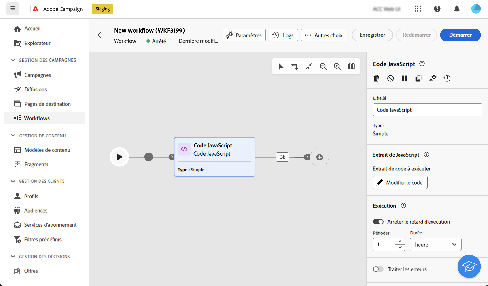

# Code JavaScript {#javascript-code}

>[!CONTEXTUALHELP]
>id="acw_orchestration_javascript"
>title="Code JavaScript"
>abstract="La variable **Code JavaScript** permet d&#39;exécuter un script JavaScript dans le contexte d&#39;un workflow. Vous pouvez ainsi effectuer des actions ou collecter des informations à partir de la base de données. Utilisation **Simple** Activités de code JavaScript pour exécuter un fragment de code lors de l’exécution du workflow. **Avancé** Les activités de code JavaScript vous permettent d’effectuer des opérations plus complexes en exécutant deux fragments de code différents dans un ordre séquentiel. La première fois que le workflow est démarré, le premier appel est exécuté. Chaque fois que le workflow s’exécute de nouveau, le code défini dans le deuxième appel est exécuté."

>[!CONTEXTUALHELP]
>id="acw_orchestration_javascript_snippet"
>title="Fragment de code JavaScript"
>abstract="Définissez le script à exécuter lors de l’exécution de l’activité. Si vous configurez une **Avancé** Vous devez éditer deux fragments de code dans l&#39;activité JavaScript : le premier code d&#39;appel à s&#39;exécuter lors de la première exécution du workflow et le prochain code d&#39;appel à exécuter lors des appels suivants du workflow."

>[!CONTEXTUALHELP]
>id="acw_orchestration_javascript_execution"
>title="Exécution de JavaScript"
>abstract="Configurez le délai d’exécution pour arrêter l’activité après une période d’exécution. Par défaut, la phase d’exécution ne peut pas dépasser 1 heure. Passé ce délai, le processus est abandonné en incluant un message d’erreur et l’exécution de l’activité échoue. Pour ignorer cette limite, définissez la valeur sur 0."

>[!CONTEXTUALHELP]
>id="acw_orchestration_javascript_transition"
>title="Transition JavaScript"
>abstract="Si vous souhaitez ajouter plusieurs transitions en sortie, cliquez sur le bouton **[!UICONTROL Ajouter des transitions]** bouton . Cela vous permet, par exemple, de déclencher une transition spécifique selon une condition spécifique définie dans l&#39;activité Code JavaScript . Cette option est disponible pour **Avancé** Activités de code JavaScript uniquement."

La variable **Code JavaScript** est une activité **Gestion des données** activité. Utilisez cette activité pour exécuter un script JavaScript dans le contexte d&#39;un workflow. Vous pouvez ainsi collecter des informations de la base de données ou effectuer d’autres opérations complexes.

## Configuration de l&#39;activité Code JavaScript {#javascript-code-configuration}

Pour configurer la variable **Code JavaScript** activité :

1. Ajouter un **Code JavaScript** dans votre workflow.

1. Choisissez le type d&#39;activité que vous souhaitez créer :

   * **Simple**: exécutez un fragment de code.
   * **Avancé**: cette option vous permet d’effectuer des opérations plus avancées en exécutant deux fragments de code différents. [Découvrez comment configurer une activité JavaScript avancée](#advanced)

   >[!NOTE]
   >
   >Avec l&#39;interface utilisateur web de Campaign, nous avons consolidé deux activités en une seule en fusionnant les deux. **Simple** et **Avancé** Fonctionnalités du code JavaScript. Cette consolidation n&#39;a aucun impact sur les fonctionnalités de l&#39;activité.

1. Confirmez puis cliquez sur le bouton **[!UICONTROL Modifier le code]** pour ouvrir l’éditeur d’expression. Le volet de gauche fournit des syntaxes prédéfinies que vous pouvez exploiter pour créer votre code, y compris des variables d’événement. [Découvrez comment utiliser les variables d’événement et l’éditeur d’expression](../event-variables.md)

   

1. Dans le **[!UICONTROL Exécution]** , configurez le délai pour arrêter l’activité après une période d’exécution. Par défaut, la phase d’exécution ne peut pas dépasser 1 heure. Passé ce délai, le processus est abandonné en incluant un message d’erreur et l’exécution de l’activité échoue. Pour ignorer cette limite, définissez la valeur sur 0.

   

1. Activez l’option **[!UICONTROL Traiter les erreurs]** pour conserver les erreurs qui se produisent pendant l’exécution du script dans une transition de sortie supplémentaire.

## Activités de code JavaScript avancé {#advanced}

Les activités JavaScript avancées vous permettent d’effectuer des opérations complexes. Il vous permet d’effectuer les opérations suivantes :

* Exécutez deux fragments de code différents. Le premier fragment de code est exécuté la première fois que le workflow est démarré. Chaque fois que le workflow s’exécute de nouveau, le fragment de code défini dans le deuxième appel est exécuté.
* Ajoutez plusieurs transitions de sortie avec lesquelles vous pouvez interagir dynamiquement à l’aide d’un script.

Pour configurer une activité Code JavaScript avancé , procédez comme suit :

1. Sélectionnez la variable **Avancé** saisissez , puis configurez le ou les fragments de code à exécuter :

   * Cliquez sur **[!UICONTROL Modifier le code du premier appel]** pour définir le script à exécuter lors du premier appel.
   * Cliquez sur **[!UICONTROL Modifier le code d’appel suivant]** pour définir le script à exécuter lors des appels suivants du workflow. (facultatif)

1. Pour ajouter une ou plusieurs transitions en sortie, cliquez sur le bouton **[!UICONTROL Ajouter des transitions]** et indiquez un libellé et un nom interne pour chaque transition.

   Dans cet exemple, nous avons configuré deux transitions qui sont activées par le script dans le fragment de code en fonction de conditions spécifiques.

   

1. Effectuez le paramétrage de l&#39;activité et démarrez le workflow.

## Exemple {#javascript-code-example}

### Initialiser des variables basées sur la population entrante {#example1}

Cet exemple montre comment initialiser une variable en fonction du nombre de profils ciblés par un workflow.


Nous ciblons ici VIP profils de notre base de données. Nous voulons créer une variable nommée &quot;channel&quot; avec une valeur qui dépend du nombre de profils ciblés par l’activité Créer l’audience :

* Si plus de 1 000 profils sont ciblés, initialisez la variable avec la valeur &quot;email&quot;.
* Sinon, initialisez-le avec la valeur &quot;sms&quot;.

Pour ce faire, procédez comme suit :

1. Ajouter un **Code JavaScript** activité de type **Simple** après la balise **Créer une audience** activité.

1. Cliquez sur **Modifier le code** et configurez le fragment de code comme suit :

   ```
   if (vars.recCount > 1000)
       vars.channel ="email"
   else
       vars.channel = "sms"
   ```

1. Démarrez le workflow. La variable &quot;channel&quot; est créée avec la valeur &quot;email&quot; ou &quot;sms&quot;, selon le nombre de profils ciblés par la variable **Créer une audience** activité.

### Déclencher des transitions en fonction de la valeur d’une variable {#example2}

Cet exemple montre comment déclencher une transition en fonction de la valeur d’une variable.


Ici, le workflow commence par une **Signal externe** activité, dans laquelle une variable (`interest`) est transmis à partir d’un autre workflow. La valeur de la variable est &quot;running&quot; ou &quot;yoga&quot;, selon les opérations de filtrage effectuées dans le workflow initial.

Nous voulons déclencher différentes transitions dans le workflow, en fonction de la valeur de la variable.

Pour ce faire, procédez comme suit :

1. Ajouter un **Code JavaScript** activité après l&#39;activité Signal externe avec le type **Avancé**.

1. Ajoutez deux transitions : une pour chaque valeur de variable possible (&quot;running&quot;, &quot;yoga&quot;).

1. Cliquez sur **Modifier le code du premier appel** et configurez le fragment de code comme suit :

   ```
   if (vars.interest=="running")
       task.postEvent(task.transitionByName("running"));
   else
       task.postEvent(task.transitionByName("yoga"));
   ```

1. Effectuez le paramétrage de chaque transition selon vos besoins, puis démarrez le workflow. L’une des deux transitions en sortie est activée, en fonction de la valeur de la variable `interest` qui a été transmise par l’intermédiaire de la variable **Signal externe** activité.
