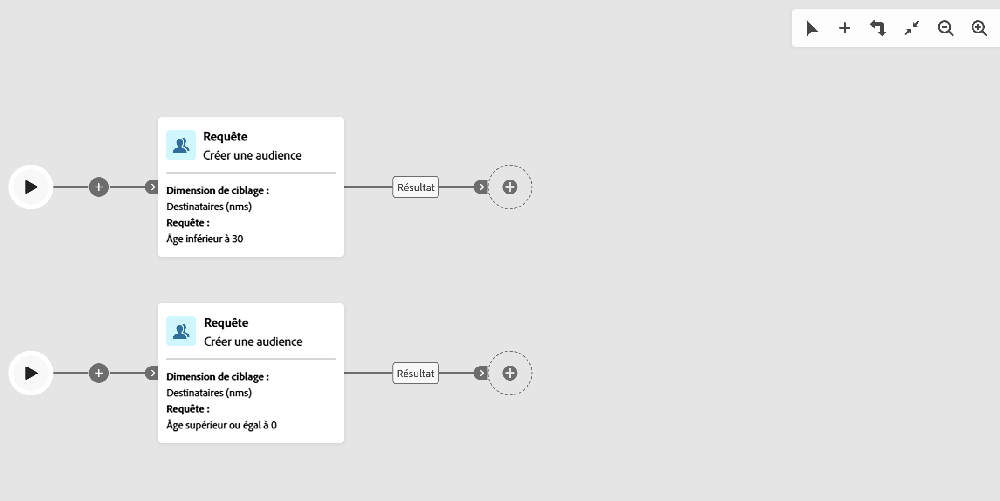
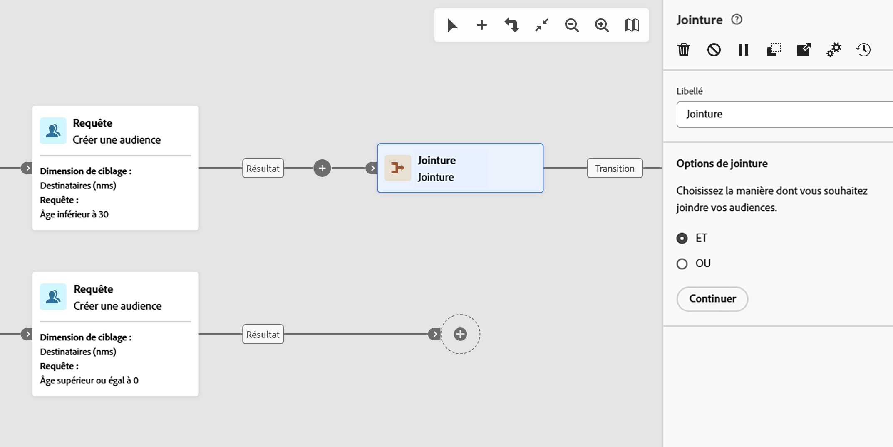
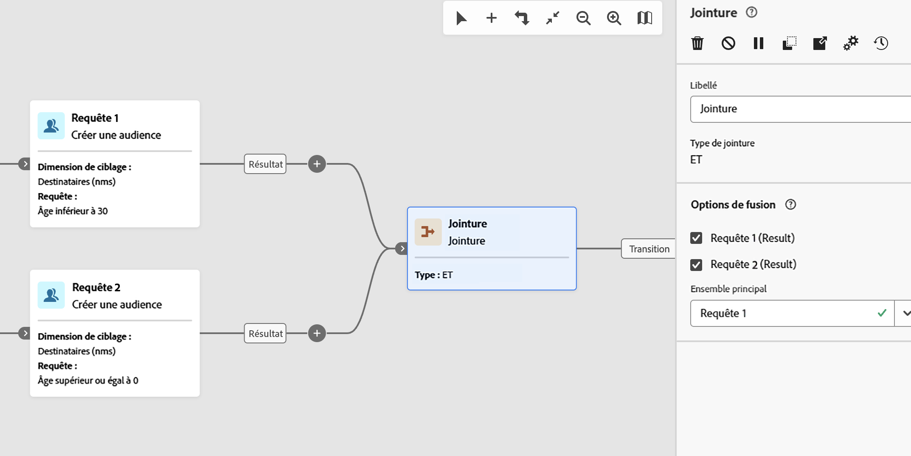
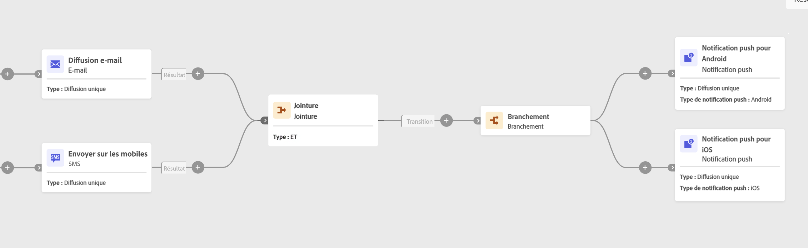

# Jointure {#join}

>[!CONTEXTUALHELP]
>id="acw_homepage_welcome_rn5"
>title="Plusieurs branches de workflow et activité Jointure"
>abstract="Plusieurs branches sont désormais prises en charge. Au lieu d’utiliser un branchement, vous pouvez cliquer sur Ajouter une branche dans la barre d’outils. L’activité Rendez-vous a également été améliorée. Il s’agit désormais d’une activité de jointure générique qui vous permet de choisir entre les options de jointure ET et OU."
>additional-url="https://experienceleague.adobe.com/docs/campaign-web/v8/release-notes/release-notes.html?lang=fr" text="Voir les notes de mise à jour"

>[!CONTEXTUALHELP]
>id="acw_orchestration_and-join"
>title="Activité AND-join"
>abstract="L’activité **Rendez-vous** vous permet de synchroniser plusieurs branches d’exécution d’un workflow. Elle est déclenchée une fois toutes les activités précédentes terminées. Cela permet de s’assurer que certaines activités sont terminées avant de continuer à exécuter le workflow."

>[!CONTEXTUALHELP]
>id="acw_orchestration_join"
>title="Activité de jointure"
>abstract="L&#39;activité **Joindre** permet de fusionner plusieurs transitions entrantes. Choisissez de continuer lorsque toutes les transitions entrantes sont terminées (AND) ou lorsqu’une transition entrante est terminée (OR)."

L&#39;activité **Joindre** est une activité de contrôle de flux **Flow**. Il synchronise plusieurs branches d’exécution d’un workflow.
Vous pouvez choisir le mode d’évaluation des transitions entrantes :

* **AND** : se poursuit uniquement après l’activation de toutes les transitions entrantes sélectionnées.
* **OR** : se poursuit dès qu’une transition entrante sélectionnée est activée.

Lorsque l’option **AND** est sélectionnée, cette activité ne déclenche sa transition sortante qu’une fois toutes les transitions entrantes activées. En d’autres termes, elle s’active une fois toutes les activités précédentes terminées. Cela permet de s’assurer que certaines activités sont terminées avant de continuer à exécuter le workflow.

Lorsque l’option **OR** est sélectionnée, l’exécution se poursuit dès que l’une des transitions entrantes sélectionnées est activée. Il n&#39;attend pas chaque succursale.

## Configuration de l&#39;activité Jointure {#join-configuration}

>[!CONTEXTUALHELP]
>id="acw_orchestration_and-join_merging"
>title="Options de fusion"
>abstract="Sélectionnez les activités auxquelles vous souhaitez adhérer. Dans l’**Ensemble principal**, choisissez la population de transition entrante à conserver."

Pour configurer l&#39;activité **Joindre**, procédez comme suit :

1. Ajoutez plusieurs activités, telles que des activités de canal, pour former au moins deux branches d’exécution différentes. Vous pouvez utiliser un **Branchement** ou ajouter une branche distincte à l’aide du bouton de la barre d’outils **Ajouter une branche** (+). Voir [Orchestrer des activités](../orchestrate-activities.md#toolbar).

   

1. Ajoutez une activité **Joindre** à l’une des branches.

   

1. Dans les options de jointure, choisissez **AND** ou **OR** et cliquez sur **Continuer**.
1. Dans les **Options de fusion**, cochez les activités précédentes à joindre.
1. Dans l’**Ensemble principal**, choisissez la population de transition entrante à conserver. La transition sortante ne peut contenir que l’une des populations de la transition entrante.

   >[!NOTE]
   >
   >Le champ **Ensemble de Principal** n&#39;est disponible que pour l&#39;option de jointure **AND**.

   

## Exemple {#join-example}

L’exemple ci-après montre deux branches d’un workflow avec une diffusion e-mail et SMS. L&#39;activité **Joindre**, définie sur **AND**, se déclenche lorsque les deux transitions entrantes sont activées. Les notifications push sont envoyées uniquement une fois les deux diffusions terminées. Si vous définissez l’option de jointure sur **OU**, les messages push sont envoyés dès que la première activité de diffusion entrante est terminée.

{zoomable="yes"}