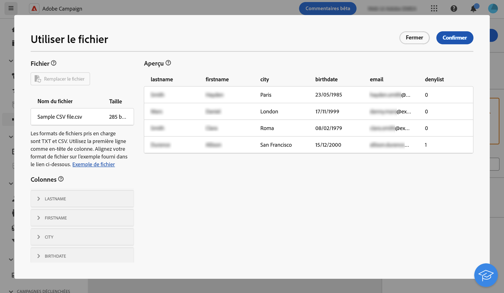

# Chargement de fichier  {#load-file}

>[!CONTEXTUALHELP]
>id="acw_orchestration_loadfile"
>title="Activité Chargement de fichier"
>abstract="La variable **Chargement de fichier** est une activité **Gestion des données** activité. Utilisez cette activité pour utiliser les données stockées dans un fichier externe."

>[!CONTEXTUALHELP]
>id="acw_orchestration_loadfile_samplefile"
>title="Exemple de fichier"
>abstract="Exemple de fichier"

>[!CONTEXTUALHELP]
>id="acw_orchestration_loadfile_nameofthefile"
>title="Nom du fichier"
>abstract="Nom du fichier"

>[!CONTEXTUALHELP]
>id="acw_orchestration_loadfile_targetdb"
>title="Base de données cible"
>abstract="Base de données cible"

>[!CONTEXTUALHELP]
>id="acw_orchestration_loadfile_rejectmgt"
>title="Gestion des rejets pour l’activité Chargement de fichier"
>abstract="Gestion des rejets pour l’activité Chargement de fichier"

>[!CONTEXTUALHELP]
>id="acw_orchestration_loadfile_outboundtransition"
>title="Transition sortante de la gestion des rejets"
>abstract="Transition sortante de la gestion des rejets"

>[!CONTEXTUALHELP]
>id="acw_orchestration_loadfile_outboundtransition_reject"
>title="Transition sortante de la gestion des rejets (pour les rejets)"
>abstract="Transition sortante de la gestion des rejets (pour les rejets)"

>[!CONTEXTUALHELP]
>id="acw_orchestration_loadfile_formatting"
>title="Mise en forme de l’activité Chargement de fichier"
>abstract="Mise en forme de l’activité Chargement de fichier"

La variable **Chargement de fichier** est une activité **Gestion des données** activité. Utilisez cette activité pour travailler avec des profils et des données stockés dans un fichier externe. Les profils et les données ne sont pas ajoutés à la base de données, mais tous les champs du fichier d’entrée sont disponibles pour [personnalisation](../../personalization/gs-personalization.md)ou pour mettre à jour les profils ou toute autre table.

>[!NOTE]
>Les formats de fichier pris en charge sont les suivants : texte (TXT) et valeur séparée par des virgules (CSV).

Cette activité peut être utilisée avec une [Réconciliation](reconciliation.md) pour lier des données non identifiées à des ressources existantes. Par exemple, la variable **Chargement de fichier** peut être placée avant une activité **Réconciliation** si vous importez des données non standard dans la base de données.

## Configuration de l’activité Chargement de fichier {#load-configuration}

Pour configurer la variable **Chargement de fichier** activité :

1. Faites glisser et déposez un **Chargement de fichier** dans votre workflow. Cliquez sur le bouton **Sélectionner dans le fichier** bouton .

1. Sélectionnez le fichier local à utiliser. Le format doit être aligné sur cette [exemple de fichier](../../audience/file-audience.md#sample-file).

1. Prévisualisez et vérifiez le mappage des données dans la section centrale de l’écran.

   

1. Utilisez la variable **Colonnes** dans le volet de gauche afin d’ajuster le type et la largeur des données pour chaque colonne.

1. Dans le **Formatage** , située sous la configuration des colonnes, indiquez le format du fichier externe pour vous assurer que les données sont correctement importées.

1. Cliquez sur **Confirmer** une fois que les paramètres sont corrects.

## Exemple{#load-example}

Un exemple de chargement de fichier externe utilisé avec la fonction **Réconciliation** est disponible dans [cette section](reconciliation.md#example).