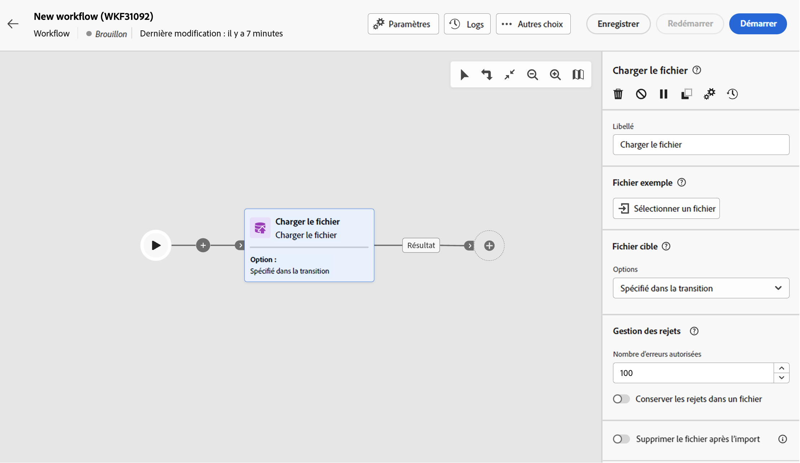
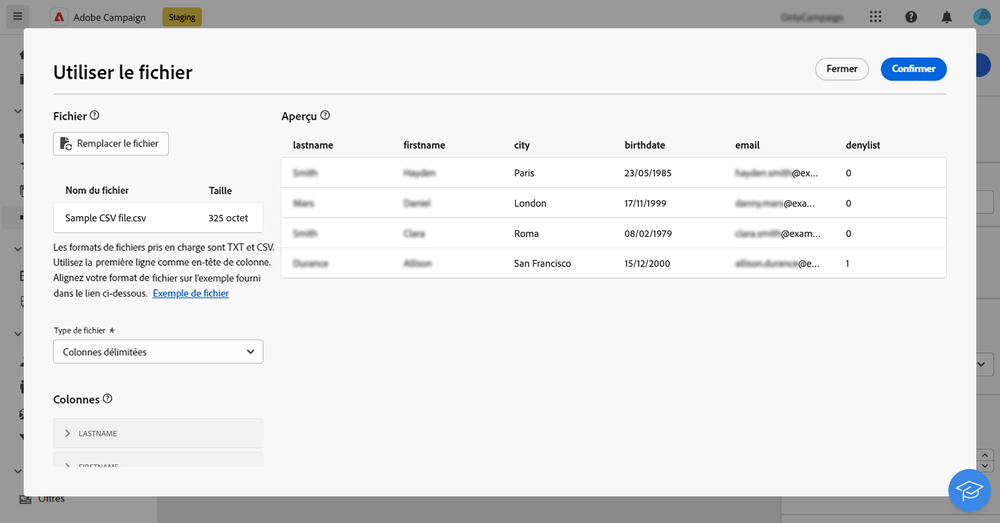
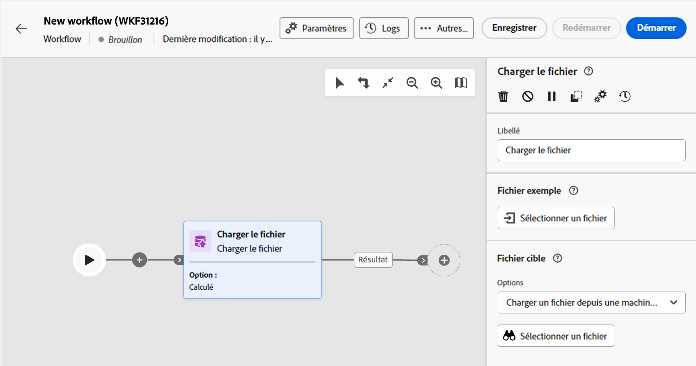
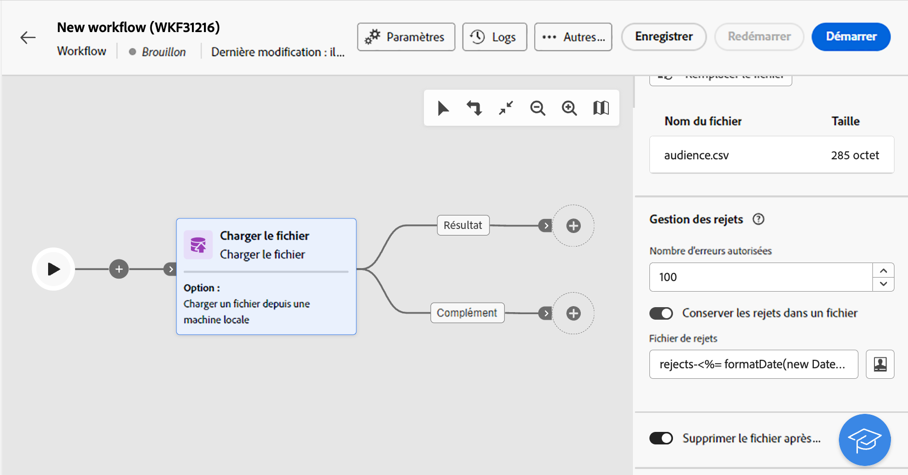

# Chargement de fichier {#load-file}

>[!CONTEXTUALHELP]
>id="acw_orchestration_loadfile"
>title="Activité Chargement de fichier"
>abstract="L’activité **Chargement de fichier** est une activité de **Data Management**. Utilisez cette activité pour utiliser les données stockées dans un fichier externe. Les profils et les données ne sont pas ajoutés à la base de données, mais tous les champs du fichier d’entrée peuvent être personnalisés, mis à jour les profils ou toute autre table. "

>[!CONTEXTUALHELP]
>id="acw_orchestration_loadfile_outboundtransition"
>title="Transition sortante de la gestion des rejets"
>abstract="Transition sortante de la gestion des rejets"

>[!CONTEXTUALHELP]
>id="acw_orchestration_loadfile_outboundtransition_reject"
>title="Transition sortante de la gestion des rejets (pour les rejets)"
>abstract="Transition sortante de la gestion des rejets (pour les rejets)"

L’activité **Chargement de fichier** est une activité de **Data Management**. Utilisez-la lorsque vous travaillez avec des profils et des données stockés dans un fichier externe. Les profils et les données ne sont pas ajoutés à la base de données, mais tous les champs du fichier d’entrée sont disponibles pour la [personnalisation](../../personalization/gs-personalization.md) ou la mise à jour des profils ou des tables.

>[!NOTE]
>Les formats de fichier pris en charge sont les suivants : texte (TXT) et valeur séparée par des virgules (CSV). Vous pouvez charger des fichiers d’une taille maximale de 50 Mo.

Combinée avec l’activité [Réconciliation](reconciliation.md), elle permet de lier des données non identifiées à des ressources existantes. L’activité **Chargement de fichier** peut par exemple être placée après une activité de **Réconciliation** si vous importez des données non standard dans la base de données.

## Configurer l’activité Chargement de fichier {#load-configuration}

La variable **Chargement de fichier** la configuration de l’activité comprend deux étapes. Tout d&#39;abord, vous devez définir la structure du fichier attendue en téléchargeant un fichier d&#39;exemple. Une fois cette opération effectuée, vous pouvez indiquer l&#39;origine du fichier dont les données seront importées. Suivez les étapes ci-dessous pour configurer l’activité.

### Configuration du fichier d’exemple {#sample}

>[!CONTEXTUALHELP]
>id="acw_orchestration_loadfile_samplefile"
>title="Exemple de fichier"
>abstract="Sélectionnez la structure de fichiers attendue en téléchargeant un fichier d&#39;exemple."

>[!CONTEXTUALHELP]
>id="acw_orchestration_loadfile_formatting"
>title="Mise en forme de l’activité Chargement de fichier"
>abstract="Dans le **Formatage** , indiquez le format du fichier pour vous assurer que les données sont correctement importées."

>[!CONTEXTUALHELP]
>id="acw_orchestration_loadfile_valueremapping"
>title="Nouveau mappage des valeurs de l’activité Chargement de fichier"
>abstract="Utilisez cette option pour mapper des valeurs spécifiques des fichiers chargés avec de nouvelles valeurs. Par exemple, si la colonne contient des valeurs &quot;True&quot;/&quot;False&quot;, vous pouvez ajouter un mappage pour remplacer automatiquement ces valeurs par des caractères &quot;0&quot;/&quot;1&quot;."

Pour configurer le fichier d’exemple utilisé pour définir la structure de fichier attendue, procédez comme suit :

1. Ajouter un **Chargement de fichier** dans votre workflow.

1. Sélectionnez le fichier d&#39;exemple à utiliser pour définir la structure de fichier attendue. Pour ce faire, cliquez sur le bouton **Sélectionner un fichier** dans le **[!UICONTROL Exemple de fichier]** et sélectionnez le fichier local à utiliser.

   >[!NOTE]
   >
   >Les données du fichier d&#39;exemple sont utilisées pour le paramétrage de l&#39;activité mais ne sont pas importées. Nous vous recommandons d&#39;utiliser un fichier d&#39;exemple contenant peu de données. Le format de fichier doit être aligné sur cette [exemple de fichier](../../audience/file-audience.md#sample-file).

1. Un aperçu de l’exemple de fichier s’affiche, affichant un maximum de 30 lignes.

1. Dans le **[!UICONTROL Type de fichier]** , indiquez si le fichier utilise des colonnes délimitées ou des colonnes à largeur fixe.

   

1. Pour les types de fichiers de colonnes délimités, utilisez la variable **Colonnes** pour configurer les propriétés de chaque colonne.

   +++ Options disponibles pour les colonnes de fichiers

   * **[!UICONTROL Libellé]**: libellé à afficher pour la colonne.
   * **[!UICONTROL Type de données]**: type de données contenues dans la colonne.
   * **[!UICONTROL Largeur]** (type de données string) : nombre maximal de caractères à afficher dans la colonne.
   * **[!UICONTROL Transformation des données]** (type de données string) : appliquez une transformation aux valeurs contenues dans la colonne.
   * **[!UICONTROL Gestion des espaces blancs]** (type de données string) : indiquez comment gérer les espaces contenus dans la colonne.
   * **[!UICONTROL Séparateurs]** (types de données date, heure, nombre entier et nombre)* : spécifiez les caractères à utiliser comme séparateurs.
   * **[!UICONTROL Autoriser les NULL]**: indiquez comment gérer les valeurs vides dans la colonne. L’option &quot;Adobe Campaign default&quot; renvoie une erreur si une valeur vide est présente.
   * **[!UICONTROL Traitement des erreurs]** (type de données string) : indiquez le comportement en cas d&#39;erreur sur l&#39;une des lignes.
   * **[!UICONTROL Remappage de valeurs]**: cette option vous permet de mapper des valeurs spécifiques avec de nouvelles valeurs. Par exemple, si la colonne contient des valeurs &quot;True&quot;/&quot;False&quot;, vous pouvez ajouter un mappage pour remplacer automatiquement ces valeurs par des caractères &quot;0&quot;/&quot;1&quot;.

+++

1. Dans le **Formatage** , indiquez le format du fichier pour vous assurer que les données sont correctement importées.

### Définition du fichier cible à charger {#target}

>[!CONTEXTUALHELP]
>id="acw_orchestration_loadfile_targetfile"
>title="Fichier cible de l’activité Chargement de fichier"
>abstract="Dans le **[!UICONTROL Fichier cible]** , indiquez comment récupérer le fichier à télécharger sur le serveur."

>[!CONTEXTUALHELP]
>id="acw_orchestration_loadfile_nameofthefile"
>title="Nom du fichier"
>abstract="Indiquez le nom du champ à télécharger sur le serveur. Cliquez sur le bouton **[!UICONTROL Ouvrir la boîte de dialogue de personnalisation]** pour utiliser l’éditeur d’expression, y compris les variables d’événement, pour calculer le nom du fichier."

>[!CONTEXTUALHELP]
>id="acw_orchestration_loadfile_targetdb"
>title="Base de données cible"
>abstract="Si vous accédez à une **[!UICONTROL Chargement de fichier]** une activité qui a déjà été configurée dans la console cliente, une **[!UICONTROL Base de données cible]** est disponible si vous avez configuré l’activité pour télécharger le fichier vers une base de données externe."

>[!CONTEXTUALHELP]
>id="acw_orchestration_loadfile_command"
>title="Commande de chargement de fichier"
>abstract="L’autorisation d’une commande arbitraire pour le prétraitement est un problème de sécurité. Désactivez l’option de sécurité XtkSecurity_Disable_Preproc pour forcer l’utilisation d’une liste prédéfinie de commandes."

>[!CAUTION]
>
>Avant de charger le fichier cible, assurez-vous qu’il respecte le formatage de fichier d’exemple. Toute incohérence dans le format de fichier, la structure des colonnes ou le nombre de colonnes peut entraîner des erreurs lors de l’exécution du workflow.

Pour définir le fichier cible à télécharger, procédez comme suit :

1. Dans le **[!UICONTROL Fichier cible]** , indiquez l’action à effectuer lors de la récupération du fichier à télécharger sur le serveur.

   * **[!UICONTROL Chargement d’un fichier depuis un ordinateur local]**: sélectionnez le fichier à télécharger sur votre ordinateur.

   * **[!UICONTROL Spécifié par la transition]**: téléchargez le fichier provenant de la transition entrante à venir d’une activité précédente, telle que **[!UICONTROL Transfert de fichier]**.

   * **[!UICONTROL Prétraiter le fichier]**: téléchargez le fichier provenant de la transition précédente et appliquez-lui une commande de pré-traitement telle que **[!UICONTROL Décompression]** ou **[!UICONTROL Décrypter]**.

   * **[!UICONTROL Calculé]**: téléchargez le fichier dont le nom est spécifié dans la variable **[!UICONTROL Nom du fichier]** champ . Cliquez sur le bouton **[!UICONTROL Ouvrir la boîte de dialogue de personnalisation]** pour utiliser l’éditeur d’expression, y compris les variables d’événement, pour calculer le nom du fichier.

   

   >[!NOTE]
   >
   >Si vous accédez à une **[!UICONTROL Chargement de fichier]** une activité qui a déjà été configurée dans la console cliente, une **[!UICONTROL Base de données cible]** s’affiche si vous avez configuré l’activité pour télécharger le fichier vers une base de données externe. Il permet de spécifier si vous souhaitez télécharger le fichier sur le serveur Campaign ou sur la base de données externe.

### Options additionnelles {#options}

>[!CONTEXTUALHELP]
>id="acw_orchestration_loadfile_rejectmgt"
>title="Gestion des rejets pour l’activité Chargement de fichier"
>abstract="Dans le **Gestion des rejets** , indiquez le comportement de l’activité en cas d’erreur. Vous pouvez définir le nombre maximal d’erreurs à autoriser et activer/désactiver la variable **[!UICONTROL Conserver les rejets dans un fichier]** pour télécharger sur le serveur un fichier contenant les erreurs qui se sont produites pendant l’importation."

>[!CONTEXTUALHELP]
>id="acw_orchestration_loadfile_delete"
>title="Supprimer le fichier après l’import"
>abstract="Activez le bouton **Supprimer le fichier après l’import** pour supprimer le fichier d’origine du serveur après son import."

1. Dans le **Gestion des rejets** , indiquez le comportement de l’activité en cas d’erreur :

   * Dans le **[!UICONTROL Dele]** indiquez le nombre maximal d’erreurs autorisées lors du traitement du fichier à charger. Par exemple, si la valeur est définie sur &quot;20&quot;, l’exécution du workflow échoue si plus de 20 erreurs se produisent lors du chargement du fichier.

   * Pour conserver les erreurs qui se sont produites lors du chargement du fichier, faites basculer le **[!UICONTROL Conserver les rejets dans un fichier]** et indiquez le nom de votre choix pour le fichier dans la variable **[!UICONTROL Fichier de rejet]** champ .

     Après avoir activé cette option, une transition de sortie supplémentaire nommée &quot;Complémentaire&quot; est ajoutée après l’activité. Toute erreur qui se produira pendant l’importation sera stockée dans le fichier spécifié sur le serveur.

1. Pour supprimer le fichier chargé du serveur une fois le workflow exécuté, faites basculer le **[!UICONTROL Supprimer le fichier après importation]** .

   

1. Cliquez sur **Confirmer** une fois que les paramètres sont corrects.

## Exemple {#load-example}

Un exemple de chargement de fichier externe est disponible avec l’activité **Réconciliation** dans [cette section](reconciliation.md#reconciliation-example).
