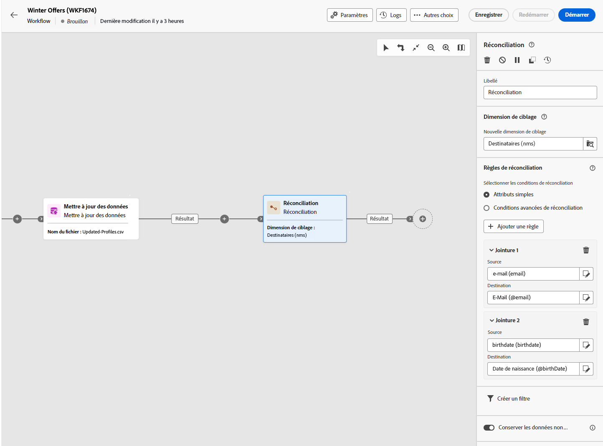

# Réconciliation {#reconciliation}

>[!CONTEXTUALHELP]
>id="acw_orchestration_reconciliation"
>title="Activité Réconciliation"
>abstract="La variable **Réconciliation** est une activité **Ciblage** activité permettant de définir le lien entre les données de la base Adobe Campaign et les données d&#39;une table de travail. Par exemple, la variable **Réconciliation** peut être placée après une **Chargement de fichier** pour importer des données non standard dans la base de données. Dans ce cas, la variable **Réconciliation** activité permet de définir le lien entre les données de la base Adobe Campaign et les données de la table externe."

>[!CONTEXTUALHELP]
>id="acw_orchestration_reconciliation_field"
>title="Champ de sélection de la réconciliation"
>abstract="Champ de sélection de la réconciliation"

>[!CONTEXTUALHELP]
>id="acw_orchestration_reconciliation_condition"
>title="Condition de création de réconciliation"
>abstract="Condition de création de réconciliation"

>[!CONTEXTUALHELP]
>id="acw_orchestration_reconciliation_complement"
>title="Complément de génération de réconciliation"
>abstract="Complément de génération de réconciliation"

La variable **Réconciliation** est une activité **Ciblage** activité permettant de définir le lien entre les données de la base Adobe Campaign et les données d&#39;une table de travail, par exemple les données chargées à partir d&#39;un fichier externe.

Par exemple, la variable **Réconciliation** peut être placée après une **Chargement de fichier** pour importer des données non standard dans la base de données. Dans ce cas, la variable **Réconciliation** permet de définir le lien entre les données de la base Adobe Campaign et celles de la table de travail.

## Bonnes pratiques {#reconciliation-best-practices}

Lorsque la variable **Enrichissement** vous permet de définir des données additionnelles à traiter dans votre workflow (vous pouvez utiliser une **Enrichissement** pour combiner des données provenant de plusieurs ensembles, ou pour créer des liens vers une ressource temporaire), la variable **Réconciliation** vous permet de lier des données non identifiées à des ressources existantes.

>[!NOTE]
>L&#39;opération de réconciliation implique que les données des dimensions liées se trouvent déjà dans la base de données.  Par exemple, si vous importez un fichier d&#39;actes d&#39;achats indiquant quel produit a été acheté, à quelle heure, par quel client, etc., le produit ainsi que le client doivent déjà exister en base.

## Configurer l&#39;activité Réconciliation {#reconciliation-configuration}

>[!CONTEXTUALHELP]
>id="acw_orchestration_reconciliation_targeting"
>title="Targeting dimension"
>abstract="Sélectionnez la nouvelle dimension de ciblage. Une dimension permet de définir la population ciblée : destinataires, abonnés aux applications, opérateurs, abonnés, etc. Par défaut, la dimension de ciblage actuelle est sélectionnée."

>[!CONTEXTUALHELP]
>id="acw_orchestration_reconciliation_rules"
>title="Règles de réconciliation"
>abstract="Sélectionnez le ou les champs de réconciliation à utiliser pour la déduplication. Vous pouvez utiliser un ou plusieurs critères de réconciliation."

>[!CONTEXTUALHELP]
>id="acw_orchestration_reconciliation_targeting_selection"
>title="Sélectionner la dimension de ciblage"
>abstract="Sélectionnez la dimension de ciblage des données entrantes avec lesquelles vous souhaitez effectuer la réconciliation."
>additional-url="https://experienceleague.adobe.com/docs/campaign-web/v8/audiences/gs-audiences-recipients.html#targeting-dimensions" text="Dimensions de ciblage"

>[!CONTEXTUALHELP]
>id="acw_orchestration_keep_unreconciled_data"
>title="Conserver les données non réconciliées"
>abstract="Par défaut, les données non réconciliées sont conservées dans la transition sortante et disponibles dans la table de travail pour une utilisation ultérieure. Pour supprimer les données non réconciliées, désactivez la variable **Conserver les données non réconciliées** ."

>[!CONTEXTUALHELP]
>id="acw_orchestration_reconciliation_attribute"
>title="Attribut de réconciliation"
>abstract="Sélectionnez l’attribut à utiliser pour réconcilier les données, puis cliquez sur Confirmer."

Pour configurer la variable **Réconciliation** activité :

1. Faites glisser et déposez un **Réconciliation** dans votre workflow. Cette activité doit être ajoutée à la suite d&#39;une transition contenant une population dont la dimension de ciblage ne provient pas directement d&#39;Adobe Campaign.

1. Sélectionnez la nouvelle dimension de ciblage. Une dimension permet de définir la population ciblée : destinataires, abonnés aux applications, opérateurs, abonnés, etc. [En savoir plus sur les dimensions de ciblage](../../audience/about-recipients.md#targeting-dimensions).

1. Sélectionnez le ou les champs à utiliser pour la réconciliation. Vous pouvez utiliser un ou plusieurs critères de réconciliation.

   1. Pour utiliser des attributs afin de réconcilier des données, sélectionnez la variable **Attributs simples** . La variable **Source** répertorie les champs disponibles dans la transition de saisie, qui doivent être réconciliés. La variable **Destination** correspond aux champs de la dimension de ciblage sélectionnée. Les données sont réconciliées lorsque la source et la destination sont égales. Par exemple, sélectionnez la variable **Email** pour dédupliquer les profils en fonction de leur adresse email.

      Pour ajouter un autre critère de réconciliation, cliquez sur le bouton **Ajouter une règle** bouton . Si plusieurs conditions de jointure sont indiquées, elles doivent TOUTES être vérifiées pour que le lien entre les données puisse se faire.

      

   1. Pour utiliser d’autres attributs afin de réconcilier des données, sélectionnez la variable **Conditions de réconciliation avancées** . Vous pouvez ensuite créer votre propre condition de réconciliation à l’aide du modeleur de requête. Découvrez comment utiliser le créateur de modèles de requête dans [cette section](../../query/query-modeler-overview.md).

1. Vous pouvez filtrer les données à réconcilier à l’aide de la variable **Créer un filtre** bouton . Vous pouvez ainsi créer une condition personnalisée à l’aide de la variable [query modeler](../../query/query-modeler-overview.md).

Par défaut, les données non réconciliées sont conservées dans la transition sortante et disponibles dans la table de travail pour une utilisation ultérieure. Pour supprimer les données non réconciliées, désactivez la variable **Conserver les données non réconciliées** .

## Exemple {#reconciliation-example}

L&#39;exemple suivant illustre un workflow permettant de créer une audience de profils directement à partir d&#39;un fichier importé contenant des nouveaux clients. Il se compose des activités suivantes :

Le workflow se présente comme suit :


Il est construit avec les activités suivantes :

* Une activité [Chargement de fichier](load-file.md) télécharge un fichier contenant des données de profils extraites à l&#39;aide d&#39;un outil externe.

  Par exemple :

  ```
  lastname;firstname;email;birthdate;
  JACKMAN;Megan;megan.jackman@testmail.com;07/08/1975;
  PHILLIPS;Edward;phillips@testmail.com;09/03/1986;
  WEAVER;Justin;justin_w@testmail.com;11/15/1990;
  MARTIN;Babe;babeth_martin@testmail.net;11/25/1964;
  REESE;Richard;rreese@testmail.com;02/08/1987;
  ```

* A **Réconciliation** activité qui identifie les données entrantes sous forme de profils, en utilisant la variable **email** et **Date de naissance** champs comme critères de réconciliation.

  

* A [Sauvegarde d’audience](save-audience.md) pour créer une audience à partir de ces mises à jour. Vous pouvez également remplacer la variable **Sauvegarde d’audience** activité par une **Fin** activité si aucune audience spécifique ne doit être créée ou mise à jour. Les profils de destinataires sont mis à jour dans tous les cas lorsque vous exécutez le workflow.


## Compatibilité {#reconciliation-compat}

La variable **Réconciliation** n’existe pas dans la console cliente. Tous **Enrichissements** les activités créées dans la console cliente avec les options de réconciliation activées s’affichent sous la forme **Réconciliation** activités dans l’interface utilisateur web de Campaign.
