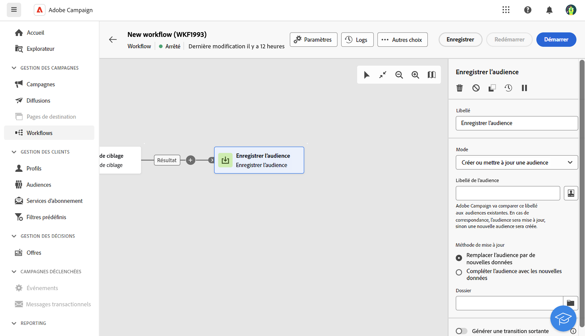

# Enregistrer l’audience {#save-audience}

>[!CONTEXTUALHELP]
>id="acw_orchestration_save_audience"
>title="Enregistrer une audience"
>abstract="Utilisez cette activité pour mettre à jour une audience existante ou créer une audience à partir de la population calculée en amont dans le workflow. Les audiences créées sont ajoutées à la liste des audiences et sont disponibles dans le menu **Audiences**."

>[!CONTEXTUALHELP]
>id="acw_orchestration_saveaudience_outbound"
>title="Générer une transition sortante"
>abstract="Utilisez cette option si vous souhaitez ajouter une transition après l’activité **Enregistrer l’audience**."

L’activité **Enregistrer l’audience** est une activité de **ciblage**. Cette activité permet de mettre à jour une audience existante ou de créer une audience à partir de la population calculée en amont dans un workflow. Les audiences créées sont ajoutées à la liste des audiences de l’application, disponible via le menu **Audiences**.

Cette activité est essentiellement utilisée afin de conserver des groupes de population calculés dans le même workflow, en les convertissant en audiences réutilisables. Connectez-la à d’autres activités de ciblage telles que **Créer une audience** ou **Combiner**.

## Configurer l’activité Enregistrer l’audience{#save-audience-configuration}

Pour configurer l’activité **Enregistrer l’audience**, procédez comme suit :

1. Ajoutez une activité **Enregistrer l’audience** à votre workflow.

1. Dans le menu déroulant **Mode**, sélectionnez l’action à réaliser :

   * **Créer ou mettre à jour une audience existante** : définissez un **libellé d’audience**. Si l’audience existe déjà, elle est mise à jour, sinon une nouvelle audience est créée.

   * **Mettre à jour une audience existante** : sélectionnez l’**Audience** à mettre à jour parmi la liste des audiences existantes.

1. Sélectionnez le **mode de mise à jour** qui s’appliquera aux audiences existantes :

   * **Remplacer le contenu de l’audience par de nouvelles données** : tout le contenu de l’audience est remplacé. Les anciennes données sont perdues. Seules les données issues de la transition entrante de l’activité d’enregistrement d’audience sont conservées. Cette option écrase le type et la dimension de ciblage de l’audience mise à jour.

   * **Compléter l’audience avec les nouvelles données** : l’ancien contenu de l’audience est conservé et les données sont complétées avec celles issues de la transition entrante de l’activité d’enregistrement d’audience.

1. Cochez l’option **Générer une transition sortante** si vous souhaitez ajouter une transition après l’activité **Enregistrer l’audience**.

Le contenu de l’audience enregistrée est ensuite disponible dans la vue détaillée de l’audience, accessible depuis le menu **Audiences**. Les colonnes disponibles depuis cette vue correspondent aux colonnes de la transition entrante de l’activité **Enregistrer l’audience** du workflow.

## Exemple{#save-audience-example}

L’exemple suivant illustre une mise à jour simple de l’audience à partir du ciblage. Un planificateur est ajouté de sorte à exécuter le workflow une fois par mois. Une requête récupère tous les profils abonnés aux différentes applications disponibles. L’activité **Enregistrer l’audience** permet de mettre à jour l’audience spécifiée en y supprimant les profils s’étant désabonnés des services depuis la dernière exécution du workflow et en y ajoutant les nouveaux profils abonnés.
