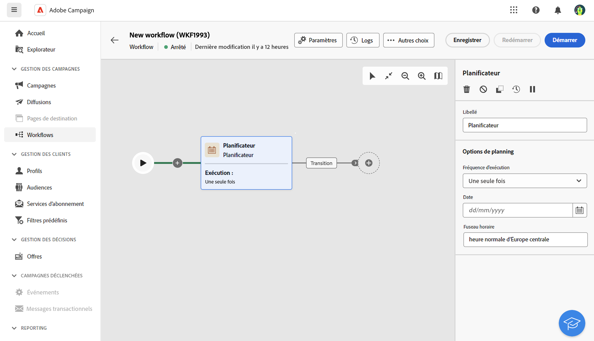
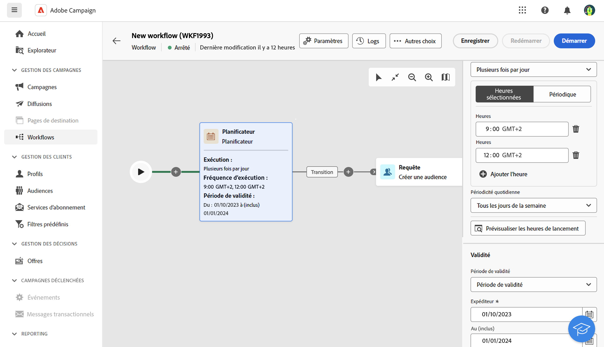

# Planificateur {#scheduler}

>[!CONTEXTUALHELP]
>id="acw_orchestration_schedule_options"
>title="Activité Planificateur"
>abstract="La variable **Planificateur** est une activité **Contrôle de flux** activité. Il permet de planifier le démarrage du workflow. Cette activité doit être considérée comme un début planifié. Il ne peut être utilisé que comme première activité du workflow."

La variable **Planificateur** est une activité **Contrôle de flux** activité. Il permet de planifier le démarrage du workflow. Cette activité doit être considérée comme un début planifié. Il ne peut être utilisé que comme première activité du workflow.

## Bonnes pratiques

* Ne planifiez pas l’exécution d’un workflow à une fréquence supérieure à toutes les 15 minutes, car cela peut nuire aux performances générales du système et créer des blocs dans la base de données.
* Si vous souhaitez envoyer une diffusion ponctuelle dans votre workflow, vous pouvez ajouter une activité Planificateur et la configurer pour qu’elle s’exécute. **Une fois**. Vous pouvez également définir **Planification** dans les paramètres de la diffusion.
* Si vous souhaitez envoyer une diffusion récurrente dans votre workflow, vous devez utiliser une **Planificateur** et définissez la fréquence d&#39;exécution. L&#39;activité de diffusion récurrente ne permet pas de définir de planning.

## Configuration

>[!CONTEXTUALHELP]
>id="acw_orchestration_schedule_validity"
>title="Validité du planificateur"
>abstract="Vous pouvez définir une période de validité pour le planificateur. Il peut être permanent ou valide jusqu’à une date spécifique."

Pour configurer la variable **Planificateur** activité :

1. Ajouter un **Planificateur** à votre workflow.

   

1. Configurez la variable **Fréquence d&#39;exécution**:

   * **Une seule fois** : le workflow n&#39;est exécuté qu&#39;une seule fois.

   * **Quotidienne** : le workflow est exécuté à une heure précise, une fois par jour.

   * **Plusieurs fois par jour :** le workflow est exécuté régulièrement plusieurs fois par jour. Vous pouvez configurer des exécutions à des heures et dates spécifiques ou périodiquement.

   * **Hebdomadaire** : le workflow est exécuté à un instant défini, une ou plusieurs fois par semaine.

   * **Mensuelle** : le workflow est exécuté à un instant défini, une ou plusieurs fois par mois. Vous pouvez sélectionner les mois auxquels le workflow doit être exécuté. Vous pouvez également configurer des exécutions les jours de semaine spécifiés du mois, comme le deuxième mardi du mois.

1. Spécifiez les détails de l&#39;exécution selon la fréquence choisie. Les champs du détail peuvent varier en fonction de la fréquence sélectionnée (heure, fréquence de répétition, jours spécifiques, etc.).

1. Cliquez sur **Aperçu des heures de lancement** pour vérifier le planning des dix prochaines exécutions de votre workflow.

1. Définissez la période de validité du planificateur :

   * **Permanent (n’expire jamais)**: le workflow est exécuté selon la fréquence d&#39;exécution définie, sans limite dans le temps ni au niveau du nombre d&#39;itérations.

   * **Période de validité**: le workflow est exécuté selon la fréquence d&#39;exécution définie, jusqu&#39;à une date spécifique. Vous devez spécifier les dates de début et de fin.

>[!NOTE]
>
>Si vous souhaitez démarrer immédiatement le workflow, vous pouvez cliquer sur le bouton **Traitement de la tâche en attente** dans la barre d’actions supérieure du planificateur. Ce bouton n’est disponible que lorsque vous avez démarré le workflow.

Notes:

## Exemple

Dans l’exemple suivant, l’activité est configurée de sorte que le workflow s’exécute plusieurs fois par jour à 9h00 et 12h00, tous les jours de la semaine du 1er octobre 2023 au 1er janvier 2024.

