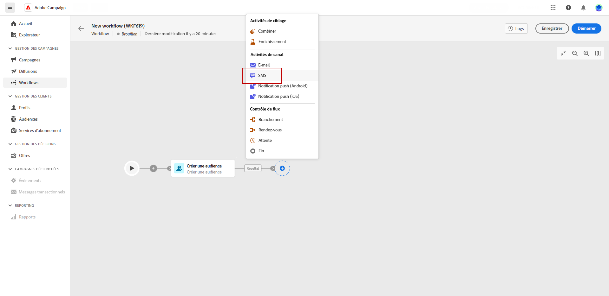

# SMS {#sms}

Le **SMS** L’activité fournit la fonctionnalité d’envoi de messages SMS dans un workflow. Il permet l&#39;automatisation de l&#39;envoi des SMS à une cible spécifique déterminée dans le même workflow.

Pour définir les destinataires du SMS, vous pouvez les configurer avant l&#39;activité Diffusion SMS dans le workflow à l&#39;aide de l&#39;activité Créer l&#39;audience . En savoir plus.

1. Après avoir créé et configuré un nouveau workflow, ajoutez une activité Créer une audience pour sélectionner une audience existante ou utilisez le créateur de règles pour définir votre propre requête.

1. Ajoutez une activité Canal SMS à votre workflow.

   
<!--
1. Select the Type of delivery:

    * Single delivery: Choose this option if you want the SMS to be sent only once. You have the flexibility to choose whether or not to include an outbound transition from this activity.

    * Recurring delivery: Choose this option if you want the SMS to be sent multiple times based on a defined frequency. The frequency can be configured using a Scheduler activity, allowing you to schedule the SMS to be sent at regular intervals.
-->

1. Sélectionnez votre activité. Dans le menu de la diffusion, sélectionnez les Modèles à utiliser pour cette diffusion. En savoir plus sur les modèles

1. Cliquez sur Créer une diffusion pour configurer votre diffusion SMS. Pour plus d&#39;informations sur la diffusion SMS, consultez cette page.

1. Une fois que votre diffusion est prête à être envoyée, revenez à votre workflow et cliquez sur Démarrer pour lancer votre workflow.

1. Par défaut, le lancement d’un workflow de diffusion déclenche l’étape de préparation du message, sans envoyer immédiatement le message.

   Cliquez sur Réviser et envoyer dans le menu avancé de votre activité SMS pour confirmer l&#39;envoi.

1. Dans le tableau de bord de la diffusion SMS, cliquez sur Envoyer.
