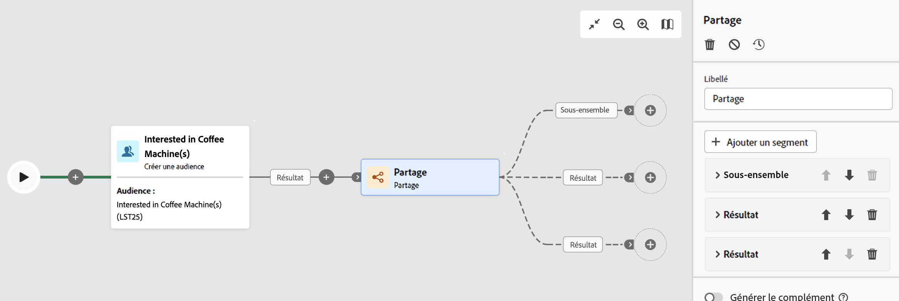
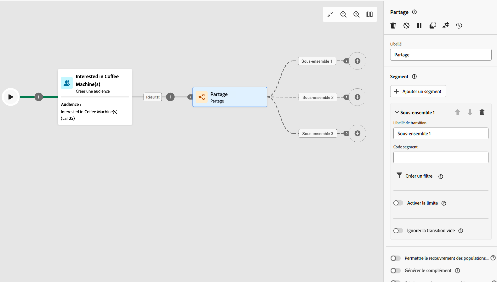
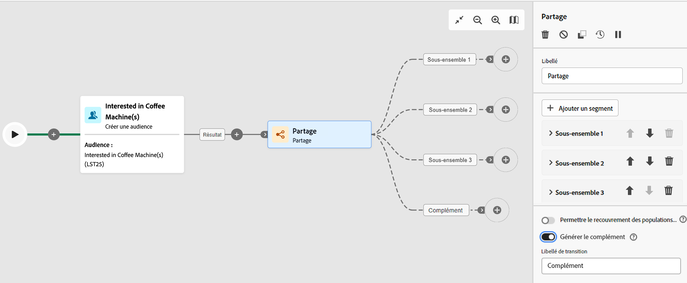
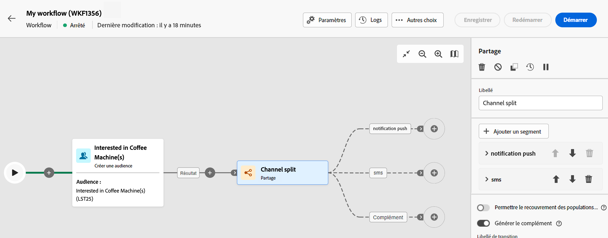

# Partage {#split}

>[!CONTEXTUALHELP]
>id="acw_orchestration_split"
>title="Partage activité"
>abstract="La variable **Partage** permet de segmenter les populations entrantes en plusieurs sous-ensembles selon différents critères de sélection, tels que les règles de filtrage ou la taille de la population."

L’activité **Partage** est une activité de **ciblage** vous permettant de segmenter les populations entrantes en plusieurs sous-ensembles selon différents critères de sélection, tels que les règles de filtrage ou la taille de la population.

## Configuration {#general}

>[!CONTEXTUALHELP]
>id="acw_orchestration_split_filter"
>title="Filtre d&#39;activité de partage"
>abstract="Pour appliquer une condition de filtrage au sous-ensemble, cliquez sur **[!UICONTROL Créer un filtre]** et configurez la règle de filtrage souhaitée. Par exemple, incluez les profils de la population entrante dont l’adresse e-mail existe dans la base de données."

>[!CONTEXTUALHELP]
>id="acw_orchestration_split_limit"
>title="Limite de l&#39;activité de fractionnement"
>abstract="Pour limiter le nombre de profils sélectionnés par le sous-ensemble, activez la fonction **[!UICONTROL Activer la limite]** et indiquez le nombre ou les pourcentages de la population à inclure."

>[!CONTEXTUALHELP]
>id="acw_orchestration_split_sorting"
>title="Tri de l&#39;activité de partage"
>abstract="Lorsque vous définissez une limite de population pour un sous-ensemble, vous pouvez classer les profils sélectionnés en fonction d’un attribut de profil spécifique, dans un ordre croissant ou décroissant. Pour ce faire, activez l’option **Activer le tri**. Par exemple, vous pouvez restreindre un sous-ensemble afin de n’inclure que les 50 premiers profils ayant le montant d’achat le plus élevé."

Pour configurer l’activité **Partage**, procédez comme suit :

1. Ajoutez une activité **Partage** à votre workflow.

1. Le volet de configuration des activités s’ouvre avec un sous-ensemble par défaut. Cliquez sur le bouton **Ajouter un segment** pour ajouter autant de sous-ensembles que vous le souhaitez pour segmenter la population entrante.

   

   >[!IMPORTANT]
   >
   >Lorsque l’activité Partage est exécutée, la population est segmentée entre les différents sous-ensembles dans l’ordre dans lequel ils sont ajoutés à l’activité. Par exemple, si le premier sous-ensemble récupère 70 % de la population initiale, le sous-ensemble ajouté suivant n’appliquera ses critères de sélection qu’aux 30 % restants, etc.
   >
   > Avant de configurer vos sous-ensembles, assurez-vous de les avoir ajoutés dans l’ordre approprié, car leur position ne peut pas être modifiée.

1. Une fois les sous-ensembles ajoutés, l’activité propose autant de transitions en sortie que de sous-ensembles : Nous vous recommandons vivement de modifier le libellé de chaque sous-ensemble afin de les identifier facilement dans la zone de travail du workflow.

1. Configurez la manière dont chaque sous-ensemble doit filtrer la population entrante. Pour ce faire, procédez comme suit :

   1. Ouvrez le sous-ensemble pour afficher ses propriétés.

   1. Pour appliquer une condition de filtrage au sous-ensemble, cliquez sur **[!UICONTROL Créer un filtre]** et configurez la règle de filtrage souhaitée. Par exemple, incluez les profils de la population entrante dont l’adresse e-mail existe dans la base de données.

   1. Pour limiter le nombre de profils sélectionnés par le sous-ensemble, activez la fonction **[!UICONTROL Activer la limite]** et indiquez le nombre ou les pourcentages de la population à inclure.

      

      >[!NOTE]
      >
      >Lorsque vous définissez une limite de population pour un sous-ensemble, vous pouvez classer les profils sélectionnés en fonction d’un attribut de profil spécifique, dans un ordre croissant ou décroissant. Pour ce faire, activez l’option **[!UICONTROL Activer le tri]**. Par exemple, vous pouvez restreindre un sous-ensemble afin de n’inclure que les 50 premiers profils ayant le montant d’achat le plus élevé.

1. Une fois que vous avez paramétré tous les sous-ensembles, vous pouvez sélectionner la population restante qui ne correspond à aucun des sous-ensembles et les inclure dans une transition sortante supplémentaire. Pour ce faire, activez l’option **[!UICONTROL Générer le complémentaire]**.

   

L’activité est désormais configurée. Lors de l’exécution du workflow, la population sera segmentée dans les différents sous-ensembles, dans l’ordre dans lequel ils ont été ajoutés à l’activité.

## Exemple

Dans l’exemple suivant, l’activité **[!UICONTROL Partage]** sert à segmenter une audience en sous-ensembles distincts en fonction du canal de communication que nous voulons utiliser :

* **Sous-ensemble 1 « notification push »** : ce sous-ensemble comprend tous les profils ayant installé notre application mobile.
* **Sous-ensemble 2 « SMS »** : utilisateurs et utilisatrices de téléphone mobile : pour la population restante qui ne faisait pas partie du sous-ensemble 1, le sous-ensemble 2 applique une règle de filtrage afin de sélectionner les profils avec des téléphones mobiles dans la base de données.
* **Transition complémentaire** : cette transition capture tous les profils restants qui ne correspondent pas au sous-ensemble 1 ou au sous-ensemble 2. Plus précisément, elle inclut les profils qui n’ont pas installé l’application mobile ou qui n’ont pas de téléphone mobile, tels que les utilisateurs et utilisatrices qui n’ont pas installé l’application mobile ou qui ne disposent pas d’un numéro de mobile enregistré.

