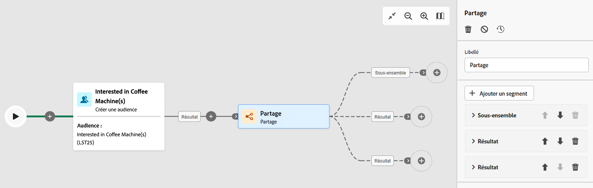

# Partage {#split}

>[!CONTEXTUALHELP]
>id="acw_orchestration_split"
>title="Activité Partage"
>abstract="L’activité **Partage** permet de segmenter les populations entrantes en plusieurs sous-ensembles selon différents critères de sélection, tels que les règles de filtrage ou la taille de la population."

L&#39;activité **Partage** est une activité **Ciblage** qui segmente les populations entrantes en plusieurs sous-ensembles en fonction de différents critères de sélection, tels que les règles de filtrage ou la taille de la population.

## Configurer l’activité Partage {#split-configuration}

>[!CONTEXTUALHELP]
>id="acw_orchestration_split_segments"
>title="Segments de l’activité de partage"
>abstract="Ajoutez autant de sous-ensembles que vous le souhaitez pour segmenter la population entrante. Lorsque l’activité **Partage** est exécutée, la population est segmentée entre les différents sous-ensembles dans l’ordre dans lequel ils sont ajoutés à l’activité. Avant de démarrer votre workflow, assurez-vous d’avoir trié les sous-ensembles dans l’ordre qui vous convient à l’aide des boutons fléchés."

>[!CONTEXTUALHELP]
>id="acw_orchestration_split_filter"
>title="Filtre de l’activité Partage"
>abstract="Pour appliquer une condition de filtrage au sous-ensemble, cliquez sur **[!UICONTROL Créer un filtre]** et configurez la règle de filtrage souhaitée à l’aide du concepteur de requête. Incluez, par exemple, les profils de la population entrante dont l’adresse e-mail existe dans la base de données."
>additional-url="https://experienceleague.adobe.com/fr/docs/campaign-web/v8/query-database/query-modeler-overview" text="Utiliser le concepteur de requête"

>[!CONTEXTUALHELP]
>id="acw_orchestration_split_limit"
>title="Limite de l’activité Partage"
>abstract="Pour limiter le nombre de profils sélectionnés par le sous-ensemble, activez la fonction **[!UICONTROL Activer la limite]** et indiquez le nombre ou les pourcentages de la population à inclure."

>[!CONTEXTUALHELP]
>id="acw_orchestration_split_sorting"
>title="Tri de l’activité Partage"
>abstract="Lorsque vous définissez une limite de population pour un sous-ensemble, vous pouvez classer les profils sélectionnés en fonction d’un attribut de profil spécifique, dans un ordre croissant ou décroissant. Pour ce faire, activez l’option **Activer le tri**. Par exemple, vous pouvez restreindre un sous-ensemble afin de n’inclure que les 50 premiers profils qui ont le montant d’achat le plus élevé."

>[!CONTEXTUALHELP]
>id="acw_orchestration_split_complement"
>title="Générer un complément pour l’activité Partage"
>abstract="Une fois tous les sous-ensembles configurés, vous pouvez sélectionner la population restante qui ne correspond à aucun des sous-ensembles et les inclure dans une transition sortante supplémentaire. Pour ce faire, activez l’option **Générer un complément**."

>[!CONTEXTUALHELP]
>id="acw_orchestration_split_generatesubsets"
>title="Générer tous les sous-ensembles dans le même tableau"
>abstract="Activez cette option pour regrouper tous les sous-ensembles en une seule transition de sortie."

>[!CONTEXTUALHELP]
>id="acw_orchestration_split_emptytransition"
>title="Ignorer la transition vide"
>abstract="Activez l’option **[!UICONTROL Ignorer la transition vide]** pour désactiver la transition sortante pour ce sous-ensemble si la population entrante est vide."

>[!CONTEXTUALHELP]
>id="acw_orchestration_split_enable_overlapping"
>title="Permettre le chevauchement des populations de sortie"
>abstract="L’option **[!UICONTROL Permettre le recouvrement des populations de sortie]** permet de gérer les populations qui appartiennent à plusieurs sous-ensembles. Lorsque la case n&#39;est pas cochée, l&#39;activité de partage permet de s&#39;assurer qu&#39;un destinataire ne peut pas être présent dans plusieurs transitions sortantes, même s&#39;il répond aux critères de plusieurs sous-ensembles. La personne destinataire sera dans la cible du premier onglet dont les critères sont vérifiés. Lorsque la case est cochée, les personnes destinataires peuvent apparaître dans plusieurs sous-ensembles si elles sont associées aux bons critères de filtrage. Adobe Campaign vous recommande d’utiliser des critères exclusifs."

Pour configurer l’activité **Partage**, procédez comme suit :

1. Ajoutez une activité **Partage** à votre workflow.

1. Le volet de configuration des activités s’ouvre avec un sous-ensemble par défaut. Cliquez sur le bouton **Ajouter un segment** pour ajouter autant de sous-ensembles que vous le souhaitez pour segmenter la population entrante.

   

   >[!IMPORTANT]
   >
   >Lorsque l’activité **Partage** est exécutée, la population est segmentée entre les différents sous-ensembles dans l’ordre dans lequel ils sont ajoutés à l’activité. Par exemple, si le premier sous-ensemble récupère 70 % de la population initiale, le sous-ensemble ajouté suivant n’appliquera ses critères de sélection qu’aux 30 % restants, etc.
   >
   >Avant de démarrer votre workflow, vérifiez que vous avez trié les sous-ensembles dans l’ordre qui vous convient. Utilisez les boutons fléchés pour modifier la position d’un sous-ensemble.

1. Une fois les sous-ensembles ajoutés, l’activité propose autant de transitions en sortie que de sous-ensembles : Modifiez le libellé de chaque sous-ensemble pour les identifier facilement dans la zone de travail du workflow.

1. Configurez la manière dont chaque sous-ensemble filtre la population entrante. Procédez comme suit :

   1. Ouvrez le sous-ensemble pour afficher ses propriétés.

   1. Pour appliquer une condition de filtrage au sous-ensemble, cliquez sur **[!UICONTROL Créer un filtre]** et configurez la règle de filtrage souhaitée à l’aide du concepteur de requête. Incluez, par exemple, les profils de la population entrante dont l’adresse e-mail existe dans la base de données. [Découvrez comment utiliser le concepteur de requête](../../query/query-modeler-overview.md).

   1. Pour limiter le nombre de profils sélectionnés par le sous-ensemble, activez la fonction **[!UICONTROL Activer la limite]** et indiquez le nombre ou les pourcentages de la population à inclure.

   1. Pour désactiver une transition si la population entrante est vide, activez l’option **[!UICONTROL Ignorer la transition vide]**. Si aucun profil ne correspond au sous-ensemble, le workflow ne passera pas à l’activité suivante.

      

      >[!NOTE]
      >
      >Lorsque vous définissez une limite de population pour un sous-ensemble, vous pouvez classer les profils sélectionnés en fonction d’un [attribut de profil](../../get-started/attributes.md) spécifique, dans un ordre croissant ou décroissant. Pour ce faire, activez l’option **[!UICONTROL Activer le tri]**. Par exemple, vous pouvez restreindre un sous-ensemble afin de n’inclure que les 50 premiers profils qui ont le montant d’achat le plus élevé.

1. Une fois tous les sous-ensembles configurés, vous pouvez sélectionner la population restante qui ne correspond à aucun des sous-ensembles et les inclure dans une transition sortante supplémentaire. Pour ce faire, activez l’option **[!UICONTROL Générer un complément]**.

   

   >[!NOTE]
   >
   >L’option **[!UICONTROL Générer tous les sous-ensembles dans le même tableau]** vous permet de regrouper tous les sous-ensembles dans une seule transition sortante.

1. L&#39;option **[!UICONTROL Permettre le recouvrement des populations de sortie]** permet de gérer les populations qui appartiennent à plusieurs sous-ensembles :

   * Lorsque la case n&#39;est pas cochée, l&#39;activité de partage permet de s&#39;assurer qu&#39;un destinataire ne peut pas être présent dans plusieurs transitions sortantes, même s&#39;il répond aux critères de plusieurs sous-ensembles. Il sera dans la cible du premier onglet dont les critères sont vérifiés.
   * Lorsque la case est cochée, les personnes destinataires peuvent apparaître dans plusieurs sous-ensembles si elles sont associées aux bons critères de filtrage. Adobe Campaign vous recommande d’utiliser des critères exclusifs.

L’activité est désormais configurée. Lors de l’exécution du workflow, la population segmente les différents sous-ensembles dans l’ordre dans lequel ils ont été ajoutés à l’activité.

## Exemple {#split-example}

Dans l’exemple suivant, l’activité **[!UICONTROL Partage]** segmente une audience en sous-ensembles distincts en fonction du canal de communication à utiliser :

* **Sous-ensemble 1 « push »** : ce sous-ensemble comprend tous les profils qui ont installé l&#39;application mobile.
* **Sous-ensemble 2 « sms »** : Utilisateurs de téléphones mobiles : pour la population restante qui n’appartient pas au sous-ensemble 1, le sous-ensemble 2 applique une règle de filtrage pour sélectionner les profils ayant des téléphones mobiles dans la base de données.
* **Transition complémentaire** : cette transition capture tous les profils restants qui ne correspondent pas au sous-ensemble 1 ou au sous-ensemble 2. Plus précisément, elle inclut les profils qui n’ont pas installé l’application mobile ou qui n’ont pas de téléphone mobile, tels que les utilisateurs et utilisatrices qui n’ont pas installé l’application mobile ou qui ne disposent pas d’un numéro de mobile enregistré.

