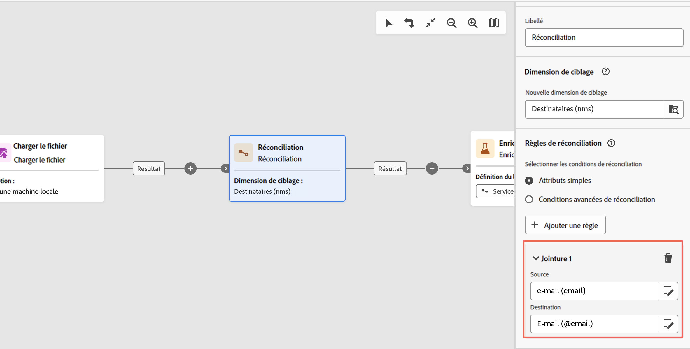

# Services d’abonnement {#subscription-services}

>[!CONTEXTUALHELP]
>id="acw_orchestration_subscription"
>title="Activité Services d’abonnement"
>abstract="L’activité Services d’abonnement permet d’abonner plusieurs profils à un service ou de les désabonner d’un service en une seule action."

>[!CONTEXTUALHELP]
>id="acw_orchestration_subscription_general"
>title="Paramètres généraux d’un service d’abonnement"
>abstract="Sélectionnez le service souhaité et choisissez l’action à effectuer (abonnement ou désabonnement). Activez l’option **Envoyer un message de confirmation** pour informer la population qu’elle est abonnée au service sélectionné ou désabonnée de celui-ci."

>[!CONTEXTUALHELP]
>id="acw_orchestration_subscription_outboundtransition"
>title="Générer une transition sortante"
>abstract="Activez l’option **Générer une transition sortante** pour ajouter une transition après l’activité."

>[!CONTEXTUALHELP]
>id="acw_orchestration_subscription_additionalinfo"
>title="Informations supplémentaires"
>abstract="Spécifiez les données et l’origine de l’abonnement pour chaque enregistrement. Vous pouvez laisser cette section vide, auquel cas aucune date ou origine ne sera définie lors de l’exécution du workflow. Si les données entrantes contiennent une colonne indiquant la date d’abonnement du profil au service, vous pouvez la sélectionner dans le champ **[!UICONTROL Date]**. Dans le champ **[!UICONTROL Chemin de l’origine]**, définissez l’origine de l’abonnement. Vous pouvez la définir sur l’un champs des données entrantes ou sur une valeur constante de votre choix en cochant l’option **[!UICONTROL Définir une constante comme origine]**."

L’activité **Services d’abonnement** est une activité de **Gestion des données**. Celle-ci vous permet de créer ou de supprimer un abonnement à un service d’information pour la population spécifiée dans la transition.

## Configurer l’activité Services d’abonnement {#subscription-services-configuration}

Pour configurer l’activité **Services d’abonnement**, procédez comme suit :

1. Ajoutez une activité **Services d’abonnement** dans votre workflow. Vous pouvez utiliser cette activité après avoir ciblé des profils ou après avoir importé un fichier avec des données identifiées.

1. Sélectionnez le service dont vous souhaitez gérer les abonnements à l’aide de l’une des options suivantes :

   * **[!UICONTROL Sélectionner un service spécifique]** : sélectionnez manuellement un service à l’aide du champ **[!UICONTROL Service]**.

   * **[!UICONTROL À partir de la transition entrante]** : utilisez le service spécifié dans la transition entrante. Vous pouvez, par exemple, importer un fichier qui spécifie le service à gérer pour chaque ligne. Le service sur lequel l’opération doit être effectuée est alors sélectionné de manière dynamique pour chaque profil.

   

1. Sélectionnez l’opération à effectuer : **Abonner** ou **Désabonner**.

   Si le service est défini dans la transition entrante, vous pouvez choisir comment récupérer cette opération :

   * **Sélectionner un type d’opération spécifique** : sélectionnez manuellement le type d’opération à effectuer (**Abonner** ou **Désabonner**).

   * **Sélectionner un type d’opération depuis un chemin de transition entrante** : sélectionnez la colonne des données entrantes spécifiant l’opération à effectuer pour chaque enregistrement. Vous pouvez, par exemple, importer un fichier qui spécifie l’opération à réaliser pour chaque ligne dans une colonne « opération ».

     Seuls les champs Booléen ou Entier peuvent être sélectionnés ici. Assurez-vous que les données contenant l’opération à effectuer correspondent à ce format. Par exemple, si vous chargez des données depuis une activité Chargement de fichier, vérifiez que vous avez correctement paramétré le format de la colonne qui contient l’opération dans l’activité **[!UICONTROL Chargement de fichier]**. Un exemple vous est présenté dans [cette section ](#uc2).

     >[!CAUTION]
     >
     >Par défaut, si vous sélectionnez cette option, l’activité **Services d’abonnements** s’attend à ce qu’une définition de lien soit associée au tableau **Services (nms)** configurée dans le workflow. Pour ce faire, vérifiez que vous avez configuré un lien de réconciliation dans une **activité Enrichissement** vers le haut dans le workflow. Un exemple d’utilisation de cette option est disponible [ici](#uc2).

   

1. Pour informer les personnes destinataires qu’elles sont abonnées au service sélectionné ou désabonnées de ce dernier, activez l’option **[!UICONTROL Envoyer un message de confirmation]**. Le contenu de cette notification est défini dans un modèle de diffusion associé au service d’information.

1. Si vous utilisez des données d’une transition entrante, une section **[!UICONTROL Informations supplémentaires]** s’affiche, qui vous permet de spécifier les données et l’origine de l’abonnement pour chaque enregistrement. Vous pouvez laisser cette section vide, auquel cas aucune date ou origine ne sera définie lors de l’exécution du workflow.

   * Si les données entrantes contiennent une colonne indiquant la date d’abonnement du profil au service, vous pouvez la sélectionner dans le champ **[!UICONTROL Date]**.

   * Dans le champ **[!UICONTROL Chemin de l’origine]**, définissez l’origine de l’abonnement. Vous pouvez la définir sur l’un champs des données entrantes ou sur une valeur constante de votre choix en cochant l’option **[!UICONTROL Définir une constante comme origine]**.

   

1. Pour ajouter une transition sortante après l’activité, activez l’option **[!UICONTROL Générer une transition sortante]**.

## Exemples {#example}

### Abonner une audience à un service spécifique {#uc1}

Le workflow ci-dessous montre comment abonner une audience à un service existant.


* L’activité **[!UICONTROL Créer une audience]** cible une audience existante.

* L’activité **[!UICONTROL Services d’abonnement]** vous permet de sélectionner le service auquel les profils doivent s’abonner.

### Mise à jour de plusieurs statuts d’abonnement à partir d’un fichier {#uc2}

Le workflow ci-dessous montre comment importer un fichier contenant des profils et comment mettre à jour leur abonnement à plusieurs services spécifiés dans le fichier.


* L’activité **[!UICONTROL Chargement de fichier]** charge un fichier CSV contenant les données et définit la structure des colonnes importées. Les colonnes « service » et « opération » spécifient le service à mettre à jour et l’opération à effectuer (abonnement ou désabonnement).

  ```
  Lastname,firstname,city,birthdate,email,service,operation
  Smith,Hayden,Paris,23/05/1985,hayden.smith@example.com,yoga,sub
  Mars,Daniel,London,17/11/1999,danny.mars@example.com,running,sub
  Smith,Clara,Roma,08/02/1979,clara.smith@example.com,running,unsub
  Durance,Allison,San Francisco,15/12/2000,allison.durance@example.com,yoga,sub
  Durance,Alison,San Francisco,15/12/2000,allison.durance@example.com,running,unsub
  ```

  Comme vous l’avez peut-être remarqué, l’opération est spécifiée en tant que « sub » ou « unsub » dans le fichier. Le système attend une valeur de type **Booléen** ou **Entier** pour déterminer l’opération à réaliser : la valeur &quot;0&quot; pour désabonner et la valeur &quot;1&quot; pour abonner. Pour répondre à cette exigence :
   * Le **Type de données** pour la colonne « operation » est défini sur entier.
   * Un **remapping des valeurs** doit être effectué pour faire correspondre les valeurs « sub » et « unsub » avec les valeurs « 1 » et « 0 ».

  

  Si le fichier utilise déjà les valeurs « 0 » et « 1 » pour identifier l’opération, il n’est pas nécessaire de mapper ces valeurs à nouveau. Assurez-vous uniquement que la colonne soit traitée comme une valeur **Booléenne** ou **Nombre entier** dans les colonnes du fichier d’exemple.

* Une activité de **[!UICONTROL Réconciliation]** permet d’identifier les données provenant du fichier comme appartenant à la dimension des profils de la base de données Adobe Campaign. Le champ **e-mail** du fichier correspond au champ **e-mail** de la ressource de profil.

  

* L’activité **[!UICONTROL Enrichissement]** crée un lien de réconciliation vers le tableau « Services (nms) » avec une jointure simple entre la colonne « service » du fichier chargé et le champ « nom interne » des services dans la base de données.

  

* L’élément **[!UICONTROL Services d’abonnements]** identifie les services à mettre à jour comme provenant de la transition.

  Le **[!UICONTROL Type d’opération]** est identifié comme provenant du champ **operation** du fichier. Seul un champ Booléen ou Entier peut être sélectionné ici. Si la colonne du fichier contenant l’opération à effectuer n’apparaît pas dans la liste, vérifiez que vous avez correctement défini le format de la colonne dans l’activité **[!UICONTROL Charger le fichier]**, comme expliqué plus haut dans cet exemple.

  