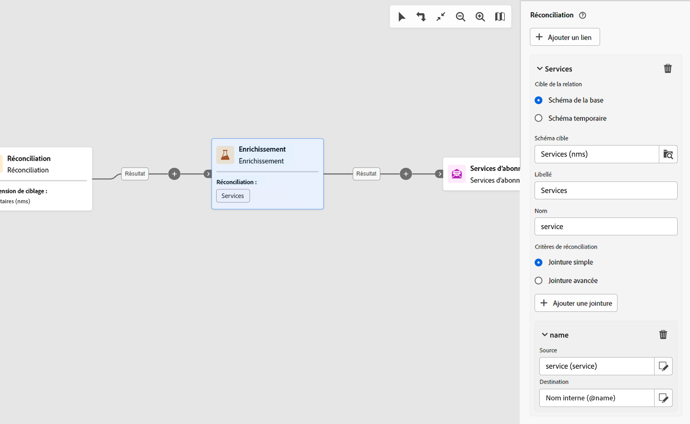

# Services d’abonnement {#subscriptipon-services}

>[!CONTEXTUALHELP]
>id="acw_orchestration_subscription"
>title="Activité Services d’abonnement"
>abstract="L’activité Services d’abonnement permet d’abonner plusieurs profils à un service ou de les désinscrire de ce service en une seule action."

>[!CONTEXTUALHELP]
>id="acw_orchestration_subscription_general"
>title="Paramètres généraux d’un service d’abonnement"
>abstract="Sélectionnez le service souhaité et choisissez l’action à effectuer (abonnement ou désabonnement). Activez l’option **Envoyer un message de confirmation** pour informer la population qu’elle est abonnée au service sélectionné ou désinscrite de ce dernier."

>[!CONTEXTUALHELP]
>id="acw_orchestration_subscription_outboundtransition"
>title="Générer une transition sortante"
>abstract="Activez l’option **Générer une transition sortante** pour ajouter une transition après l’activité."

>[!CONTEXTUALHELP]
>id="acw_orchestration_subscription_additionalinfo"
>title="Informations additionnelles"
>abstract="Informations additionnelles"

L’activité **Services d’abonnement** est une activité de **Gestion des données**. Celle-ci vous permet de créer ou de supprimer un abonnement à un service d’information pour la population spécifiée dans la transition.

## Configurer l’activité Services d’abonnement {#subscription-services-configuration}

Pour configurer l’activité **Services d’abonnement**, procédez comme suit :

1. Ajoutez une activité **Services d’abonnement** dans votre workflow. Vous pouvez utiliser cette activité après avoir ciblé des profils ou après avoir importé un fichier avec des données identifiées.

1. Sélectionnez le service dont vous souhaitez gérer les abonnements à l’aide de l’une des options suivantes :

   * **[!UICONTROL Sélectionner un service spécifique]** : sélectionnez manuellement un service à l’aide du champ **[!UICONTROL Service]**.

   * **[!UICONTROL À partir de la transition entrante]** : utilisez le service spécifié dans la transition entrante. Vous pouvez, par exemple, importer un fichier qui spécifie le service à gérer pour chaque ligne. Le service sur lequel l’opération doit être effectuée est alors sélectionné de manière dynamique pour chaque profil.

   

1. Sélectionnez l’opération à effectuer : **Abonner** ou **Désabonner**.

   Si le service est défini dans la transition entrante, vous pouvez choisir comment récupérer cette opération :

   * **Sélectionner un type d’opération spécifique** : sélectionnez manuellement le type d’opération à effectuer (**Abonner** ou **Désabonner**).

   * **Sélectionner un type d’opération depuis un chemin de transition entrante** : sélectionnez la colonne des données entrantes spécifiant l’opération à effectuer pour chaque enregistrement. Vous pouvez, par exemple, importer un fichier qui spécifie le service à gérer pour chaque ligne dans une colonne « opération ».

     >[!NOTE]
     >
     >Seul un champ Booléen ou Entier peut être sélectionné ici. Assurez-vous que les données contenant l’opération à effectuer correspondent à ce format. Par exemple, si vous chargez des données depuis une activité Chargement de fichier, vérifiez que vous avez correctement paramétré le format de la colonne qui contient l’opération dans l’activité **[!UICONTROL Chargement de fichier]**. Un exemple vous est présenté dans [cette section ](#uc2).

   

1. Pour informer les personnes destinataires qu’elles sont abonnées au service sélectionné ou désabonnées de ce dernier, activez l’option **[!UICONTROL Envoyer un message de confirmation]**. Le contenu de cette notification est défini dans un modèle de diffusion associé au service d’information.

1. Si vous utilisez des données d’une transition entrante, une section **[!UICONTROL Informations supplémentaires]** s’affiche, qui vous permet de spécifier les données et l’origine de l’abonnement pour chaque enregistrement. Vous pouvez laisser cette section vide, auquel cas aucune date ou origine ne sera définie lors de l’exécution du workflow.

   * Si les données entrantes contiennent une colonne indiquant la date d’abonnement du profil au service, vous pouvez la sélectionner dans le champ **[!UICONTROL Date]**.

   * Dans le champ **[!UICONTROL Chemin de l’origine]**, définissez l’origine de l’abonnement. Vous pouvez la définir sur l’un champs des données entrantes ou sur une valeur constante de votre choix en cochant l’option **[!UICONTROL Définir une constante comme origine]**.

   

1. Pour ajouter une transition sortante après l’activité, activez l’option **[!UICONTROL Générer une transition sortante]**.

## Exemples {#example}

### Abonner une audience à un service spécifique {#uc1}

Le workflow ci-dessous montre comment abonner une audience à un service existant.


* L’activité **[!UICONTROL Créer une audience]** cible une audience existante.

* L’activité **[!UICONTROL Services d’abonnement]** vous permet de sélectionner le service auquel les profils doivent s’abonner.

<!--
### Updating multiple subscription statuses from a file {#uc2}

The workflow below shows how to import a file containing profiles and update their subscription to several services specified in the file.


* A **[!UICONTROL Load file]** activity loads a CSV file containing the data and defines the structure of the imported columns. The "service" and "operation" columns specify the service to update and the operation to perform (subscription or unsubscription).

  ```
  Lastname,firstname,city,birthdate,email,service,operation
  Smith,Hayden,Paris,23/05/1985,hayden.smith@example.com,yoga,sub
  Mars,Daniel,London,17/11/1999,danny.mars@example.com,running,sub
  Smith,Clara,Roma,08/02/1979,clara.smith@example.com,running,unsub
  Durance,Allison,San Francisco,15/12/2000,allison.durance@example.com,yoga,sub
  Durance,Alison,San Francisco,15/12/2000,allison.durance@example.com,running,unsub
  ```

  As you may have noticed, the operation is specified in the file as "sub" or "unsub". The system expects a **Boolean** or **Integer** value to recognize the operation to perform: "0" to unsubscribe and "1" to subscribe. To match this requirement, a remapping of values must be performed in the detail of the "operation" column in the sample file configuration screen.

  

  If your file already uses "0" and "1" to identify the operation, you don't need to remap those values. Only make sure that the column is processed as a **Boolean** or **Integer** in the sample file columns.

* A **[!UICONTROL Reconciliation]** activity identifies the data from the file as belonging to the profile dimension of the Adobe Campaign database. The **email** field of the file is matched to the **email** field of the profile resource.

  

* An **[!UICONTROL Enrichment]** activity creates a link to the "Services (nms)" table and creates a simple join between the "service" column of the uploaded file, and the services "internal name" field in the database.

    

* A **[!UICONTROL Deduplication]** based on the **email** field identifies duplicates. It is important to eliminate duplicates since the subscription to a service will fail for all data in case of duplicates.

  
  
* A **[!UICONTROL Subscription Services]** identifies the services to update as coming from the transition, through the link created in the **[!UICONTROL Reconciliation]** activity.

  The **[!UICONTROL Operation type]** is identified as coming from the **operation** field of the file. Only Boolean or Integer fields can be selected here. If the column of your file that contains the operation to perform does not appear in the list, make sure that you have correctly set your column format in the **[!UICONTROL Load file]** activity, as explained earlier in this example.

  -->
