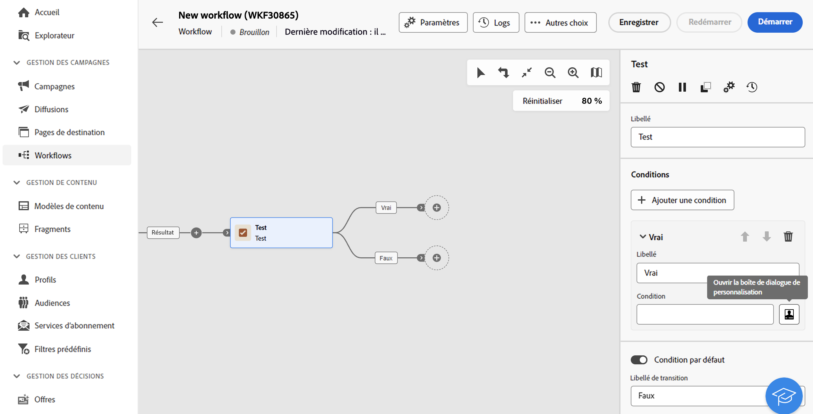
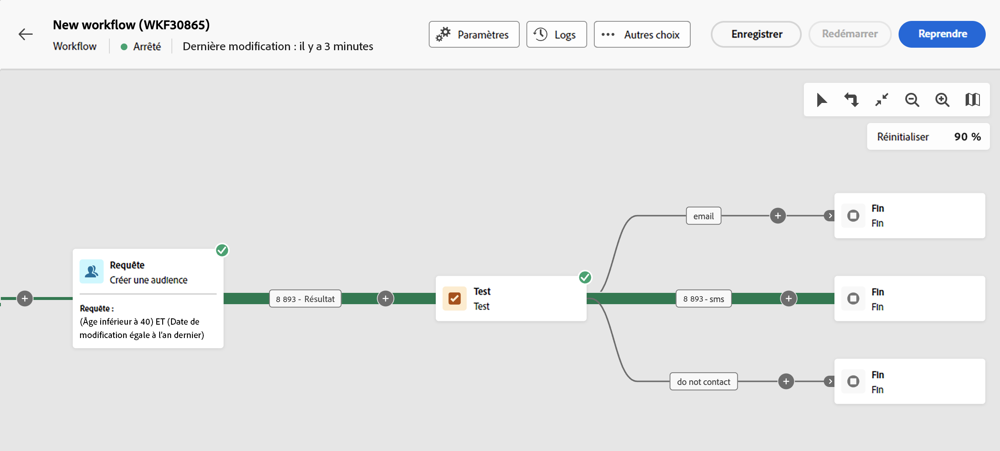
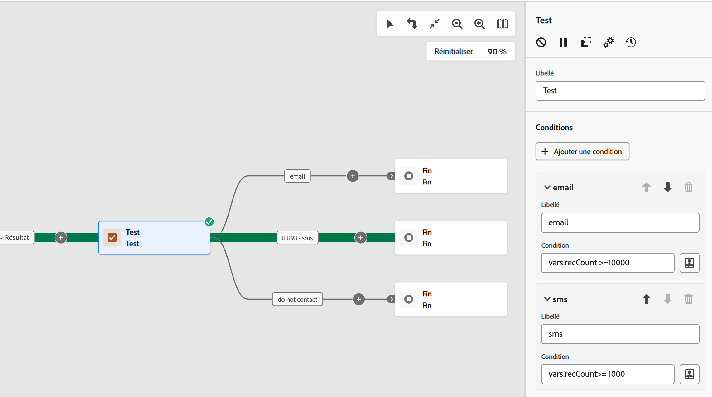

# Test {#test}

La variable **Test** est une activité **Contrôle de flux** activité. Il permet d&#39;activer des transitions en fonction de conditions spécifiées.

## Configuration de l’activité Test {#test-configuration}

Pour configurer la variable **Test** activité :

1. Ajoutez une activité **Test** à votre workflow.

1. Par défaut, la variable **[!UICONTROL Test]** activity présente un test booléen simple. Si la condition définie dans la transition &quot;Vrai&quot; est remplie, cette transition sera activée. Sinon, une transition &quot;False&quot; par défaut sera activée.

1. Pour configurer la condition associée à une transition, cliquez sur le bouton **[!UICONTROL Ouvrir la boîte de dialogue de personnalisation]** Icône Utilisez l&#39;éditeur d&#39;expression pour définir les règles d&#39;activation de cette transition. Vous pouvez également utiliser des variables d’événements, des conditions et des fonctions de date/heure. [Découvrez comment utiliser les variables d’événement et l’éditeur d’expression](../event-variables.md)

   En outre, vous pouvez modifier la variable **[!UICONTROL Libellé]** pour personnaliser le nom de la transition dans la zone de travail du workflow.

   

1. Vous pouvez ajouter plusieurs transitions en sortie à une **[!UICONTROL Test]** activité. Pour ce faire, cliquez sur le bouton **[!UICONTROL Ajouter une condition]** et paramétrez le libellé et la condition associée pour chaque transition.

1. Lors de l’exécution du workflow, chaque condition est testée de manière séquentielle jusqu’à ce que l’une d’elles soit remplie. Si aucune des conditions n’est remplie, le workflow se poursuit sur le chemin de la variable **[!UICONTROL Condition par défaut]**. Si aucune condition par défaut n’est activée, les workflows s’arrêtent à ce stade.

## Exemple {#example}

Dans cet exemple, différentes transitions sont activées en fonction du nombre de profils ciblés par un **[!UICONTROL Créer une audience]** activité :
* Si plus de 10 000 profils sont ciblés, un email est envoyé.
* Pour 1 000 à 10 000 profils, un SMS est envoyé.
* Si les profils ciblés sont inférieurs à 1 000, ils sont dirigés vers une transition &quot;Ne pas contacter&quot;.

Pour ce faire, la variable `vars.recCount` La variable d’événement a été utilisée dans les conditions &quot;email&quot; et &quot;sms&quot; pour comptabiliser le nombre de profils ciblés et activer la transition appropriée.

