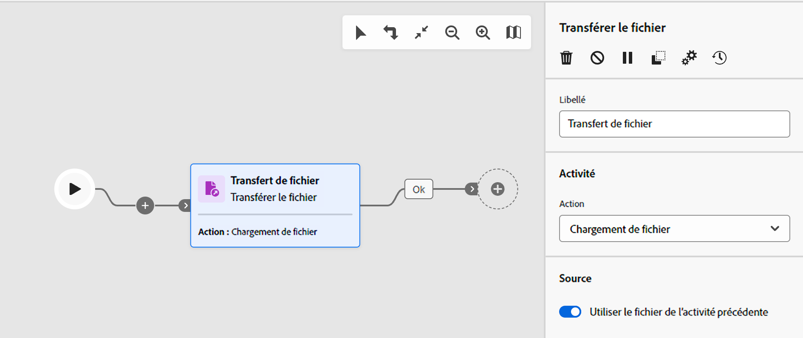
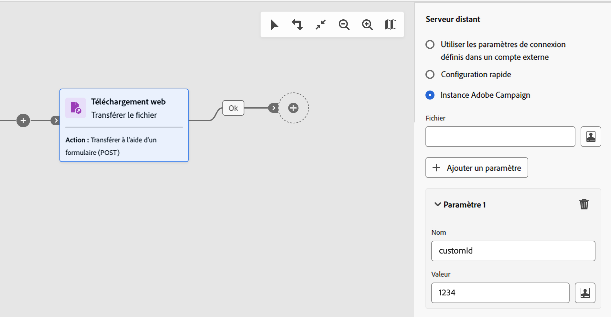
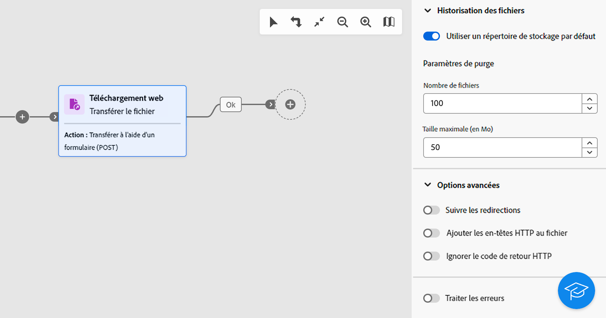

# Transfert de fichier {#transfer-file}

>[!CONTEXTUALHELP]
>id="acw_orchestration_transferfile"
>title="Transfert de fichier"
>abstract="L’activité **Transfert de fichier** permet de recevoir ou d’envoyer des fichiers, de tester la présence de fichiers ou de répertorier les fichiers sur un serveur. Le protocole utilisé peut être soit un protocole serveur à serveur, soit un protocole HTTP."

>[!CONTEXTUALHELP]
>id="acw_orchestration_transferfile_options"
>title="Options de transfert de fichier"
>abstract="Options de transfert de fichier"

>[!CONTEXTUALHELP]
>id="acw_orchestration_transferfile_activity"
>title="Activité de transfert de fichier"
>abstract="Activité de transfert de fichier"

>[!CONTEXTUALHELP]
>id="acw_orchestration_transferfile_remoteserver"
>title="Serveur distant de transfert de fichier"
>abstract="Indiquez le serveur à connecter."

>[!CONTEXTUALHELP]
>id="acw_orchestration_transferfile_source"
>title="Source de transfert de fichier"
>abstract="Saisissez le nom de fichier souhaité."

>[!CONTEXTUALHELP]
>id="acw_orchestration_transferfile_advancedoptions_delete_file"
>title="Effacer les fichiers source après leur transfert"
>abstract="Effacez les fichiers source après un transfert réussi."

>[!CONTEXTUALHELP]
>id="acw_orchestration_transferfile_advancedoptions_display_logs"
>title="Afficher les logs de la session"
>abstract="Les informations relatives à l’opération de transfert sont affichées dans les logs des workflows."

>[!CONTEXTUALHELP]
>id="acw_orchestration_transferfile_advancedoptions_list_files"
>title="Répertorier tous les fichiers"
>abstract="Cette option indexe tous les fichiers présents sur le serveur dans la variable d’événement **vars.filenames**."

>[!CONTEXTUALHELP]
>id="acw_orchestration_transferfile_historization"
>title="Historisation des fichiers"
>abstract="Historisation des fichiers"

>[!CONTEXTUALHELP]
>id="acw_orchestration_transferfile_process_missing_file"
>title="Traiter les fichiers absents"
>abstract="Cette option vous permet d’activer une transition sortante **Aucun fichier** après l’activité."

>[!CONTEXTUALHELP]
>id="acw_orchestration_transferfile_process_errors"
>title="Traiter les erreurs"
>abstract="Cette option vous permet d’activer une transition sortante **Erreur** après l’activité."

L’activité **Transfert de fichier** est une activité de **Gestion des données**. Elle permet de recevoir ou d’envoyer des fichiers, de tester la présence de fichiers ou de répertorier les fichiers sur un serveur. Le protocole utilisé peut être soit un protocole serveur à serveur, soit un protocole HTTP.

>[!NOTE]
>
>Avec l’interface d’utilisation de Campaign Web, nous avons consolidé deux activités en une seule en fusionnant les fonctionnalités **Transfert de fichier** et **Téléchargement web**. Cette consolidation n’a aucun impact sur les fonctionnalités de l’activité.

Suivez les étapes détaillées ci-dessous pour configurer l’activité **Transfert de fichier**.

## Choisir le protocole de transfert et l’opération {#protocol}

1. Ajoutez une activité **Transfert de fichier** dans votre workflow, puis indiquez le type de transfert à effectuer en fonction du protocole que vous souhaitez utiliser :

   * Pour le protocole HTTP, sélectionnez **[!UICONTROL Téléchargement web]**. Vous pouvez ainsi effectuer le téléchargement GET ou POST d’un fichier sur une URL explicite, un compte externe ou une instance Adobe Campaign.
   * Pour les autres protocoles serveur à serveur et actions connexes, sélectionnez **[!UICONTROL Transfert de fichier]**.

1. Sélectionnez l’action à exécuter avec l’activité. Les actions disponibles dépendent du type de transfert que vous avez sélectionné. Pour plus d’informations, développez les sections ci-dessous.

   +++Actions disponibles avec les activités de type **Transfert de fichier**

   * **[!UICONTROL Téléchargement web]** : téléchargez un fichier à partir du serveur.
   * **[!UICONTROL Chargement de fichier]** : chargez un fichier sur le serveur.
   * **[!UICONTROL Test d’existence de fichier]** : vérifiez la présence d’un fichier donné sur le serveur. Génère deux transitions sortantes après l’activité : « Fichier existe » et « Fichier n’existe pas ».
   * **[!UICONTROL Liste de fichiers]** : liste de tous les fichiers disponibles sur le serveur.

+++

   +++Actions disponibles avec les activités de type **Téléchargement web**

   * **[!UICONTROL Transfert simple (GET)]** : récupérez un fichier.
   * **[!UICONTROL Transfert à l’aide d’un formulaire (POST)]** : chargez un fichier et des paramètres supplémentaires.

+++

   

1. Par défaut, pour les actions de chargement de fichiers, l’activité utilise le fichier spécifié dans l’activité précédente. Pour utiliser un autre fichier,désactivez l’option **[!UICONTROL Utiliser le fichier de l’activité précédente]** puis cliquez sur le bouton **[!UICONTROL Ajouter un fichier]**.

   Dans le champ **[!UICONTROL Source]**, saisissez le nom de fichier souhaité ou utilisez l’éditeur d’expression pour calculer le nom du fichier à l’aide de variables d’événement. [Découvrez comment travailler avec des variables d’événement et l’éditeur d’expression](../event-variables.md). Répétez l’opération pour ajouter autant de fichiers que nécessaire.

## Définir la destination du transfert {#destination}

1. Dans la section **[!UICONTROL Serveur distant]**, spécifiez le serveur auquel se connecter à l’aide de l’une des méthodes suivantes :

   * **[!UICONTROL Utiliser les paramètres de connexion définis dans un compte externe]** : connectez-vous à un serveur à l’aide des paramètres de connexion d’un compte externe. Dans le champ **[!UICONTROL Dossier du serveur]**, spécifiez le chemin d’accès au fichier (ou au dossier pour les actions de liste de fichiers).
   * **[!UICONTROL Configuration rapide]** : saisissez l’URL du fichier (ou dossier pour les actions de liste de fichiers).
   * **[!UICONTROL Instance Adobe Campaign]** (Activités de type Téléchargement Web) : téléchargez un fichier à partir d’un serveur d’instance Adobe Campaign.

   

1. Pour les actions POST de téléchargement web, vous pouvez transmettre des paramètres supplémentaires avec l’opération. Pour ce faire, cliquez sur le bouton **[!UICONTROL Ajouter un paramètre]**, puis indiquez le nom et la valeur des paramètres. Vous pouvez ajouter autant de paramètres que vous le souhaitez.

1. Par défaut, pour le chargement de fichiers, les fichiers chargés sur un serveur sont automatiquement enregistrés. Si vous ne souhaitez pas conserver cet historique, désactivez l’option **[!UICONTROL Garder un historique des fichiers envoyés]**.

## Paramètres d’historisation   {#historization}

À chacune de ses exécutions, l’activité **[!UICONTROL Transfert de fichier]** stocke les fichiers transférés ou téléchargés dans un dossier dédié. Un dossier est créé pour chaque activité Transfert de fichier d’un workflow. Par défaut, les fichiers sont enregistrés dans le répertoire de stockage par défaut du dossier d’installation d’Adobe Campaign (`/vars`) avant d’être traité. Pour utiliser un dossier spécifique, désactivez l’option **[!UICONTROL Utiliser un répertoire de stockage par défaut]** et saisissez le chemin du répertoire.

Il est important de pouvoir limiter la taille de ce dossier de façon à préserver l’espace physique sur le serveur. Pour ce faire, vous pouvez définir un nombre maximum de fichiers ou la taille totale du dossier de l’activité. Par défaut, 100 fichiers et 50 Mo sont autorisés.

À chaque exécution de l’activité, le dossier est vérifié comme suit :

* Seuls les fichiers créés plus de 24 heures avant l’exécution de l’activité sont pris en compte.
* Si le nombre de fichiers pris en compte est supérieur à la valeur du champ **[!UICONTROL Nombre de fichiers]**, les fichiers les plus anciens sont supprimés jusqu’à ce que le nombre maximum de fichiers soit atteint.
* Si la taille totale des fichiers pris en compte est supérieure à la valeur du paramètre **[!UICONTROL Taille maximale (en Mo)]**, les fichiers les plus anciens sont supprimés jusqu’à ce que la taille maximale (en Mo) soit atteinte.

>[!CAUTION]
>
>Si l’activité n’est pas exécutée à nouveau, son dossier ne sera pas vérifié ni purgé. Faites donc preuve de prudence lorsque vous transférez des fichiers de grande taille.

## Options avancées et de gestion des erreurs {#advanced}

1. Dans les **[!UICONTROL Options avancées]**, d’autres options sont disponibles en fonction du type d’activité que vous configurez. Pour plus d’informations, développez les sections ci-dessous.

   +++ Options supplémentaires pour les activités de type **[!UICONTROL Transfert de fichier]**

   * **[!UICONTROL Supprimer les fichiers source après leur transfert]** : effacez les fichiers source après un transfert réussi.
   * **[!UICONTROL Afficher les logs de la session]** : lorsque cette option est activée, les informations relatives à l’opération de transfert s’affichent dans les logs du workflow une fois le workflow exécuté.
   * **[!UICONTROL Répertorier tous les fichiers]** (Actions de listage de fichiers) : cette option indexe tous les fichiers présents sur le serveur dans la variable d’événement `vars.filenames` dans laquelle les noms de fichier sont séparés par les caractères `n`. [Découvrir comment travailler avec les variables d’événement](../event-variables.md)

+++

   +++Options supplémentaires pour les activités de type **[!UICONTROL Téléchargement web]**

   * **[!UICONTROL Suivre les redirections]** : la redirection de fichier permet d’utiliser des remplacements pour diriger les entrées ou les sorties de données vers un périphérique d’un différent type.
   * **[!UICONTROL Ajouter des en-têtes HTTP au fichier]** : dans certains cas, vous pouvez ajouter des en-têtes HTTP supplémentaires à un fichier. Le plus souvent, ces en-têtes sont utilisés pour fournir des informations supplémentaires à des fins de résolution de problèmes, pour le [partage de ressources entre origines multiples (CORS)](https://developer.mozilla.org/docs/Web/HTTP/CORS) ou pour définir des directives de mise en cache spécifiques.
   * **[!UICONTROL Ignorer le code de retour HTTP]** : les codes de retour HTTP, également appelés codes d’état HTTP, indiquent le résultat d’une requête HTTP.

1. L’option **[!UICONTROL Traiter les erreurs]** permet d’activer une transition sortante « Erreur » après l’activité si une erreur se produit pendant le transfert.

   En outre, pour les activités de type **Transfert de fichier**, l’option **[!UICONTROL Traiter l’absence de fichier]** permet d’activer une transition sortante « Aucun fichier » après l’activité si le fichier n’est pas disponible sur le chemin spécifié.
