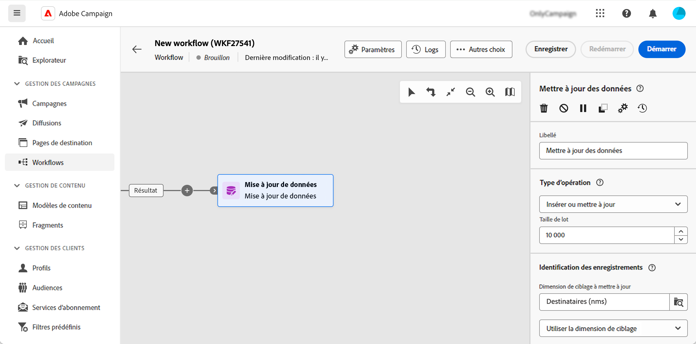

# Mise à jour de données {#update-data}

L’activité **Mise à jour de données** est une activité de **Gestion des données**. L’activité Mise à jour de données permet de mettre à jour en masse les champs de la base de données. Plusieurs options vous permettent de personnaliser la mise à jour des données.

<!--
The **Operation type** field lets you choose the process to be carried out on the data in the database. Select the first option to add data or update it if it has already been added. You can also only add data, only update data, or delete data. Select the **Update and merge collections** to select a primary record to link duplicates to, and delete those duplicates safely.

Specify how to identify the records in the database: if data relate to an existing targeting dimension, select the **Using the targeting dimension** option and select the targeting dimension and fields to update. Otherwise, specify one or more custom links to identify the data in the database, or directly use reconciliation keys.

Select the fields to update and reconciliation settings. You can use the **Auto-mapping** option to automatically identify the fields to be updated.

The **Advanced options** section lets you specify additional settings to manage data and duplicates.

Toggle the **Generate an outbound transition** option to add an outbound transition that will be activated at the end of the execution of the **Update data** activity. The update generally marks the end of a targeting workflow, and therefore the option is not activated by default.

Toggle the **Generate an outbound transition for rejects** option to add an outbound transition containing records that have not been correctly processed after the update (for example, if there is a duplicate). The update generally marks the end of a targeting workflow, and therefore the option is not activated by default.
-->

## Configurer l’activité Mise à jour de données {#update-data-configuration}

Pour configurer l’activité **Mise à jour de données**, ajoutez l’activité à votre workflow et définissez un libellé.

### Type d&#39;opération

Le champ **Type d&#39;opération** permet de choisir le traitement à réaliser sur les données de la base de données :

* **Insérer ou mettre à jour** : insérez des données ou mettez-les à jour si des enregistrements existent déjà dans la base de données.
* **Insérer** : insérez des données uniquement. Les enregistrements déjà existants ne sont pas mis à jour. Si des critères de réconciliation sont définis, seuls les enregistrements non réconciliés sont ajoutés.
* **Mettre à jour** : mettez à jour les données des enregistrements déjà existants dans la base de données uniquement.
* **Supprimer** : supprimez des données.

Le champ **Taille des mises à jours** permet de sélectionner le nombre d&#39;éléments de la transition entrante qui seront mis à jour. Par exemple, si vous indiquez 500, les 500 premiers enregistrements traités seront mis à jour.

### Identification des enregistrements

Cette section vous permet de définir comment identifier les enregistrements dans la base de données :

* Si les données saisies correspondent à une dimension de ciblage existante, sélectionnez l’option **Utiliser la dimension de ciblage** et sélectionnez-la dans le champ **Dimension de ciblage à mettre à jour**.
* Vous pouvez également sélectionner **Utiliser des liens personnalisés** et spécifier un ou plusieurs liens qui permettront d’identifier les données de la base de données.
* Si le type d’opération sélectionné implique une mise à jour, utilisez l’option **Utiliser des règles de réconciliation**.

### Champs à mettre à jour

Dans la section **Champs à mettre à jour**, ajoutez les champs sur lesquels la mise à jour sera appliquée. Si nécessaire, ajoutez des conditions afin que cette mise à jour soit effectuée. Utilisez le champ **Pris en compte si** pour définir des conditions. Les conditions sont appliquées les unes après les autres dans l’ordre de la liste. Utilisez les flèches situées à droite pour modifier l&#39;ordre des mises à jour. Vous pouvez utiliser plusieurs fois le même champ de destination.

Associez automatiquement les champs à l’aide du bouton **Mapping automatique**. L’association automatique détecte les champs portant le même nom.

Dans le cadre d’une opération de type **Insérer ou mettre à jour**, sélectionnez individuellement, pour chaque champ, l’opération à appliquer. Utilisez le champ **Type d’opération** pour spécifier la valeur souhaitée.

### Options avancées

La section **Options avancées** vous permet de définir des paramètres supplémentaires pour la gestion des données et des doublons.

<!--
* **Disable automatic key management**
* **Disable audit**
* **Empty the destination value if the source value is empty**
* **Update all columns with matching names**
* **Ignore records which concern the same target**: only the first in the list of expressions will be considered
-->

Les deux dernières options permettent d’effectuer des actions spécifiques :

* **Générer une transition sortante** : crée une transition sortante qui sera activée à la fin de l’exécution. La mise à jour marque généralement la fin d’un workflow de ciblage et l’option n’est donc pas activée par défaut.

* **Générer une transition sortante pour les rejets** : créé une transition sortante qui contient les enregistrements qui n’ont pas été correctement traités après la mise à jour (par exemple en cas de doublon). La mise à jour marque généralement la fin d’un workflow de ciblage et l’option n’est pas activée par défaut.