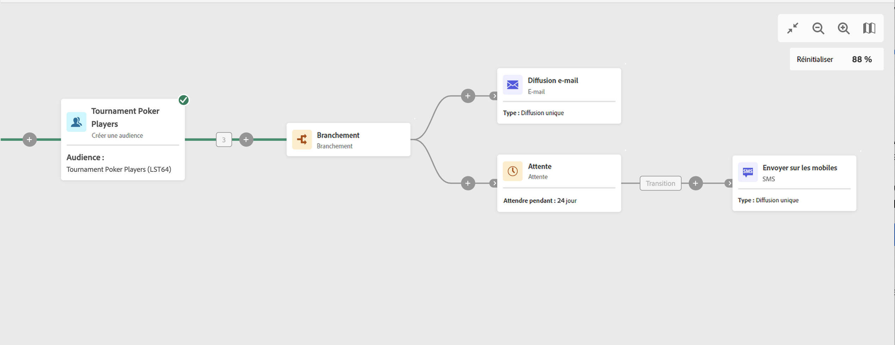

# Attente {#wait}

>[!CONTEXTUALHELP]
>id="acw_orchestration_wait"
>title="Activité d’attente"
>abstract="La variable **Attente** est utilisée pour retarder la transition d’une activité à une autre."

L’activité d’**attente** est une activité de **contrôle de flux**. Elle est utilisée pour permettre qu’un certain temps s’écoule entre l’exécution de deux activités. Par exemple, elle permet d’attendre plusieurs jours après une activité de diffusion e-mail puis d’analyser les ouvertures et les clics générés pendant ce laps de temps avant d’appliquer d’autres traitements (e-mail de rappel, création d’audience, etc.).

## Configuration

Pour configurer l’activité d’**attente**, procédez comme suit :

1. Ajoutez une activité d’**attente** dans votre workflow.

1. Spécifiez la **durée** de l’attente entre les transitions entrante et sortante.

1. Sélectionnez l’unité de temps dans le champ **Périodes** : secondes, minutes, heures.

## Exemple

L’exemple suivant illustre l’activité **Attente** dans un cas typique. Un e-mail d’invitation à un événement est envoyé. 24 heures après son envoi, une diffusion SMS est envoyée à la même population.

