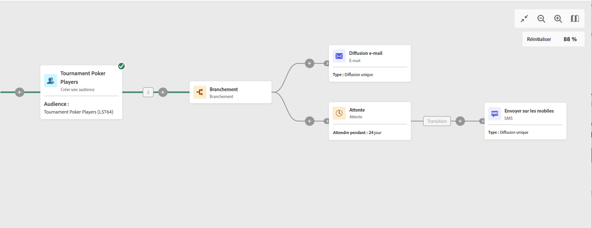

# Attente {#wait}

>[!CONTEXTUALHELP]
>id="acw_orchestration_wait"
>title="Activité Attente"
>abstract="L’activité **Attente** est utilisée pour retarder la transition d’une activité à une autre."

L’activité d’**attente** est une activité de **contrôle de flux**. Elle est utilisée pour permettre qu’un certain temps s’écoule entre l’exécution de deux activités. Elle peut par exemple être utilisée pour attendre plusieurs jours après une activité de diffusion e-mail, puis analyser les ouvertures et les clics générés pendant cette période avant d’effectuer les opérations à suivre, comme l’envoi d’un e-mail de rappel ou la création d’une audience.

## Configuration {#wait-configuration}

Pour configurer l’activité d’**attente**, procédez comme suit :

1. Ajoutez une activité d’**attente** dans votre workflow.

1. Spécifiez la **durée** de l’attente entre les transitions entrante et sortante.

1. Sélectionnez l’unité de temps dans le champ **Périodes** : secondes, minutes, heures, jours.

## Exemple {#wait-example}

L’exemple suivant illustre l’activité **Attente** dans un cas typique. Un e-mail d’invitation à un événement est envoyé. Au bout de 24 heures, une diffusion SMS est envoyée à la même population.

